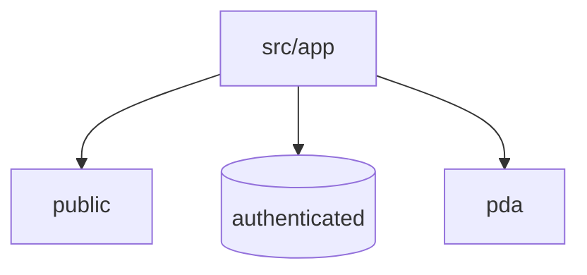

# HANES MES 프론트엔드 라우팅 인덱스

## 목적

이 문서는 프론트엔드 라우트를 도메인 기준으로 전수에 가깝게 파악하기 위한 인덱스 문서다.
기준 원본은 `apps/frontend/src/app`의 현재 폴더 구조다.

## 기준 위치

- 루트: `apps/frontend/src/app`
- 인증 영역: `apps/frontend/src/app/(authenticated)`
- PDA 영역: `apps/frontend/src/app/pda`

## 상위 라우팅 구조

## 공개 영역

- `page.tsx`
- `login/page.tsx`

## 인증 영역 전수 그룹

- `dashboard`
- `master`
- `material`
- `inventory`
- `production`
- `quality`
- `inspection`
- `shipping`
- `sales`
- `equipment`
- `customs`
- `outsourcing`
- `consumables`
- `system`
- `workflow`
- `interface`
- `product`

## 도메인별 라우트 인덱스

### `master`

- `bom`
- `code`
- `company`
- `equip`
- `equip-inspect`
- `gauge`
- `iqc-item`
- `label`
- `part`
- `partner`
- `process`
- `process-capa`
- `prod-line`
- `routing`
- `vendor-barcode`
- `equip-inspect-item`
- `iqc-part-spec`
- `warehouse`
- `work-calendar`
- `work-instruction`
- `worker`

### `material`

- `adjustment`
- `arrival`
- `arrival-stock`
- `hold`
- `iqc`
- `iqc-history`
- `issue`
- `lot`
- `lot-merge`
- `lot-split`
- `misc-receipt`
- `physical-inv`
- `po`
- `po-status`
- `receipt-cancel`
- `receive`
- `receive-history`
- `receive-label`
- `request`
- `scrap`
- `shelf-life`
- `stock`

### `material` 추가 라우트

- `arrival-result`
- `arrival-transaction`
- `concession`
- `issue-other`
- `physical-inv-history`
- `shelf-life-history`
- `shelf-life-reinspect`

### `inventory`

- `material-physical-inv`
- `material-physical-inv-apply`
- `material-physical-inv-history`
- `product-hold`
- `product-physical-inv`
- `product-physical-inv-history`
- `stock`
- `transaction`

### `production`

- `fg-stock`
- `input-equip`
- `input-inspect`
- `input-kiosk`
- `monthly-plan`
- `order`
- `pack-result`
- `progress`
- `repair`
- `result`
- `result-summary`
- `sample-inspect`
- `simulation`
- `specification-setup`
- `subprocess-kitting`
- `wip-material-stock`
- `wip-material-trans`
- `wip-stock`

### `quality`

- `audit`
- `capa`
- `change-control`
- `complaint`
- `control-plan`
- `defect`
- `fai`
- `inspect`
- `msa`
- `oqc`
- `oqc-history`
- `ppap`
- `rework`
- `rework-history`
- `rework-inspect`
- `spc`
- `self-inspect-history`
- `trace`

### `quality` 추가 라우트

- `aql`
- `defect-code`
- `request-inspect`

### `inspection`

- `history`
- `integrated`
- `protocol`
- `result`
- `structure`
- `terminal-result`

### `shipping`

- `confirm`
- `customer-po`
- `history`
- `order`
- `pack`
- `pallet`
- `return`

### `shipping` 추가 라우트

- `box-stock`
- `customer-po-status`
- `pallet-ship`

### `sales`

- `customer-po`
- `customer-po-status`

### `equipment`

- `calibration-history`
- `daily-inspect`
- `inspect-calendar`
- `inspect-history`
- `mold`
- `mold-mgmt`
- `periodic-inspect-calendar`
- `periodic-inspect`
- `pm-calendar`
- `pm-plan`
- `pm-result`
- `status`

### 기타 인증 영역

- `customs`: `entry`, `stock`, `usage`
- `outsourcing`: `order`, `receive`, `vendor`
- `consumables`: `issuing`, `label`, `life`, `master`, `mount`, `receiving`, `stock`
- `interface`: `dashboard`, `log`, `manual`
- `system`: `comm-config`, `config`, `department`, `document`, `er-view`, `improvement-requests`, `menu-categories`, `pda-roles`, `roles`, `screen-requirements`, `scheduler`, `training`, `users`
- `workflow`: `components` 기반 요약 화면
- `product`: `issue`, `issue-cancel`, `receipt-cancel`, `receive`

## PDA 영역 전수 그룹

- `login`
- `menu`
- `settings`
- `equip-inspect`
- `material/adjustment`
- `material/inventory-count`
- `material/issuing`
- `material/menu`
- `material/receiving`
- `product/inventory-count`
- `product/receiving`
- `shipping`

## 라우트 사용 주의사항

1. 웹과 PDA는 같은 앱 안에 있지만 흐름과 UI 패턴이 다르다.
2. `(authenticated)` 내부 라우트는 업무 도메인 기준으로 유지한다.
3. PDA는 스캔과 빠른 입력 흐름을 우선한다.
4. 컴포넌트 하위 폴더는 라우트 자체가 아니라 화면 구현 보조 구조다.
5. 이 문서의 기준 원본은 `apps/frontend/src/app` 폴더 구조다. 신규 화면 추가 시 이 문서도 함께 갱신한다.

## 함께 읽을 문서

- [01-system-architecture.md](./01-system-architecture.md)
- [ui-screen-patterns.md](../standards/ui-screen-patterns.md)
- [04-backend-api-endpoints.md](./04-backend-api-endpoints.md)
