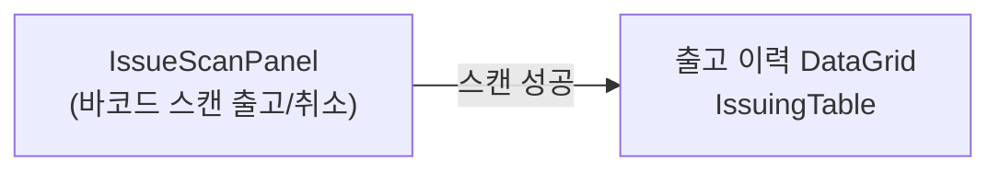
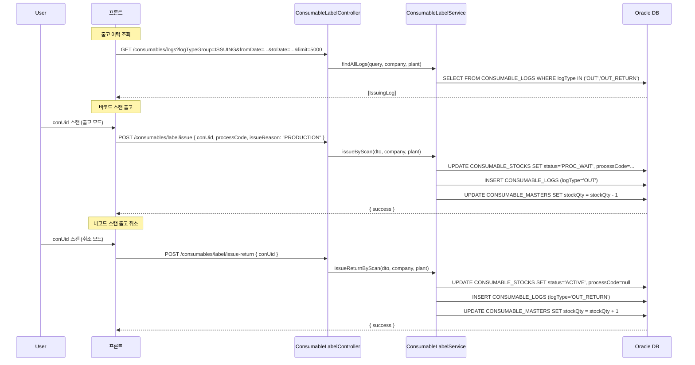
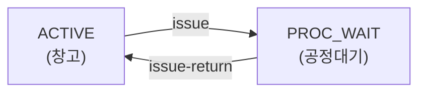

---
sources:
  - apps/backend/src/common/guards/jwt-auth.guard.ts
  - apps/backend/src/modules/consumables/controllers/consumable-label.controller.ts
  - apps/backend/src/modules/consumables/services/consumable-label.service.ts
  - apps/frontend/src/components/consumables/IssuingFormPanel.tsx
  - apps/frontend/src/components/consumables/IssuingReturnPanel.tsx
  - apps/frontend/src/hooks/consumables/useIssuingData.ts
verifiedCommit: 8a7e96ea
---

# 소모품 출고 관리 — 비즈니스 로직 & 데이터 흐름 분석
> **분석 기준 커밋:** `8a7e96ea`
> **분석 일자:** `2026-07-04`

## 1. 화면 개요

소모품을 생산 공정으로 출고(OUT)하거나 출고 취소(OUT_RETURN)하는 메뉴. 바코드 스캔 방식으로 처리.

| 항목 | 내용 |
|------|------|
| 메뉴 코드 | CONS_ISSUING |
| 경로 | `/consumables/issuing` |
| 페이지 | `IssuingPage` |
| 주요 역할 | 소모품 출고/취소 + 이력 조회 |
| 권한 | JwtAuthGuard |

## 2. 화면 구성

| 컴포넌트 | 파일 | 설명 |
|----------|------|------|
| `IssuingPage` | `page.tsx` | 메인 페이지 |
| `IssuingTable` | `components/consumables/IssuingTable.tsx` | 출고 이력 DataGrid |
| `IssueScanPanel` | `components/consumables/IssueScanPanel.tsx` | 바코드 스캔 출고/취소 |
| `DateRangeFilter` | `@/components/shared/DateRangeFilter` | 기간 필터 |
| `useIssuingData` | `hooks/consumables/useIssuingData.ts` | 데이터 조회 훅 |

## 3. 상태 관리

| 상태 | 소스 | 설명 |
|------|------|------|
| `data, isLoading` | `useIssuingData` | 출고 이력 데이터 |
| `searchTerm` | `useIssuingData` | 검색어 |
| `typeFilter` | `useIssuingData` | 유형 필터 (OUT/OUT_RETURN) |
| `startDate, endDate` | `useIssuingData` | 기간 필터 |

**IssueScanPanel 내부 상태:**

| 상태 | 설명 |
|------|------|
| `scanValue` | 스캔 입력값 |
| `processCode` | 출고 공정 코드 |
| `mode` | 'issue'(출고) / 'issue-return'(취소) |
| `isScanning` | API 호출 중 |

## 4. API 호출 흐름

## 5. 백엔드 처리

```mermaid
flowchart TB
  subgraph Issue["출고 처리 (labelService.issueByScan)"]
    SCAN_ISSUE["POST /consumables/label/issue<br/>{ conUid, processCode }"] --> STOCK_UPDATE["ConsumableStock UPDATE<br/>status='PROC_WAIT'<br/>processCode=입력값"]
    STOCK_UPDATE --> LOG_ISSUE["ConsumableLog INSERT<br/>logType='OUT'<br/>issueReason='PRODUCTION'"]
    LOG_ISSUE --> MASTER_DEC["ConsumableMaster UPDATE<br/>stockQty = stockQty - 1"]
  end

  subgraph Return["출고 취소 (labelService.issueReturnByScan)"]
    SCAN_RETURN["POST /consumables/label/issue-return<br/>{ conUid }"] --> STOCK_RETURN["ConsumableStock UPDATE<br/>status='ACTIVE'<br/>processCode=null"]
    STOCK_RETURN --> LOG_RETURN["ConsumableLog INSERT<br/>logType='OUT_RETURN'"]
    LOG_RETURN --> MASTER_INC["ConsumableMaster UPDATE<br/>stockQty = stockQty + 1"]
  end
```

## 6. 처리 규칙 및 검증

| 규칙 | 설명 |
|------|------|
| 출고 전제조건 | conUid의 status가 ACTIVE여야 함 |
| 출고 효과 | stockQty -1, 인스턴스 PROC_WAIT 전환 |
| 출고 취소 전제조건 | conUid의 status가 PROC_WAIT여야 함 |
| 취소 효과 | stockQty +1, 인스턴스 ACTIVE 복귀 |
| 공정 선택 필수 | 출고 시 ProcessSelect로 processCode 필수 입력 |
| 출고사유 | PRODUCTION(생산), REPAIR(수리), OTHER(기타) |

## 7. 상태 전이 (ConsumableStock 기준)

## 8. 상태 코드 및 공통코드

| 코드 그룹 | 값 | 설명 |
|-----------|-----|------|
| `CON_STOCK_STATUS` | ACTIVE, PROC_WAIT | 인스턴스 상태 |
| `ISSUE_REASON` | PRODUCTION, REPAIR, OTHER | 출고 사유 |

## 9. DB 테이블 영향 및 엔티티

| 테이블 | 엔티티 | 설명 |
|--------|--------|------|
| `CONSUMABLE_LOGS` | `ConsumableLog` | 출고 이력 (logType='OUT'/'OUT_RETURN') |
| `CONSUMABLE_STOCKS` | `ConsumableStock` | status/processCode 변경 |
| `CONSUMABLE_MASTERS` | `ConsumableMaster` | stockQty 증감 |

ConsumableLog 출고 시 컬럼:
- `TRANS_DATE`, `SEQ`
- `CONSUMABLE_CODE`, `LOG_TYPE` ('OUT'/'OUT_RETURN')
- `QTY=1`
- `PROCESS_CODE`, `ISSUE_REASON`, `CON_UID`
- `COMPANY`, `PLANT_CD`

## 10. 에러 코드

| HTTP | 상황 |
|------|------|
| 200/201 | 출고/취소 성공 |
| 404 | conUid 미존재 |
| 400 | 필수값 누락/잘못된 상태 |

## 11. 비고

- 수동 출고 패널(`IssuingFormPanel.tsx`, `IssuingReturnPanel.tsx`)은 현재 `IssuingPage`에서 미사용 (페이지에 Plus 버튼 없음)
- 바코드 스캔이 주 처리 방식, `IssueScanPanel`이 `BarcodeScanInput` 사용
- `useIssuingData`는 @tanstack/react-query의 useQuery로 이력 관리
