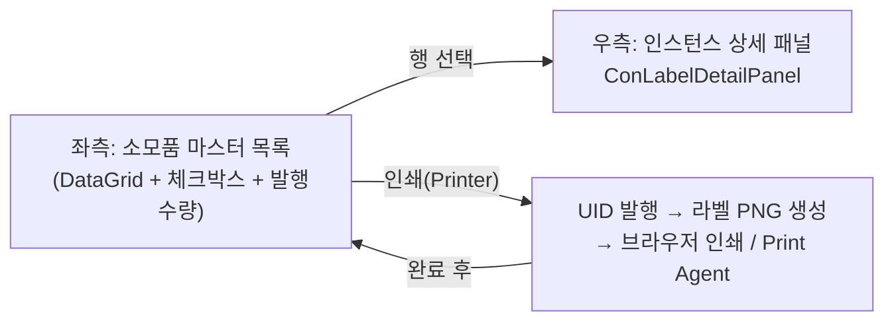
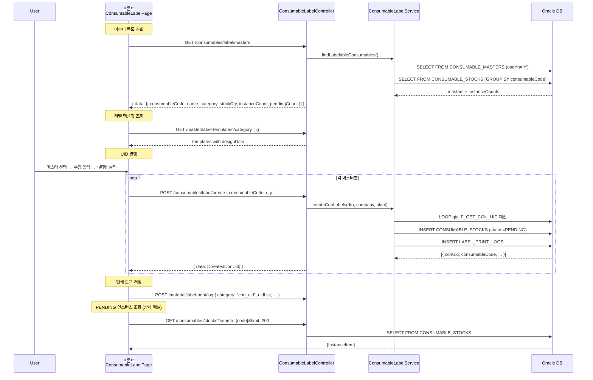
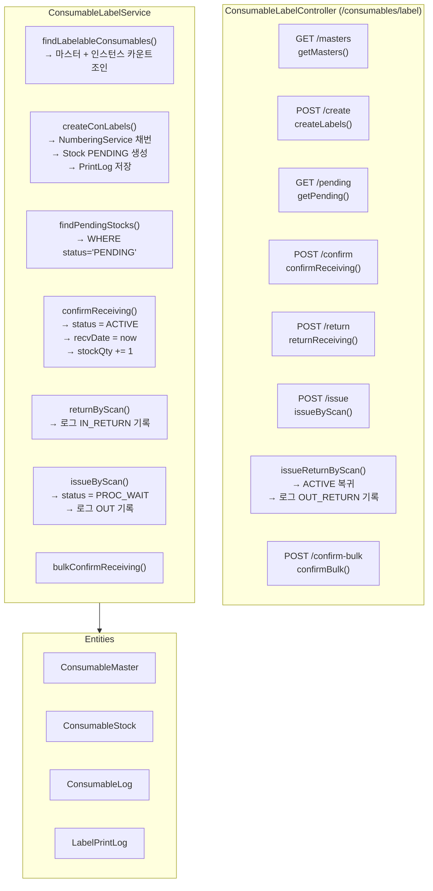

---
sources:
  - apps/backend/src/common/guards/jwt-auth.guard.ts
  - apps/backend/src/modules/consumables/controllers/consumable-label.controller.ts
  - apps/backend/src/modules/consumables/services/consumable-label.service.ts
  - apps/backend/src/shared/numbering.service.ts
  - apps/frontend/src/app/(authenticated)/consumables/label/components/ConLabelColumns.tsx
  - apps/frontend/src/app/(authenticated)/consumables/label/components/ConLabelDetailPanel.tsx
  - apps/frontend/src/app/(authenticated)/consumables/label/components/useConLabelIssue.ts
verifiedCommit: 8a7e96ea
---

# 소모품 라벨 발행 — 비즈니스 로직 & 데이터 흐름 분석
> **분석 기준 커밋:** `8a7e96ea`
> **분석 일자:** `2026-07-04`

## 1. 화면 개요

소모품 개별 식별 라벨(conUid 바코드 라벨)을 발행/인쇄하는 메뉴. 마스터 선택 → 수량 입력 → UID 채번 → 라벨 인쇄까지의 전체 흐름 처리.

| 항목 | 내용 |
|------|------|
| 메뉴 코드 | CONS_LABEL |
| 경로 | `/consumables/label` |
| 페이지 | `page.tsx` → `ConsumableLabelPage` |
| 주요 역할 | conUid 채번 + PENDING 생성 + 라벨 인쇄 |
| 권한 | JwtAuthGuard |

## 2. 화면 구성

| 컴포넌트 | 파일 | 설명 |
|----------|------|------|
| `page.tsx` | `page.tsx` | 메인 페이지, 라벨 렌더링/인쇄 로직 |
| `useConLabelColumns` | `components/ConLabelColumns.tsx` | DataGrid 컬럼 + 체크박스 + 수량 입력 |
| `useConLabelIssue` | `components/useConLabelIssue.ts` | UID 생성 + 인쇄 로그 훅 |
| `ConLabelDetailPanel` | `components/ConLabelDetailPanel.tsx` | 마스터별 PENDING 인스턴스 목록 |
| `LabelDesignRenderer` | `../../master/label/components/LabelDesignRenderer` | 라벨 디자인 렌더링 |
| `LabelPrintRenderer` | `../../master/label/components/LabelPrintRenderer` | 인쇄용 라벨 렌더러 |

## 3. 상태 관리

| 상태 | 타입 | 초기값 | 설명 |
|------|------|--------|------|
| `masters` | `LabelableMaster[]` | `[]` | 라벨 발행 가능 마스터 목록 |
| `selectedCodes` | `Set<string>` | `new Set()` | 선택된 마스터 코드들 |
| `qtyMap` | `Map<string, number>` | `new Map()` | 마스터별 발행 수량 |
| `issueStatus` | `IssueStatus\|null` | `null` | 발행 상태 표시 (성공/실패/로딩) |
| `printing` | `boolean` | `false` | 인쇄 중 상태 |
| `issuing` | `boolean` | `false` | UID 생성 중 상태 |
| `activePrintItems` | `PrintItem[]` | `[]` | 인쇄할 라벨 항목들 |
| `detailMaster` | `LabelableMaster\|null` | `null` | 우측 패널에서 볼 마스터 |

## 4. API 호출 흐름

## 5. 백엔드 처리

## 6. 처리 규칙 및 검증

| 규칙 | 설명 |
|------|------|
| conUid 채번 | Oracle Function `F_GET_CON_UID`로 채번 (NumberingService) |
| PENDING 생성 | conUid 발행 직후 ConsumableStock은 status=PENDING |
| 수량 범위 | 1 ~ 99, QtyInput으로 제한 |
| 브라우저 인쇄 | 팝업 창 → LabelPrintRenderer HTML → `window.print()` |
| Print Agent | `printAgentPng()` 로 agent 출력 (설치 필요) |
| 재발행 | PENDING 인스턴스에 한해 `handleReprintLabel()` → agent 출력 |
| 인쇄 로그 | `POST /material/label-print/log`로 이력 저장 |

## 7. 상태 전이 (ConsumableStock 기준)

## 8. 상태 코드 및 공통코드

| 코드 그룹 | 값 | 설명 |
|-----------|-----|------|
| `CONSUMABLE_CATEGORY` | MOLD, JIG, TOOL, ETC | 소모품 분류 |
| `CON_STOCK_STATUS` | PENDING, ACTIVE, PROC_WAIT, MOUNTED | 인스턴스 상태 |

## 9. DB 테이블 영향 및 엔티티

| 테이블 | 엔티티 | 설명 |
|--------|--------|------|
| `CONSUMABLE_MASTERS` | `ConsumableMaster` | 라벨 발행 가능 마스터 조회 |
| `CONSUMABLE_STOCKS` | `ConsumableStock` | conUid별 개별 인스턴스 (INSERT) |
| `CONSUMABLE_LOGS` | `ConsumableLog` | 입출고 이력 |
| `LABEL_PRINT_LOGS` | `LabelPrintLog` | 라벨 인쇄 이력 |
| `LABEL_TEMPLATES` | `LabelTemplate` | 라벨 디자인 템플릿 |

ConsumableStock 채번 시 컬럼:
- `CON_UID` (PK, F_GET_CON_UID 채번값)
- `CONSUMABLE_CODE`, `STATUS` = 'PENDING'
- `LABEL_PRINTED_AT` = SYSTIMESTAMP
- `COMPANY`, `PLANT_CD`

## 10. 에러 코드

| HTTP | 상황 |
|------|------|
| 200/201 | UID 생성/조회 성공 |
| 400 | 필수값 누락 (BadRequestException) |
| 404 | 마스터 미존재 (NotFoundException) |

## 11. 비고

- 인쇄 방식: Browser Print (팝업 HTML → window.print) 또는 Print Agent (PNG 전송)
- `useConLabelIssue` 훅에서 순차적으로 마스터별 POST /create 호출
- 라벨 디자인 템플릿은 LABEL_TEMPLATES 테이블의 category='jig' 참조
- 미입고(PENDING) 목록은 `ConLabelDetailPanel`에서 실시간 조회 (GET /consumables/stocks)
