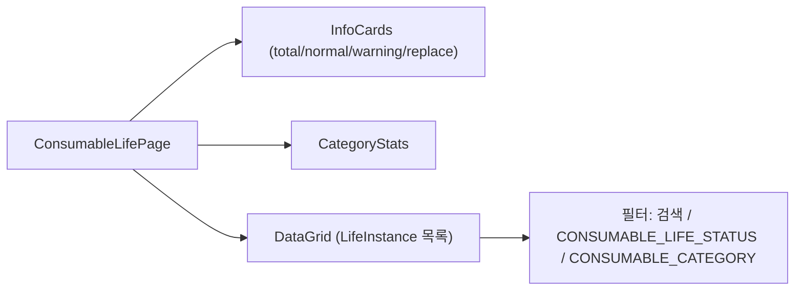
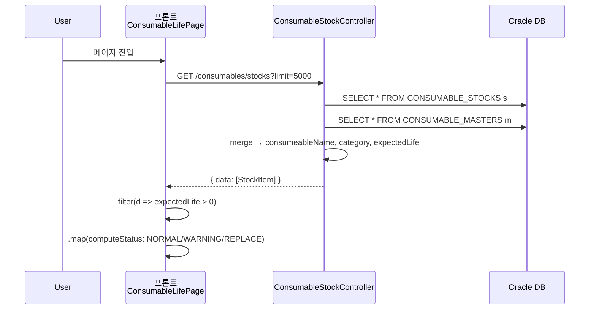
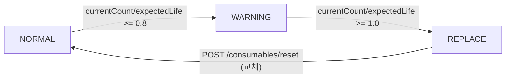

# 소모품 수명 현황 — 비즈니스 로직 & 데이터 흐름 분석
> **분석 기준 커밋:** `8a7e96ea`
> **분석 일자:** `2026-07-04`

## 1. 화면 개요

소모품(금형/지그/공구) 개별 인스턴스의 수명 상태를 모니터링하는 메뉴. 사용횟수 기반 NORMAL/WARNING/REPLACE 상태 표시.

| 항목 | 내용 |
|------|------|
| 메뉴 코드 | CONS_LIFE |
| 경로 | `/consumables/life` |
| 페이지 | `page.tsx` → `ConsumableLifePage` |
| 주요 역할 | expectedLife 기반 수명 모니터링 |
| 권한 | JwtAuthGuard |

## 2. 화면 구성



| 컴포넌트 | 파일 | 설명 |
|----------|------|------|
| `ConsumableLifePage` | `page.tsx` | 메인 페이지 |
| `createConsumableLifeGridColumns` | `consumableLifeColumns.tsx` | DataGrid 컬럼 |
| `InfoCards` | `page.tsx` (inline) | 상태별 통계 카드 |
| `ComCodeSelect` | `@/components/shared` | 필터 Select |
| `StatusBadge` | `@/components/shared/StatusBadge` | 수명 상태 배지 |
| `DataGrid` | `@/components/data-grid` | 공통 그리드 |

## 3. 상태 관리

| 상태 | 타입 | 설명 |
|------|------|------|
| `rawData` | `LifeInstance[]` | expectedLife > 0 인 인스턴스 |
| `loading` | `boolean` | 조회 중 |
| `searchTerm` | `string` | 검색어 |
| `statusFilter` | `string` | 수명 상태 필터 (NORMAL/WARNING/REPLACE) |
| `categoryFilter` | `string` | 카테고리 필터 |

## 4. API 호출 흐름



**수명 상태 계산 로직 (FE, page.tsx:21-27):**
```
computeStatus(currentCount, expectedLife):
  if pct >= 1.0  → REPLACE
  if pct >= 0.8  → WARNING
  else           → NORMAL
```

## 5. 백엔드 처리

ConsumableStockController에서 `/consumables/stocks` API는 ConsumableStock과 ConsumableMaster를 in-memory 조인하여 반환. expectedLife > 0 필터링은 FE에서 수행.

## 6. 처리 규칙 및 검증

| 규칙 | 설명 |
|------|------|
| 수명 계산 | FE computeStatus() — pct = currentCount / expectedLife |
| 표시 대상 | expectedLife가 null이 아니고 > 0 인 인스턴스만 |
| WARNING 임계 | 80% 이상 |
| REPLACE 임계 | 100% 이상 |
| 상태는 FE 전용 | CONSUMABLE_LIFE_STATUS 공통코드로 배지 표시 (NORMAL/WARNING/REPLACE) |
| 통계 | infoCards 4종 (total/normal/warning/replace) + 카테고리별 top 8 통계 |

## 7. 상태 전이



## 8. 상태 코드 및 공통코드

| 코드 그룹 | 값 | 설명 |
|-----------|-----|------|
| `CONSUMABLE_LIFE_STATUS` | NORMAL, WARNING, REPLACE | 수명 상태 |
| `CONSUMABLE_CATEGORY` | MOLD, JIG, TOOL, ETC | 소모품 분류 |

## 9. DB 테이블 영향 및 엔티티

| 테이블 | 엔티티 | 설명 |
|--------|--------|------|
| `CONSUMABLE_STOCKS` | `ConsumableStock` | 개별 인스턴스 (currentCount) |
| `CONSUMABLE_MASTERS` | `ConsumableMaster` | expectedLife 기준값 |

## 10. 에러 코드

| HTTP | 상황 |
|------|------|
| 200 | 조회 성공 |
| 404 | 없음 (전체 조회) |

## 11. 비고

- READ-ONLY: 데이터 변경은 CONS_MOUNT(increase), CONS_MASTER(expectedLife 설정) 등에서
- replaceAction 버튼(`RotateCcw`)은 현재 구현 미완료 (null 반환)
- 카테고리 통계는 상위 8개만 표시 (카테고리별 replace 수 표시)
- Progress bar: 녹색(<80%) → 노랑(80~99%) → 빨강(100%+)
