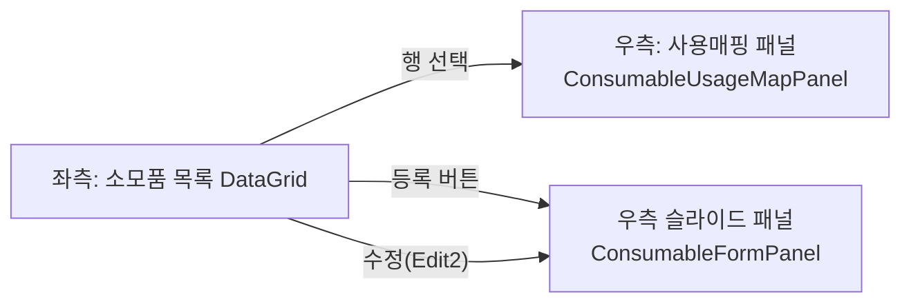
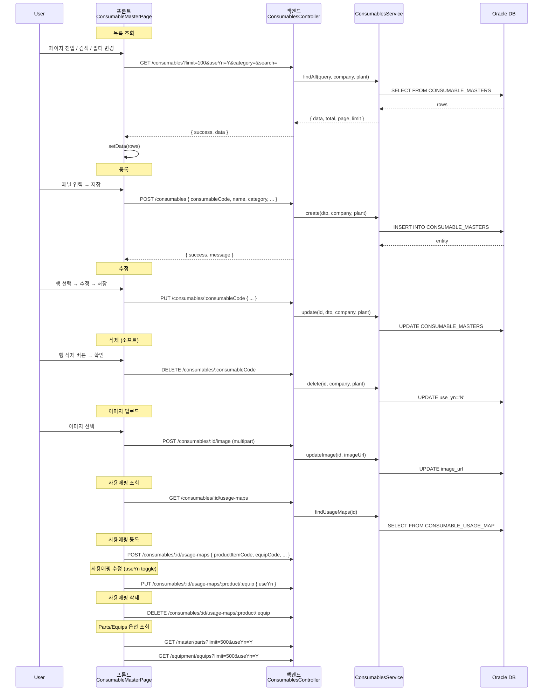
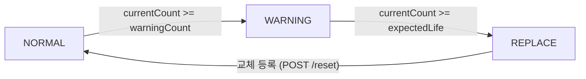

# 소모품 마스터 관리 — 비즈니스 로직 & 데이터 흐름 분석
> **분석 기준 커밋:** `8a7e96ea`
> **분석 일자:** `2026-07-04`

## 1. 화면 개요

소모품(금형/지그/공구)의 마스터 정보를 등록/수정/삭제하고, 제품-설비 사용 매핑을 관리하는 메뉴.

| 항목 | 내용 |
|------|------|
| 메뉴 코드 | CONS_MASTER |
| 경로 | `/consumables/master` |
| 페이지 | `page.tsx` → `ConsumableMasterPage` |
| 주요 역할 | 소모품 마스터 CRUD + 사용매핑 관리 |
| 권한 | JwtAuthGuard |

## 2. 화면 구성

| 컴포넌트 | 파일 | 설명 |
|----------|------|------|
| `page.tsx` | `consumables/master/page.tsx` | 메인 페이지, 상태 관리, API 연동 |
| `ConsumableFormPanel` | `components/ConsumableFormPanel.tsx` | 소모품 등록/수정 슬라이드 패널 |
| `ConsumableUsageMapPanel` | `components/ConsumableUsageMapPanel.tsx` | 소모품 사용매핑 관리 패널 |
| `createConsumableMasterGridColumns` | `consumableMasterColumns.tsx` | DataGrid 컬럼 정의 |
| `ComCodeSelect` | `@/components/shared` | 카테고리(CONSUMABLE_CATEGORY) 필터 |
| `DataGrid` | `@/components/data-grid` | 공통 그리드 |

## 3. 상태 관리

| 상태 | 타입 | 초기값 | 설명 |
|------|------|--------|------|
| `data` | `ConsumableItem[]` | `[]` | 소모품 목록 |
| `loading` | `boolean` | `false` | 목록 조회 로딩 |
| `searchTerm` | `string` | `""` | 검색어 |
| `categoryFilter` | `string` | `""` | 카테고리 필터 |
| `isPanelOpen` | `boolean` | `false` | 슬라이드 패널 열림 |
| `editing` | `ConsumableItem\|null` | `null` | 수정 대상 |
| `selected` | `ConsumableItem\|null` | `null` | 선택된 행 (사용매핑용) |
| `saving` | `boolean` | `false` | 저장/삭제 로딩 |
| `deleteTarget` | `string\|null` | `null` | 삭제할 소모품코드 |

## 4. API 호출 흐름

## 5. 백엔드 처리

```mermaid
flowchart TB
  subgraph Controller["ConsumablesController (/consumables)"]
    direction TB
    GET_LIST["GET /<br/>findAll()"]
    GET_ID["GET /:id<br/>findById()"]
    POST_CREATE["POST /<br/>create()"]
    PUT_UPDATE["PUT /:id<br/>update()"]
    DELETE_SOFT["DELETE /:id<br/>delete()"]
    POST_IMAGE["POST /:id/image<br/>uploadImage()"]
    DEL_IMAGE["DELETE /:id/image<br/>removeImage()"]
    LOGS["GET /logs<br/>findAllLogs()"]
    POST_LOG["POST /logs<br/>createLog()"]
    POST_RECV["POST /receiving<br/>createReceiving()"]
    POST_ISSUE["POST /issuing<br/>createIssuing()"]
    POST_SHOT["POST /shot-count<br/>updateShotCount()"]
    POST_RESET["POST /reset<br/>resetShotCount()"]
    SUMMARY["GET /summary<br/>getSummary()"]
    WARNING["GET /warning<br/>getWarningList()"]
    LIFE_STATUS["GET /life-status<br/>getLifeStatus()"]
    USAGE_MAPS_GET["GET /:id/usage-maps<br/>findUsageMaps()"]
    USAGE_MAPS_POST["POST /:id/usage-maps<br/>createUsageMap()"]
    USAGE_MAPS_PUT["PUT /:id/usage-maps/:product/:equip<br/>updateUsageMap()"]
    USAGE_MAPS_DEL["DELETE /:id/usage-maps/:product/:equip<br/>deleteUsageMap()"]
  end

  subgraph Service["ConsumablesService"]
    direction TB
    ENTITIES["Entities:<br/>ConsumableMaster<br/>ConsumableLog<br/>ConsumableUsageMap<br/>ItemMaster<br/>EquipMaster"]
  end
```

## 6. 처리 규칙 및 검증

| 규칙 | 설명 |
|------|------|
| 소프트 삭제 | DELETE는 use_yn='N'으로 업데이트 (실제 레코드 삭제 없음) |
| 이미지 업로드 | `./uploads/consumables` 저장, 5MB 제한, jpg/png/gif/webp |
| 이미지 삭제 | DB 경로 해제 후 물리 파일도 삭제 |
| 코드 중복 | POST /create 시 ConflictException (중복 코드 체크) |
| 사용매핑 PK | COMPANY + PLANT_CD + PRODUCT_ITEM_CODE + EQUIP_CODE + CONSUMABLE_CODE |
| 상태값 | NORMAL(정상), WARNING(주의: warningCount 도달), REPLACE(교체필요: expectedLife 도달) |
| 테넌트 | COMPANY, PLANT_CD로 데이터 격리 |

## 7. 상태 전이

## 8. 상태 코드 및 공통코드

| 코드 그룹 | 값 | 설명 |
|-----------|-----|------|
| `CONSUMABLE_CATEGORY` | MOLD, JIG, TOOL, ETC | 소모품 분류 |
| `CONSUMABLE_STATUS` | NORMAL, WARNING, REPLACE | 소모품 수명 상태 |
| `CONSUMABLE_OPER_STATUS` | WAREHOUSE, MOUNTED, REPAIR | 설비 연계 운용 상태 |

## 9. DB 테이블 영향 및 엔티티

| 테이블 | 엔티티 | 설명 |
|--------|--------|------|
| `CONSUMABLE_MASTERS` | `ConsumableMaster` | 소모품 마스터 (PK: COMPANY + PLANT_CD + CONSUMABLE_CODE) |
| `CONSUMABLE_LOGS` | `ConsumableLog` | 입출고 이력 |
| `CONSUMABLE_USAGE_MAP` | `ConsumableUsageMap` | 소모품-제품-설비 사용 매핑 |
| `ITEM_MASTERS` | `ItemMaster` | 제품/품목 마스터 (옵션 조회용) |
| `EQUIP_MASTERS` | `EquipMaster` | 설비 마스터 (옵션 조회용) |

ConsumableMaster 주요 컬럼:
- `CONSUMABLE_CODE` (PK, VARCHAR2 50)
- `NAME` (VARCHAR2 100)
- `CATEGORY` (VARCHAR2 50)
- `EXPECTED_LIFE`, `CURRENT_COUNT`, `STOCK_QTY`, `SAFETY_STOCK`, `WARNING_COUNT`
- `LOCATION`, `VENDOR`, `UNIT_PRICE`
- `STATUS` (NORMAL/WARNING/REPLACE)
- `OPER_STATUS` (WAREHOUSE/MOUNTED/REPAIR)
- `MOUNTED_EQUIP_ID`, `IMAGE_URL`, `USE_YN`
- `COMPANY` (PK), `PLANT_CD` (PK)

## 10. 에러 코드

| HTTP | 상황 |
|------|------|
| 201 | 등록/이미지 업로드 성공 |
| 200 | 조회/수정/삭제 성공 |
| 404 | 소모품 미존재 (`NotFoundException`) |
| 409 | 중복 소모품코드 (`ConflictException`) |
| 400 | 필수값 누락 (`BadRequestException`) |

## 11. 비고

- `ConsumableFormPanel`은 이미지 업로드를 마스터 저장 후에만 가능하도록 설계
- `ConsumableUsageMapPanel`에서 제품/설비 옵션은 API 로드 후 Select로 제공 (자유입력 금지)
- DataGrid 컬럼에 `imageUrl` 썸네일 표시 (로드 실패 시 '-' fallback)
- 수정 시 `consumableCode`는 disabled 처리 (PK 변경 불가)
