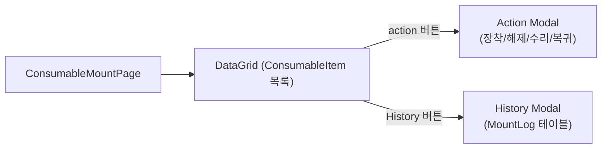
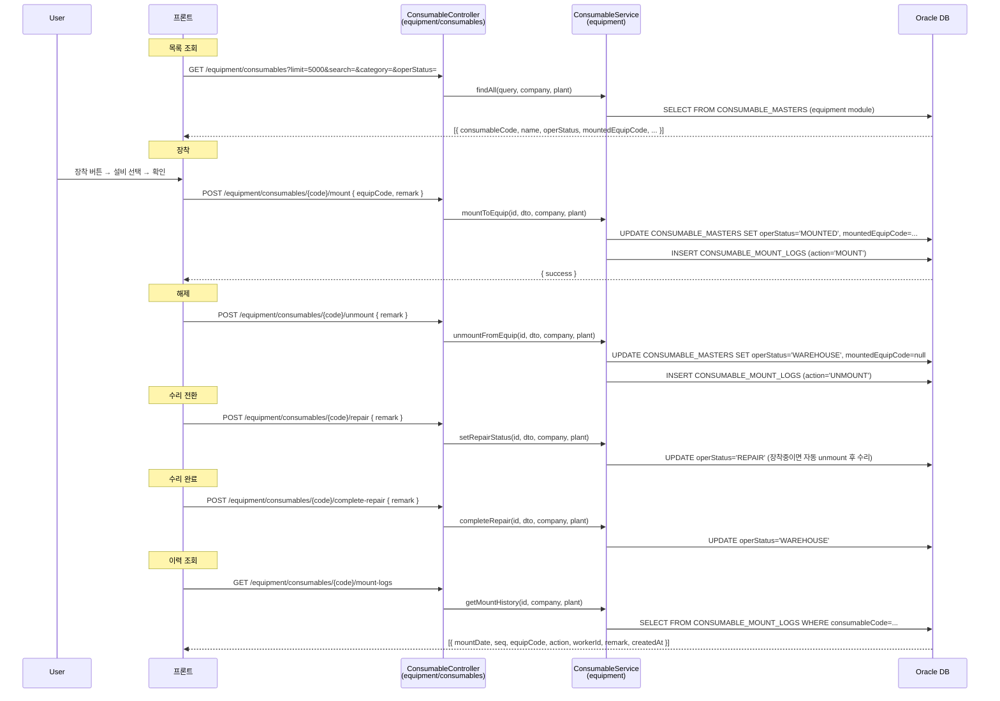
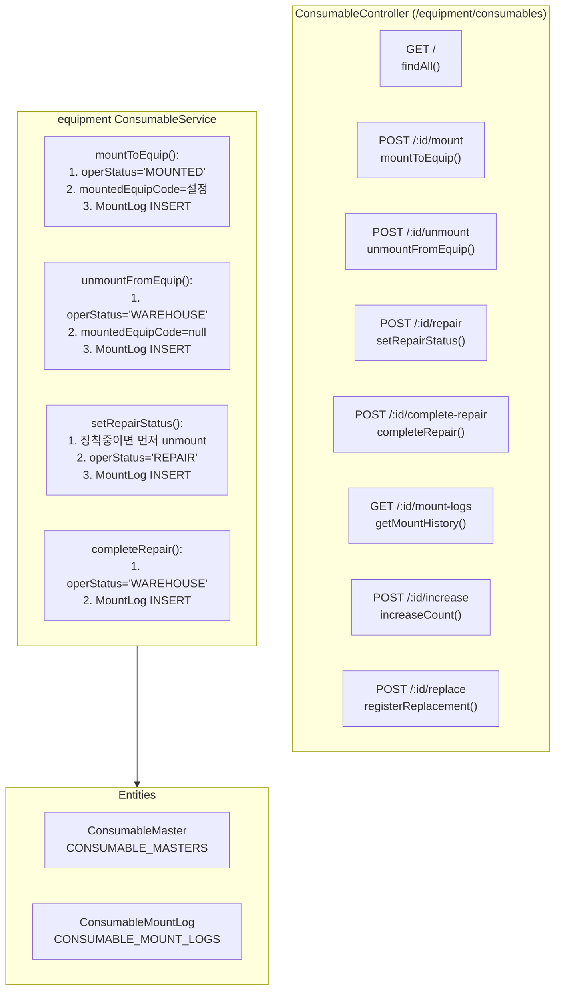
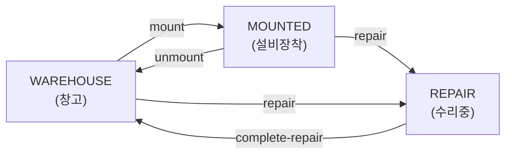

# 소모품 장착/분리 관리 — 비즈니스 로직 & 데이터 흐름 분석
> **분석 기준 커밋:** `8a7e96ea`
> **분석 일자:** `2026-07-04`

## 1. 화면 개요

소모품(금형/지그/공구)을 설비에 장착(mount), 해제(unmount), 수리(repair), 수리완료(complete-repair) 처리하고 이력을 조회하는 메뉴.

| 항목 | 내용 |
|------|------|
| 메뉴 코드 | CONS_MOUNT |
| 경로 | `/consumables/mount` |
| 페이지 | `page.tsx` → `ConsumableMountPage` |
| 주요 역할 | 설비 장착/해제/수리 관리 |
| 권한 | JwtAuthGuard |
| API 베이스 | `POST /equipment/consumables/:code/{action}` |

## 2. 화면 구성

| 컴포넌트 | 파일 | 설명 |
|----------|------|------|
| `ConsumableMountPage` | `page.tsx` | 메인 페이지 |
| `createConsumableMountGridColumns` | `consumableMountColumns.tsx` | DataGrid 컬럼 + Action/History 버튼 |
| `EquipSelect` | `@/components/shared` | 설비 선택 (장착 시) |
| `ComCodeSelect` | `@/components/shared` | 카테고리/운영상태 필터 |
| `StatusBadge` | `@/components/shared/StatusBadge` | operStatus 배지 |

## 3. 상태 관리

| 상태 | 설명 |
|------|------|
| `data` | 소모품 목록 (GET /equipment/consumables) |
| `searchTerm, categoryFilter, operStatusFilter` | 그리드 필터 |
| `actionType` | 'mount'/'unmount'/'repair'/'completeRepair' |
| `selectedItem` | action 대상 소모품 |
| `equipCode, remark` | action 입력값 |
| `saving` | API 호출 중 |
| `historyItem, historyData, historyLoading` | 이력 모달 상태 |

## 4. API 호출 흐름

## 5. 백엔드 처리

## 6. 처리 규칙 및 검증

| 규칙 | 설명 |
|------|------|
| 장착 전제 | operStatus가 'WAREHOUSE' 이어야 함 |
| 해제 전제 | operStatus가 'MOUNTED' 이어야 함 |
| 수리 전제 | 장착중이면 자동 unmount 후 수리 전환 |
| 수리완료 전제 | operStatus가 'REPAIR' 이어야 함 |
| MountLog 복합PK | MOUNT_DATE + SEQ (일자 + 일련번호) |
| 사용 횟수 증가 | POST /:id/increase로 currentCount 증가 |

## 7. 상태 전이 (ConsumableMaster.operStatus)

## 8. 상태 코드 및 공통코드

| 코드 그룹 | 값 | 설명 |
|-----------|-----|------|
| `CONSUMABLE_OPER_STATUS` | WAREHOUSE, MOUNTED, REPAIR | 설비 연계 운영 상태 |
| `CONSUMABLE_CATEGORY` | MOLD, JIG, TOOL, ETC | 소모품 분류 |
| `CONSUMABLE_STATUS` | NORMAL, WARNING, REPLACE | 수명 상태 |

## 9. DB 테이블 영향 및 엔티티

| 테이블 | 엔티티 | 설명 |
|--------|--------|------|
| `CONSUMABLE_MASTERS` | `ConsumableMaster` | operStatus, mountedEquipCode 변경 |
| `CONSUMABLE_MOUNT_LOGS` | `ConsumableMountLog` | 장착/해제 이력 |

ConsumableMountLog 컬럼:
- `MOUNT_DATE` + `SEQ` (복합PK)
- `CONSUMABLE_CODE`, `EQUIP_CODE`, `ACTION` (MOUNT/UNMOUNT)
- `WORKER_CODE`, `REMARK`, `CON_UID`
- `COMPANY`, `PLANT_CD`

## 10. 에러 코드

| HTTP | 상황 |
|------|------|
| 200 | action 성공 |
| 404 | 소모품 미존재 |
| 409 | 이미 장착된 금형 (mount 시 중복 장착) |
| 400 | 잘못된 상태 전이 |

## 11. 비고

- `CONS_MOUNT`는 `equipment/consumables` 경로 사용 (equipment 모듈 소속)
- CRUD 기본은 `consumables` 모듈이 정식, `equipment/consumables`는 설비 모듈 내 편의용
- DataGrid sqlQuery 표시는 CONSUMABLE_MASTERS 기준
- Action 버튼 가시성: operStatus에 따라 조건부 렌더링 (ex. MOUNTED면 unmount만 표시)
