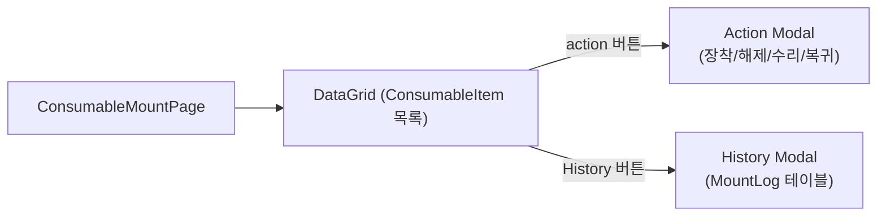
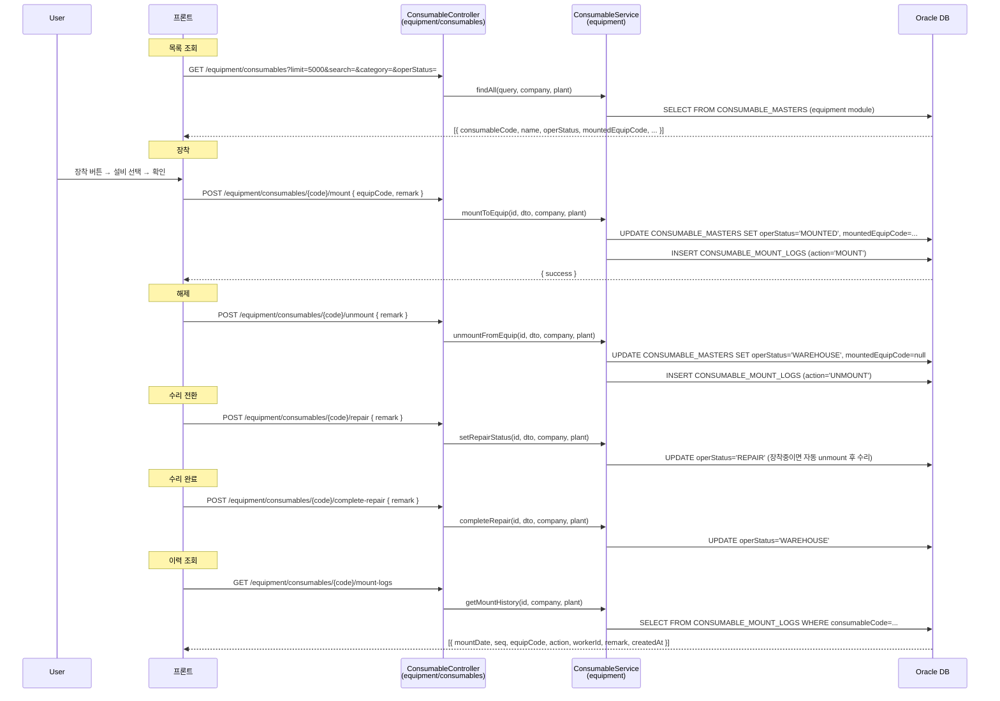
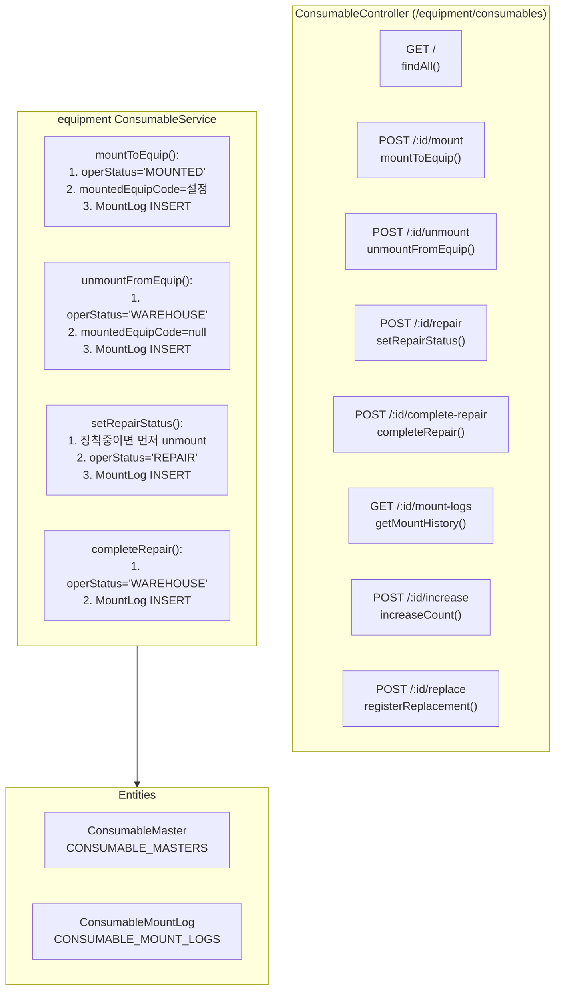

---
sources:
  - apps/backend/src/common/guards/jwt-auth.guard.ts
  - apps/backend/src/modules/equipment/controllers/consumable.controller.ts
  - apps/backend/src/modules/equipment/services/consumable.service.ts
verifiedCommit: 8a7e96ea
---

# 소모품 장착관리 — 비즈니스 로직 & 데이터 흐름 분석
> **분석 기준 커밋:** `8a7e96ea`
> **분석 일자:** `2026-07-04` / **개정:** `2026-09-14` (마스터 코드 단위 → 실물 인스턴스 단위 전환)

## 1. 화면 개요

설비에 장착된 소모품 **실물(conUid)** 현황을 조회하고, 현장에서 내리지 못한 건을 **강제 해제**하거나
**수리 상태로 전환**하는 관리자 예외 창구.

> **장착(MOUNT)은 이 화면에서 하지 않는다.** 장착은 현장 키오스크(실적입력)의 소모품 바코드 스캔에서만 일어난다.
> (`POST /production/job-orders/:orderNo/consumables/scan` → `KioskConsumableService.scanMount`)

### 2026-09-14 전환 요약

| 구분 | 이전 | 현재 |
| --- | --- | --- |
| 관리 단위 | 소모품 마스터 코드 1건 | 실물 UID(conUid) 1건 |
| 상태 컬럼 | `CONSUMABLE_MASTERS.OPER_STATUS` | `CONSUMABLE_STOCKS.STATUS` |
| 장착설비 | `CONSUMABLE_MASTERS.MOUNTED_EQUIP_ID` | `CONSUMABLE_STOCKS.MOUNTED_EQUIP_CODE` |
| 수명상태 | `CONSUMABLE_MASTERS.STATUS` | `CONSUMABLE_STOCKS.LIFE_STATUS` (신규 컬럼) |
| 장착 등록 | 이 화면에서 설비 선택 | 현장 키오스크 스캔 전용 |
| 타수 누적 | 금형은 마스터에 1타 고정, 그 외는 롯트에 소요량 | **롯트 단위 단일 경로** — 소요량(기본 1) × 실적수량 |

전환 이유: 장착 상태가 마스터와 롯트 두 군데에 따로 기록돼 동기화되지 않았고, 같은 코드 재고가 여러 개일 때
"어느 실물이 어느 설비에 붙었는지" 구분할 수 없었다. 마이그레이션 스크립트는
`scripts/2026-09-14_consumable_mount_to_instance.sql`.

| 항목 | 내용 |
|------|------|
| 메뉴 코드 | CONS_MOUNT |
| 경로 | `/consumables/mount` |
| 페이지 | `page.tsx` → `ConsumableMountPage` |
| 주요 역할 | 장착현황 조회 · 강제해제 · 수리 전환 (실물 UID 단위) |
| 권한 | JwtAuthGuard |
| API 베이스 | 목록 `GET /consumables/stocks` · 액션 `POST /equipment/consumables/:conUid/{action}` |

## 2. 화면 구성



| 컴포넌트 | 파일 | 설명 |
|----------|------|------|
| `ConsumableMountPage` | `page.tsx` | 메인 페이지 |
| `createConsumableMountGridColumns` | `consumableMountColumns.tsx` | DataGrid 컬럼 + Action/History 버튼 |
| `EquipSelect` | `@/components/shared` | 설비 선택 (장착 시) |
| `ComCodeSelect` | `@/components/shared` | 카테고리/운영상태 필터 |
| `StatusBadge` | `@/components/shared/StatusBadge` | operStatus 배지 |

## 3. 상태 관리

| 상태 | 설명 |
|------|------|
| `data` | 소모품 목록 (GET /equipment/consumables) |
| `searchTerm, categoryFilter, operStatusFilter` | 그리드 필터 |
| `actionType` | 'mount'/'unmount'/'repair'/'completeRepair' |
| `selectedItem` | action 대상 소모품 |
| `equipCode, remark` | action 입력값 |
| `saving` | API 호출 중 |
| `historyItem, historyData, historyLoading` | 이력 모달 상태 |

## 4. API 호출 흐름



## 5. 백엔드 처리



## 6. 처리 규칙 및 검증

| 규칙 | 설명 |
|------|------|
| 장착 | **이 화면에서 불가.** 키오스크 스캔에서만 — 공정대기(PROC_WAIT) + 출고공정 = 작업지시공정 + 사용맵 등록이 모두 맞아야 장착된다 |
| 강제해제 전제 | 롯트 상태가 `MOUNTED` 여야 함 |
| 강제해제 후 상태 | `returnTo` 로 선택 — `PROC_WAIT`(공정대기, 기본·공정 유지) / `ACTIVE`(창고 반납·공정 해제) / `REPAIR`(수리중·공정 해제) |
| 수리 전제 | 이미 `REPAIR` 면 거절. 장착 중이면 자동 해제 로그 후 전환 |
| 수리완료 전제 | 롯트 상태가 `REPAIR` 여야 함 → `ACTIVE` 복귀 |
| 설비당 1롯트 | 같은 설비에 같은 소모품 코드의 다른 롯트가 장착되면 기존 롯트는 자동 해제(공정대기 복귀) |
| MountLog 복합PK | `MOUNT_DATE` + `SEQ`. `CON_UID` 를 반드시 채운다(키오스크 장착/해제 포함) |
| 타수 누적 | 생산실적 저장 시 `ProdResultService.accrueConsumableUsageInTx` 가 처리. 누적량 = 소요량 × 실적수량, 사용맵 미등록이면 소요량 1(=1타) |
| 수명 인터락 | 누적 후 `LIFE_STATUS` 가 새로 `REPLACE` 가 되면 장착 설비를 `INTERLOCK` 으로 전환 |

## 7. 상태 전이 (ConsumableStock.status)

```mermaid
flowchart LR
  PENDING["PENDING<br/>(미입고)"] -->|라벨 입고확정| ACTIVE["ACTIVE<br/>(창고)"]
  ACTIVE -->|공정출고| PROC_WAIT["PROC_WAIT<br/>(공정대기)"]
  PROC_WAIT -->|키오스크 스캔 장착| MOUNTED["MOUNTED<br/>(설비장착)"]
  MOUNTED -->|키오스크 해제 / 강제해제| PROC_WAIT
  MOUNTED -->|강제해제(창고반납)| ACTIVE
  MOUNTED -->|수리 전환| REPAIR["REPAIR<br/>(수리중)"]
  ACTIVE -->|수리 전환| REPAIR
  PROC_WAIT -->|수리 전환| REPAIR
  REPAIR -->|수리 완료| ACTIVE
  ACTIVE -->|폐기| SCRAPPED["SCRAPPED<br/>(폐기)"]
```

### 7.1 수명 상태 전이 (ConsumableStock.lifeStatus)

`resolveConsumableLifeStatus`(packages/shared) 공통 규칙으로 생산실적 저장 시 재판정한다.
임계값(경고 타수 `WARNING_COUNT`, 기대수명 `EXPECTED_LIFE`)은 소모품 마스터에 등록한다.

```mermaid
flowchart LR
  NORMAL -->|누적 ≥ 경고타수| WARNING
  WARNING -->|누적 ≥ 기대수명| REPLACE
  REPLACE -->|교체 등록(타수 리셋)| NORMAL
```

## 8. 상태 코드 및 공통코드

| 코드 그룹 | 값 | 설명 |
|-----------|-----|------|
| `CON_STOCK_STATUS` | PENDING, ACTIVE, PROC_WAIT, MOUNTED, REPAIR, SCRAPPED | 실물 롯트 상태 (장착 판단 기준) |
| ~~`CONSUMABLE_OPER_STATUS`~~ | ~~WAREHOUSE, MOUNTED, REPAIR~~ | 2026-09-14 전환으로 **미사용** |
| `CONSUMABLE_CATEGORY` | MOLD, JIG, TOOL, ETC | 소모품 분류 |
| `CONSUMABLE_STATUS` | NORMAL, WARNING, REPLACE | 수명 상태 |

## 9. DB 테이블 영향 및 엔티티

| 테이블 | 엔티티 | 설명 |
|--------|--------|------|
| `CONSUMABLE_STOCKS` | `ConsumableStock` | status, mountedEquipCode, processCode, currentCount, **lifeStatus(신규)** 변경 |
| `CONSUMABLE_MASTERS` | `ConsumableMaster` | 조회만 (이름·분류·경고타수·기대수명). operStatus/mountedEquipCode 는 미사용 |
| `CONSUMABLE_MOUNT_LOGS` | `ConsumableMountLog` | 장착/해제 이력 — `CON_UID` 필수 |

ConsumableMountLog 컬럼:
- `MOUNT_DATE` + `SEQ` (복합PK)
- `CONSUMABLE_CODE`, `EQUIP_CODE`, `ACTION` (MOUNT/UNMOUNT)
- `WORKER_CODE`, `REMARK`, `CON_UID`
- `COMPANY`, `PLANT_CD`

## 10. 에러 코드

| HTTP | 상황 |
|------|------|
| 200 | action 성공 |
| 404 | 소모품 미존재 |
| 409 | 이미 장착된 금형 (mount 시 중복 장착) |
| 400 | 잘못된 상태 전이 |

## 11. 비고

- `CONS_MOUNT`는 `equipment/consumables` 경로 사용 (equipment 모듈 소속)
- CRUD 기본은 `consumables` 모듈이 정식, `equipment/consumables`는 설비 모듈 내 편의용
- DataGrid sqlQuery 표시는 CONSUMABLE_MASTERS 기준
- Action 버튼 가시성: operStatus에 따라 조건부 렌더링 (ex. MOUNTED면 unmount만 표시)
