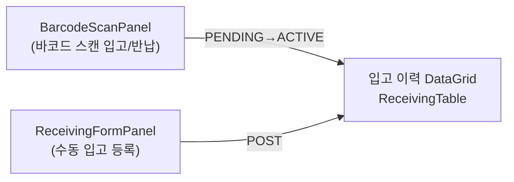
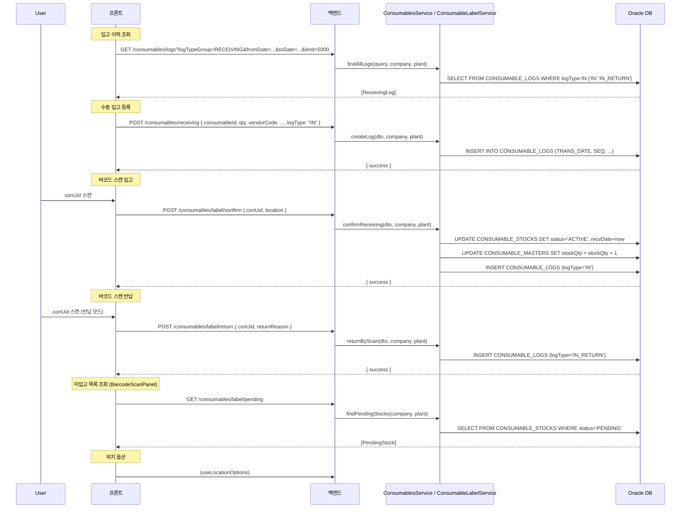
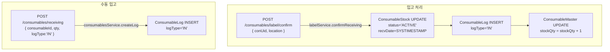

# 소모품 입고 관리 — 비즈니스 로직 & 데이터 흐름 분석
> **분석 기준 커밋:** `8a7e96ea`
> **분석 일자:** `2026-07-04`

## 1. 화면 개요

소모품의 입고/반납입고를 처리하는 메뉴. 바코드 스캔 입고 확정, 수동 입고 등록, 입고 이력 조회 기능 제공.

| 항목 | 내용 |
|------|------|
| 메뉴 코드 | CONS_RECEIVING |
| 경로 | `/consumables/receiving` |
| 페이지 | `ReceivingPage` |
| 주요 역할 | 소모품 입고/반납 + 이력 조회 |
| 권한 | JwtAuthGuard |

## 2. 화면 구성

| 컴포넌트 | 파일 | 설명 |
|----------|------|------|
| `ReceivingPage` | `page.tsx` | 메인 페이지 |
| `ReceivingTable` | `components/consumables/ReceivingTable.tsx` | 입고 이력 DataGrid |
| `ReceivingFormPanel` | `components/consumables/ReceivingFormPanel.tsx` | 수동 입고 등록 슬라이드 패널 |
| `BarcodeScanPanel` | `components/consumables/BarcodeScanPanel.tsx` | 바코드 스캔 입고/반납 |
| `DateRangeFilter` | `@/components/shared/DateRangeFilter` | 기간 필터 |
| `useReceivingData` | `hooks/consumables/useReceivingData.ts` | 데이터 조회 훅 |

## 3. 상태 관리

| 상태 | 소스 | 설명 |
|------|------|------|
| `data, isLoading` | `useReceivingData` | 입고 이력 데이터 |
| `searchTerm, setSearchTerm` | `useReceivingData` | 검색어 |
| `typeFilter, setTypeFilter` | `useReceivingData` | 유형 필터 (IN/IN_RETURN) |
| `startDate, endDate` | `useReceivingData` | 기간 필터 |
| `activePanel` | `ReceivingPage` | 열린 패널 (receiving\|null) |
| `saving` | `ReceivingPage` | 저장 로딩 |

## 4. API 호출 흐름

## 5. 백엔드 처리

## 6. 처리 규칙 및 검증

| 규칙 | 설명 |
|------|------|
| 바코드 입고 | PENDING → ACTIVE, recvDate 설정, stockQty 증가 |
| 수동 입고 | ConsumableLog만 INSERT (인스턴스 생성 별도 = 라벨 발행 필요) |
| 반납 입고 | IN_RETURN 로그만 기록 (재고 변동 없음) |
| 로그 SEQ | `SEQ_CONSUMABLE_LOGS.NEXTVAL` 오라클 시퀀스 |
| 로그 복합PK | `TRANS_DATE + SEQ` |
| 입고구분 | NEW(신규), REPLACEMENT(교체) |

## 7. 상태 전이

## 8. 상태 코드 및 공통코드

| 코드 그룹 | 값 | 설명 |
|-----------|-----|------|
| `CON_STOCK_STATUS` | PENDING, ACTIVE | 인스턴스 상태 |
| `CONSUMABLE_CATEGORY` | MOLD, JIG, TOOL, ETC | 소모품 분류 |

## 9. DB 테이블 영향 및 엔티티

| 테이블 | 엔티티 | 설명 |
|--------|--------|------|
| `CONSUMABLE_LOGS` | `ConsumableLog` | 입고 이력 (logType='IN'/'IN_RETURN') |
| `CONSUMABLE_STOCKS` | `ConsumableStock` | 바코드 스캔 시 status/recvDate 변경 |
| `CONSUMABLE_MASTERS` | `ConsumableMaster` | stockQty 증가 |

ConsumableLog 입고 시 컬럼:
- `TRANS_DATE`, `SEQ` (복합PK)
- `CONSUMABLE_CODE`, `LOG_TYPE` ('IN'/'IN_RETURN')
- `QTY`, `VENDOR_CODE`, `VENDOR_NAME`, `UNIT_PRICE`
- `INCOMING_TYPE` ('NEW'/'REPLACEMENT')
- `COMPANY`, `PLANT_CD`

## 10. 에러 코드

| HTTP | 상황 |
|------|------|
| 201 | 입고 등록 성공 |
| 200 | 조회/스캔 성공 |
| 404 | conUid 미존재 |
| 400 | 필수값 누락 |

## 11. 비고

- ReceivingFormPanel의 `ConsumableSearchModal`로 소모품 선택 (자유입력 금지)
- BarcodeScanPanel은 `BarcodeScanInput` 사용 (스캔 전용 입력)
- `ReceivingReturnPanel.tsx`는 현재 호출 미확인 (레거시로 보임), ReceivingPage는 BarcodeScanPanel의 반납 모드 사용
