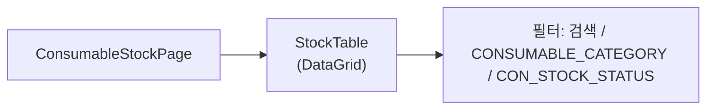
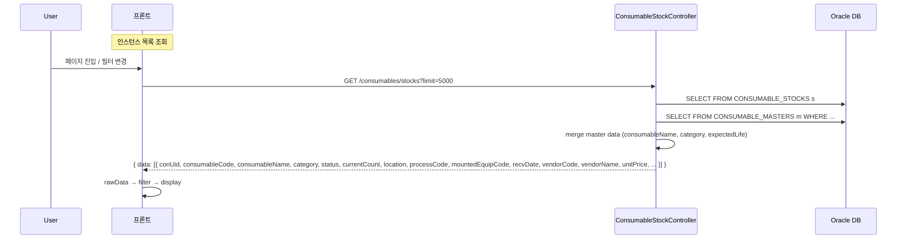
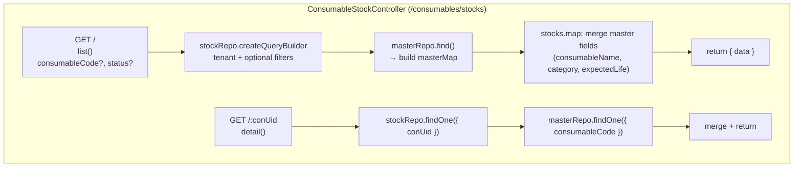

---
sources:
  - apps/backend/src/common/guards/jwt-auth.guard.ts
  - apps/backend/src/modules/consumables/controllers/consumable-stock.controller.ts
  - apps/frontend/src/hooks/consumables/useStockData.ts
verifiedCommit: 8a7e96ea
---

# 소모품 재고 현황 — 비즈니스 로직 & 데이터 흐름 분석
> **분석 기준 커밋:** `8a7e96ea`
> **분석 일자:** `2026-07-04`

## 1. 화면 개요

소모품 개별 인스턴스(conUid) 단위로 재고 현황을 모니터링하는 메뉴. conUid별 상태, 위치, 사용횟수 등을 조회.

| 항목 | 내용 |
|------|------|
| 메뉴 코드 | CONS_STOCK |
| 경로 | `/consumables/stock` |
| 페이지 | `page.tsx` → `ConsumableStockPage` |
| 주요 역할 | conUid별 인스턴스 현황 조회 |
| 권한 | JwtAuthGuard |

## 2. 화면 구성

| 컴포넌트 | 파일 | 설명 |
|----------|------|------|
| `ConsumableStockPage` | `page.tsx` | 메인 페이지 (state-less, hook 위임) |
| `StockTable` | `components/consumables/StockTable.tsx` | 재고 DataGrid |
| `useStockData` | `hooks/consumables/useStockData.ts` | 데이터 조회 + 필터 + 통계 |
| `ComCodeSelect` | `@/components/shared` | 카테고리/상태 필터 |

## 3. 상태 관리

| 상태 | 소스 | 설명 |
|------|------|------|
| `rawData` | `useStockData` | 전체 인스턴스 원본 |
| `isLoading` | `useStockData` | 조회 중 |
| `searchTerm` | `useStockData` | 검색어 (conUid/코드/명/공정코드) |
| `categoryFilter` | `useStockData` | 카테고리 필터 |
| `stockStatusFilter` | `useStockData` | 상태 필터 (CON_STOCK_STATUS) |
| `filteredData` | `useStockData` | 필터링 결과 |
| `summary` | `useStockData` | 통계 (totalItems, activeCount, mountedCount, pendingCount) |

## 4. API 호출 흐름

## 5. 백엔드 처리

## 6. 처리 규칙 및 검증

| 규칙 | 설명 |
|------|------|
| 데이터 범위 | tenant(COMPANY + PLANT_CD) 기준 |
| 마스터 조인 | ConsumableStock + ConsumableMaster를 별도 쿼리 후 in-memory merge |
| 수명 표시 | currentCount / expectedLife 비율로 색상 표시 (FE 계산) |
| 검색 필터 | FE 측 filter (백엔드는 전체 조회) |
| 통계 | FE에서 rawData 기반 계산 (totalItems, activeCount, mountedCount, pendingCount) |

## 7. 상태 값

ConsumableStock.status (CON_STOCK_STATUS):
- `PENDING` — 미입고 (라벨 발행 후 입고 전)
- `ACTIVE` — 창고 보관
- `PROC_WAIT` — 공정 대기 (출고 완료)
- `MOUNTED` — 설비 장착 중
- `DISPOSED` — 폐기
- `LOST` — 분실

## 8. 상태 코드 및 공통코드

| 코드 그룹 | 설명 |
|-----------|------|
| `CONSUMABLE_CATEGORY` | 소모품 분류 |
| `CON_STOCK_STATUS` | 인스턴스 재고 상태 |

## 9. DB 테이블 영향 및 엔티티

| 테이블 | 엔티티 | 설명 |
|--------|--------|------|
| `CONSUMABLE_STOCKS` | `ConsumableStock` | 개별 인스턴스 |
| `CONSUMABLE_MASTERS` | `ConsumableMaster` | 마스터 정보 (consumableName, category, expectedLife) |

ConsumableStock 주요 컬럼:
- `CON_UID` (PK), `CONSUMABLE_CODE`
- `STATUS`, `CURRENT_COUNT`, `LOCATION`
- `PROCESS_CODE`, `MOUNTED_EQUIP_CODE`
- `RECV_DATE`, `VENDOR_CODE`, `VENDOR_NAME`, `UNIT_PRICE`
- `COMPANY`, `PLANT_CD`

## 10. 에러 코드

| HTTP | 상황 |
|------|------|
| 200 | 조회 성공 |
| 404 | conUid 미존재 (상세 조회 시) |

## 11. 비고

- 현재 화면은 read-only 조회 전용 (재고 조작은 CONS_RECEIVING/CONS_ISSUING/CONS_MOUNT에서)
- `limit=5000`으로 전체 데이터 조회 후 FE에서 필터링
- 수명 비율 시각화: `currentCount / expectedLife` 값을 progress bar로 표시
- `StockTable`의 columns에서 `qty` 컬럼은 항상 1 (개별 conUid 단위)
