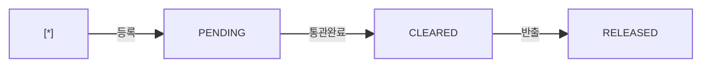

# 보세 수입신고 — 비즈니스 로직 & 데이터 흐름 분석

> **분석 기준 커밋:** `8a7e96ea`
> **분석 일자:** `2026-07-04`

---

## 1. 화면 개요

| 항목 | 내용 |
|------|------|
| **메뉴 코드** | `CUST_ENTRY` |
| **URL** | `/customs/entry` |
| **메뉴 경로** | 관세관리 > 수입신고 |
| **화면 목적** | 보세 수입신고 CRUD + LOT 관리 |
| **주요 사용자** | 관세/구매 담당자 |

## 2. 화면 구성

| 영역 | 역할 |
| --- | --- |
| 헤더 | 타이틀 + 새로고침/신규 |
| 스탯카드 4개 | Pending/Cleared/Released/Lot수 |
| DataGrid | 수입신고 목록 |
| 모달 | 생성/수정 폼 (entryNo, blNo, invoiceNo, origin, hsCode, amount, dates, status) |

## 3. API 호출 흐름

| 시점 | API | 용도 |
| --- | --- | --- |
| 페이지 로드 | `GET /customs/entries?limit=5000&search=` | 목록 |
| 생성 | `POST /customs/entries { form }` | 신규 |
| 수정 | `PUT /customs/entries/:no { form }` | 수정 |

## 4. 백엔드 처리 — `customs.controller.ts`

- `GET /customs/entries` — `CustomsEntry` 목록 + lotCount 집계
- `POST/PUT /customs/entries` — CRUD (단순 save)

## 5. 상태 전이

### CustomsEntry.status

## 6. DB 테이블 영향

| 테이블 | 변경 |
|--------|------|
| `CUSTOMS_ENTRIES` | INSERT/UPDATE |

## 7. 엔티티

| 엔티티 | 테이블명 |
|--------|----------|
| `CustomsEntry` | `CUSTOMS_ENTRIES` |
| `CustomsLot` | `CUSTOMS_LOTS` (자식) |

## 8. 비고

- `CUSTOMS_ENTRY_STATUS` 공통코드 사용 (ComCodeSelect)
- entryNo 자연키 (사용자 입력)
- 단순 CRUD 패턴 (복잡한 상태머신 없음)
