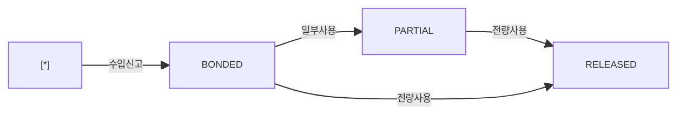

# 보세 재고현황 — 비즈니스 로직 & 데이터 흐름 분석

> **분석 기준 커밋:** `8a7e96ea`
> **분석 일자:** `2026-07-04`

---

## 1. 화면 개요

| 항목 | 내용 |
|------|------|
| **메뉴 코드** | `CUST_STOCK` |
| **URL** | `/customs/stock` |
| **메뉴 경로** | 관세관리 > 보세재고현황 |
| **화면 목적** | 보세 LOT별 재고 현황 조회 (수량/잔량/상태) |
| **주요 사용자** | 관세/자재 담당자 |

## 2. 화면 구성

| 영역 | 역할 |
| --- | --- |
| 헤더 | 타이틀 + 새로고침 |
| 스탯카드 3개 | TotalLots/BondedLots/TotalRemain |
| DataGrid | 보세 LOT 목록 (entryNo, matUid, itemCode, qty, usedQty, remainQty, status) |

## 3. API 호출 흐름

| 시점 | API | 용도 |
| --- | --- | --- |
| 페이지 로드 | `GET /customs/stock?limit=5000&search=&status=` | 보세 LOT 목록 |

## 4. 백엔드 처리 — `customs.controller.ts`

- `GET /customs/stock` — `CustomsLot` 목록 조회 (remainQty = qty - usedQty)

## 5. 상태 전이

### CustomsLot.status

## 6. DB 테이블 영향

| 테이블 | 변경 |
|--------|------|
| `CUSTOMS_LOTS` | SELECT only |

## 7. 엔티티

| 엔티티 | 테이블명 |
|--------|----------|
| `CustomsLot` | `CUSTOMS_LOTS` |
| `CustomsEntry` | `CUSTOMS_ENTRIES` (부모) |
| `ItemMaster` | `ITEM_MASTERS` (참조) |

## 8. 비고

- 조회 전용(read-only)
- `CUSTOMS_LOT_STATUS` 공통코드 사용
- LOT 상태는 usage 등록 시 자동 갱신 (BONDED→PARTIAL→RELEASED)
