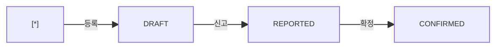

# 보세 사용신고 — 비즈니스 로직 & 데이터 흐름 분석

> **분석 기준 커밋:** `8a7e96ea`
> **분석 일자:** `2026-07-04`

---

## 1. 화면 개요

| 항목 | 내용 |
|------|------|
| **메뉴 코드** | `CUST_USAGE` |
| **URL** | `/customs/usage` |
| **메뉴 경로** | 관세관리 > 보세사용신고 |
| **화면 목적** | 보세 자재 사용 내역 CRUD + 신고/확정 상태 관리 |
| **주요 사용자** | 관세/생산 담당자 |

## 2. 화면 구성

| 영역 | 역할 |
| --- | --- |
| 헤더 | 타이틀 + 새로고침/신규 |
| 스탯카드 3개 | Draft/Reported/Confirmed |
| DataGrid | 사용신고 목록 (reportNo, lotEntryNo, matUid, usageQty, status) |
| 모달 | 생성 폼 (entryNo, matUid, usageQty, jobOrderNo, remark) |

## 3. API 호출 흐름

| 시점 | API | 용도 |
| --- | --- | --- |
| 페이지 로드 | `GET /customs/usage?limit=5000&search=` | 목록 |
| 생성 | `POST /customs/usage { form }` | 사용신고 등록 |
| 신고 | `PUT /customs/usage/:no { status: REPORTED }` | DRAFT→REPORTED |
| 확정 | `PUT /customs/usage/:no { status: CONFIRMED }` | REPORTED→CONFIRMED |

## 4. 백엔드 처리 — `customs.controller.ts`

- `GET /customs/usage` — `CustomsUsageReport` 목록
- `POST /customs/usage` — INSERT, `CUSTOMS_LOTS.usedQty` 증가, remainQty 재계산
- `PUT /customs/usage/:no` — status 변경

## 5. 상태 전이

### CustomsUsageReport.status

## 6. DB 테이블 영향

| 테이블 | 변경 |
|--------|------|
| `CUSTOMS_USAGE_REPORTS` | INSERT/UPDATE |
| `CUSTOMS_LOTS` | UPDATE usedQty, remainQty, status |

## 7. 엔티티

| 엔티티 | 테이블명 |
|--------|----------|
| `CustomsUsageReport` | `CUSTOMS_USAGE_REPORTS` |
| `CustomsLot` | `CUSTOMS_LOTS` (참조) |

## 8. 비고

- `usageQty` 등록 시 `CUSTOMS_LOTS.remainQty` 자동 차감
- remainQty=0 도달 시 LOT status RELEASED 자동 전이
- 3단계 단순 상태 전이 (DRAFT→REPORTED→CONFIRMED)
