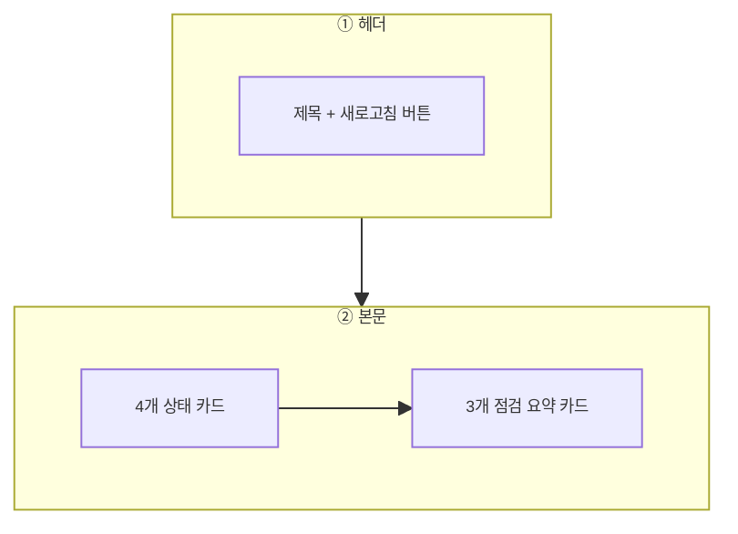

---
sources:
  - apps/backend/src/modules/dashboard/dashboard.controller.ts
  - apps/backend/src/modules/dashboard/dashboard.service.ts
verifiedCommit: 8a7e96ea
---

# 대시보드 — 비즈니스 로직 & 데이터 흐름 분석

> **분석 기준 커밋:** `8a7e96ea8e9f2710bd79a8c5d12cbbc8ecc1ab26`
> **분석 일자:** `2026-07-04`

---

## 1. 화면 개요

| 항목 | 내용 |
|------|------|
| **메뉴 코드** | `DASHBOARD` |
| **URL** | `/dashboard` |
| **메뉴 경로** | `(최상위)` |
| **화면 목적** | 설비 가동, 작업지시, 자재 알림, 품질 이슈 현황과 일상/정기/예방점검 요약을 한 화면에 표시 |
| **주요 사용자** | 생산관리자, 품질관리자, 설비관리자 |
| **Workflow 노드** | 해당 없음 (워크플로우 맵 진입점 아님) |

## 2. 화면 구성

### 2.1 레이아웃

| 영역 | 컴포넌트 | 역할 |
| --- | --- | --- |
| ① 헤더 | page.tsx 내 `div.flex` | 제목, 설명, 새로고침 버튼 (`RefreshCw`) |
| ②-1 | `StatusCard` (x4) | 설비 가동 현황, 오늘 작업지시, 자재 알림, 불량 현황 |
| ②-2 | `InspectSummaryCard` (x3) | 일상점검, 정기점검, 예방보전 (PM) 요약 |

### 2.2 입력 필드

| 필드 | 타입 | 설명 |
| --- | --- | --- |
| `날짜` | 내부 계산 (`new Date()`) | 오늘 날짜 기준 (`"YYYY-MM-DD"`)으로 API 호출 |

### 2.3 버튼/액션

| 버튼 | 핸들러 | 설명 |
| --- | --- | --- |
| 새로고침 (`RefreshCw`) | `fetchData()` | 전체 데이터 다시 호출 (로딩 중 spin) |
| 더보기 (`ChevronRight`) | `next/link` | `/equipment/inspect-calendar`, `/equipment/periodic-inspect-calendar`, `/equipment/pm-calendar` 이동 |

## 3. 상태 관리

Zustand store 미사용. `useState`로 모든 상태를 로컬 관리:

| 상태 | 타입 | 초기값 |
| --- | --- | --- |
| `equip` | `EquipStats` | `{ normal:0, maint:0, stop:0, total:0 }` |
| `job` | `JobStats` | `{ wait:0, running:0, done:0, total:0 }` |
| `mat` | `MatAlert` | `{ lowStock:0, nearExpiry:0, expired:0 }` |
| `defect` | `DefectStats` | `{ wait:0, repair:0, rework:0, done:0, total:0 }` |
| `daily` | `InspectSummary` | `emptySummary` |
| `periodic` | `InspectSummary` | `emptySummary` |
| `pm` | `InspectSummary` | `emptySummary` |
| `loading` | boolean | `false` |
| `inspectLoading` | boolean | `false` |

## 4. API 호출 흐름

### 4-1. 조회

| 시점 | API | 용도 |
| --- | --- | --- |
| 최초 마운트 (`useEffect` → `fetchData()`) | `GET /dashboard/summary?date={today}` | 설비/작업/자재/불량 통계 + 점검 요약 7개 섹션 일괄 조회 |

`fetchData`는 `useCallback`으로 `[today]` 의존성 가지고 있으며 `loading`, `inspectLoading`을 모두 true로 설정 후 API 응답을 받아 7개 상태를 한 번에 설정한다.

## 5. 백엔드 처리

### 5-1. Controller: `DashboardController` (`apps/backend/src/modules/dashboard/dashboard.controller.ts`)

| Endpoint | 핸들러 |
| --- | --- |
| `GET /dashboard/summary?date=` | `getSummary(date, company, plant)` → `DashboardService.getSummary()` |

### 5-2. Service: `DashboardService` (`apps/backend/src/modules/dashboard/dashboard.service.ts`)

`getSummary()`는 7개 프로시저를 `Promise.all`로 병렬 호출한다:

| 프로시저 (PKG_DASHBOARD) | 설명 | 반환 커서 |
| --- | --- | --- |
| `SP_EQUIP_STATS` | 설비 상태별 카운트 (normal/maint/stop/total) | 단일 ref cursor |
| `SP_JOB_ORDER_STATS` | 작업지시 상태별 카운트 (wait/running/done/total) | 단일 ref cursor |
| `SP_MAT_ALERT` | 자재 알림 (안전재고/유효기한) | 단일 ref cursor |
| `SP_DEFECT_STATS` | 불량 상태별 카운트 (wait/repair/rework/done/total) | 단일 ref cursor |
| `SP_INSPECT_DAILY` | 일상점검 요약 + 설비별 결과 | 다중 커서 `o_summary` + `o_items` |
| `SP_INSPECT_PERIODIC` | 정기점검 요약 + 설비별 결과 | 다중 커서 `o_summary` + `o_items` |
| `SP_INSPECT_PM` | 예방보전 요약 + 설비별 결과 | 다중 커서 `o_summary` + `o_items` |

Oracle `callProc` / `callProcMultiCursor`로 실행. Tenant scope는 `@Company()` / `@Plant()` decorator에서 추출.

## 6. 처리 규칙 및 검증

| 규칙 | 설명 |
| --- | --- |
| 오늘 날짜 기준 | `formatDate(new Date())`로 `YYYY-MM-DD` 생성, UTC 변환 방지를 위해 `+ "T00:00:00"` 후 `new Date()` |
| 점검 3종 분리 | 일상/정기/PM 각각 `InspectSummaryCard`로 렌더링, 링크도 각각 분기 |
| 카드 gradient | 각 카드마다 고정 gradient 스트링 사용 (하드코딩) |
| 결과 배지 | `INSPECT_JUDGE` 공통코드 사용: PASS(초록), FAIL(빨강), CONDITIONAL(노랑), COMPLETED(초록). 없는 경우 `Clock` 아이콘 + "미실시" |

## 7. 상태 전이

상태 전이 없음. 읽기 전용 현황판.

## 8. 상태 코드 및 공통코드

| 코드 | 값 | 표시 |
| --- | --- | --- |
| `comCode.INSPECT_JUDGE.PASS` | PASS | ✅ |
| `comCode.INSPECT_JUDGE.FAIL` | FAIL | ❌ |
| `comCode.INSPECT_JUDGE.CONDITIONAL` | CONDITIONAL | ⚠️ |
| `comCode.INSPECT_JUDGE.COMPLETED` | COMPLETED | ✅ |

## 9. DB 테이블 영향 및 엔티티

읽기 전용. Oracle 패키지 `PKG_DASHBOARD` 내부에서 조회 전용. 엔티티 없음.

| 패키지 프로시저 | 주요 조회 테이블 (추정) |
| --- | --- |
| `SP_EQUIP_STATS` | `EQUIP_MASTERS` |
| `SP_JOB_ORDER_STATS` | `JOB_ORDERS` |
| `SP_MAT_ALERT` | `MAT_STOCKS` |
| `SP_DEFECT_STATS` | `DEFECT_LOGS` |
| `SP_INSPECT_DAILY` | `EQUIP_INSPECT_LOGS`, `EQUIP_INSPECT_ITEM_MASTERS` |
| `SP_INSPECT_PERIODIC` | `EQUIP_PERIODIC_INSPECT_LOGS` |
| `SP_INSPECT_PM` | `PM_PLANS`, `PM_LOGS` |

## 10. 에러 코드 및 메시지

| 상황 | 처리 |
| --- | --- |
| API 실패 | `catch` 블록에서 무시, 기존 상태 유지 |

## 11. 비고

- Zunstand store 미사용. 전역 상태 없음.
- `StatusCard`는 page.tsx 내부에 인라인으로 정의된 프레젠테이셔널 컴포넌트.
- InspectSummaryCard는 별도 파일(`components/InspectSummaryCard.tsx`)로 분리.
- 자재 알림 합계는 프론트에서 `lowStock + nearExpiry + expired`로 직접 계산.
- `t()` 기본값 사용으로 i18n key 없을 시 폴백 문자열 출력.