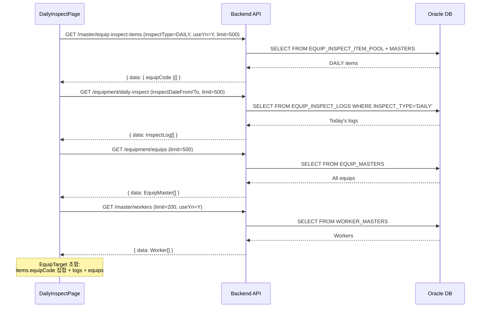

---
sources:
  - apps/backend/src/modules/equipment/controllers/daily-inspect.controller.ts
  - apps/frontend/src/app/(authenticated)/equipment/daily-inspect/components/EquipListPanel.tsx
  - apps/frontend/src/app/(authenticated)/equipment/daily-inspect/components/InspectEntryPanel.tsx
verifiedCommit: 8a7e96ea
---

# 일일설비점검 (EQUIP_DAILY) — 비즈니스 로직 & 데이터 흐름 분석
> **분석 기준 커밋:** `8a7e96ea`
> **분석 일자:** `2026-07-04`

## 1. 화면 개요
- **메뉴명:** 일일설비점검
- **경로:** `/equipment/daily-inspect`
- **유형:** 점검 결과 일괄 입력
- **주요 기능:** 사무실에서 다수 설비의 일상점검을 한 번에 처리, 누락분 보정

## 2. 화면 구성
```
┌────────────────────────────────────────────────────────┐
│ Header (제목 + 날짜선택 + 새로고침)                     │
├──────────────────────┬─────────────────────────────────┤
│ EquipListPanel (6fr) │ InspectEntryPanel (7fr)         │
│ - 금일 점검 대상      │ - 선택 설비의 점검항목 인라인 입력│
│ - 미점검/완료 상태    │ - 작업자 선택                    │
│ - 항목수 표시         │ - PASS/FAIL 라디오              │
│                      │ - 저장 버튼                     │
└──────────────────────┴─────────────────────────────────┘
```

### 컴포넌트 구조
| 컴포넌트 | 위치 | 설명 |
|---------|------|------|
| DailyInspectPage | page.tsx | 메인 페이지 |
| EquipListPanel | components/EquipListPanel.tsx | 대상 설비 목록 (재사용) |
| InspectEntryPanel | components/InspectEntryPanel.tsx | 점검 항목 입력 (재사용) |

## 3. API 호출 흐름


## 4. 화면 내 조합 로직
1. 모든 DAILY 점검항목에서 equipCode 중복 제거
2. 각 equipCode별 itemCount 계산
3. 해당일 점검 로그에서 overallResult/inspectorName 매칭
4. EQUIP_MASTERS에서 equipName/equipType 조회
5. 상태: done-ok(PASS), done-ng(FAIL), none(미점검)

## 5. 백엔드 처리
- DailyInspectController의 `GET` 엔드포인트 사용
- InspectEntryPanel 통해 POST/PUT 저장
- API BasePath: `/equipment/daily-inspect` (기본값)

## 6. 처리 규칙
1. **날짜 변경 시** selectedEquipCode 리셋
2. **EquipListPanel**과 **InspectEntryPanel**은 정기점검 화면과 공유
3. **저장:** POST(신규) / PUT(수정)

## 7. DB 테이블
- EQUIP_INSPECT_LOGS (동일)
- EQUIP_INSPECT_ITEM_POOL (참조)
- EQUIP_MASTERS (참조)

## 8. 비고
- 캘린더 화면과 동일한 DB 테이블 사용
- 정기점검(periodic-inspect)과 동일한 컴포넌트 공유 (inspectType=PERIODIC으로 오버라이드)
