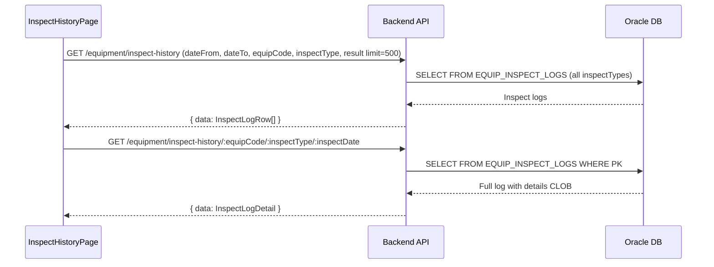

# 설비점검 이력 (EQUIP_HISTORY) — 비즈니스 로직 & 데이터 흐름 분석
> **분석 기준 커밋:** `8a7e96ea`
> **분석 일자:** `2026-07-04`

## 1. 화면 개요
- **메뉴명:** 설비점검 이력
- **경로:** `/equipment/inspect-history`
- **유형:** 통합 이력 조회
- **주요 기능:** 설비별 일상/정기/PM 모든 점검 이력 통합 조회

## 2. 화면 구성
```
┌──────────────────────────────────────────────────────────┐
│ Header (제목 + 검색 필터)                                │
├──────────────────────────────────────────────────────────┤
│ DataGrid (통합 점검 이력)                                │
│ - 컬럼: equipCode, equipName, inspectType, inspectDate,  │
│   overallResult, inspectorName, detailCount              │
│ - 행 클릭 → 상세 모달 (InspectDetailModal)               │
│ - 필터: 기간, 설비, 점검유형, 결과                       │
└──────────────────────────────────────────────────────────┘
```

### 컴포넌트 구조
| 컴포넌트 | 위치 | 설명 |
|---------|------|------|
| InspectHistoryPage | page.tsx | 메인 페이지 |
| InspectHistoryFilter | components/InspectHistoryFilter.tsx | 필터 |
| InspectHistoryGrid | components/InspectHistoryGrid.tsx | DataGrid |
| InspectDetailModal | components/InspectDetailModal.tsx | 항목별 상세 JSON 렌더링 |

### DataGrid 컬럼
inspectDate, equipCode, equipName, inspectType(ComCodeBadge: DAILY/PERIODIC/PM), overallResult(ComCodeBadge: PASS/FAIL), inspectorName, detailCount, remark

## 3. 상태 관리
- **filters**: { dateFrom, dateTo, equipCode, inspectType, result }
- **data**: 통합 이력 목록
- **selectedRow**: 선택한 이력 (상세 모달용)

## 4. API 호출 흐름


## 5. 백엔드 처리

### InspectHistoryController (`apps/backend/src/modules/equipment/controllers/inspect-history.controller.ts`)
- `@Controller('equipment/inspect-history')`
- GET findAll — 통합 이력 조회 (Query: dateFrom, dateTo, equipCode, inspectType, result)
- GET :equipCode/:inspectType/:inspectDate — 상세 조회

### InspectHistoryService
- `findAll(query, company, plant)` — EQUIP_INSPECT_LOGS 전체 조회 (type 불문)
- `findOne(equipCode, inspectType, inspectDate, company, plant)` — 단건 + details JSON 파싱

## 6. 처리 규칙
1. **점검유형:** DAILY / PERIODIC / PM 3가지 통합 표시
2. **상세:** details CLOB JSON을 파싱하여 항목별 결과 표시
3. **기본 기간:** 최근 1개월 (useEffect)

## 7. DB 테이블
- EQUIP_INSPECT_LOGS (all inspectTypes)

## 8. 공통코드
| 그룹코드 | 용도 |
|---------|------|
| INSPECT_TYPE | 점검유형 (DAILY/PERIODIC/PM) |
| INSPECT_JUDGE | 점검결과 (PASS/FAIL) |

## 9. 비고
- PM 결과도 EQUIP_INSPECT_LOGS에 저장 (inspectType='PM')
- 단일 테이블 통합 조회로 inspectType/overallResult는 공통코드 배지
