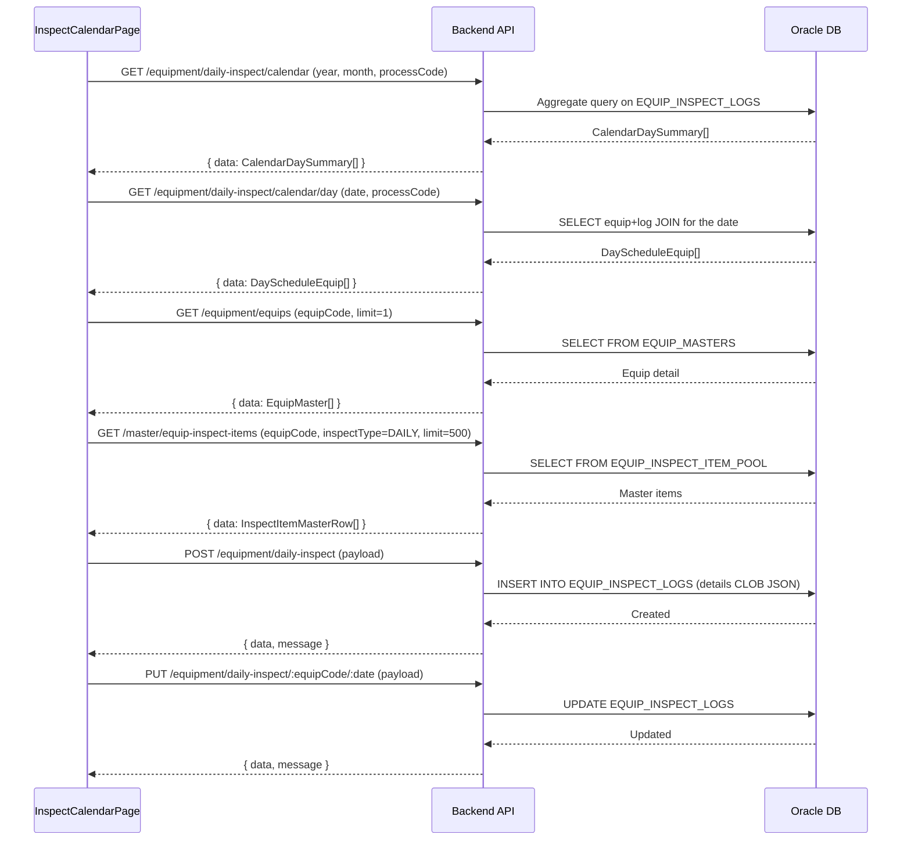

---
sources:
  - apps/backend/src/modules/equipment/controllers/daily-inspect.controller.ts
verifiedCommit: 8a7e96ea
---

# 설비 일상점검 캘린더 (EQUIP_INSPECT_CALENDAR) — 비즈니스 로직 & 데이터 흐름 분석
> **분석 기준 커밋:** `8a7e96ea`
> **분석 일자:** `2026-07-04`

## 1. 화면 개요
- **메뉴명:** 설비 일상점검 캘린더
- **경로:** `/equipment/inspect-calendar`
- **유형:** 스케줄 조회 + 점검 실행
- **주요 기능:** 월별 점검 스케줄 캘린더 조회, 일별 상세, 항목별 점검 결과 입력

## 2. 화면 구성
```
┌───────────────────────────────────────────────────────────────┐
│ Header (제목 + 공정필터 + 당월생성/차월생성)                   │
├───────────────────────────────────────────────────────────────┤
│ StatCard: 월 전체 계획/완료/불량/지연                           │
├────────────────────────┬──────────────────────────────────────┤
│ InspectCalendar (7열)  │ DaySchedulePanel                      │
│ - 월별 캘린더          │ - 선택일의 설비별 점검 목록            │
│ - 색상: ALL_PASS(초록)  │ - 점검실행 버튼 → InspectExecuteModal │
│   HAS_FAIL(빨강)        │ - 개별점검추가 → 설비선택 → 실행모달  │
│   IN_PROGRESS(노랑)     │                                      │
│   OVERDUE(빨간테두리)   │                                      │
└────────────────────────┴──────────────────────────────────────┘
```

### 컴포넌트 구조
| 컴포넌트 | 위치 | 설명 |
|---------|------|------|
| InspectCalendarPage | page.tsx | 메인 페이지 |
| InspectCalendar | components/InspectCalendar.tsx | 월별 캘린더 그리드 (재사용) |
| DaySchedulePanel | components/DaySchedulePanel.tsx | 일별 스케줄 패널 (재사용) |
| InspectExecuteModal | components/InspectExecuteModal.tsx | 점검 실행 모달 (재사용) |

## 3. 상태 관리
- calendarData: `CalendarDaySummary[]` — 월별 요약
- selectedDate: 선택일
- dayData: `DayScheduleEquip[]` — 일별 상세
- modalEquip: 실행 모달 대상 설비
- addEquipCode: 개별 추가 선택된 설비

## 4. API 호출 흐름


## 5. 백엔드 처리

### DailyInspectController (`apps/backend/src/modules/equipment/controllers/daily-inspect.controller.ts`)
- `@Controller('equipment/daily-inspect')`
- GET /calendar — 월별 요약 (inspectType='DAILY')
- GET /calendar/day — 일별 상세
- GET — 목록 조회
- GET :equipCode/:inspectDate — 상세 조회
- POST — 생성 (inspectType=DAILY)
- PUT :equipCode/:inspectDate — 수정
- DELETE :equipCode/:inspectDate — 삭제

### EquipInspectService (equipment)
- `getCalendarSummary(year, month, processCode, inspectType, company, plant)` — 캘린더 데이터 집계
- `getDaySchedule(date, processCode, inspectType, company, plant)` — 일별 스케줄
- `create(dto, tenant)` — INSERT with details JSON
- `update(equipCode, inspectType, date, dto, company, plant)` — UPDATE

## 6. 처리 규칙 및 검증
1. **캘린더 생성:** 당월/차월 버튼으로 해당 월 조회 (DB에 미리 생성된 데이터 기준)
2. **점검 실행:** 항목별 PASS/FAIL 선택 → FAIL 시 비고 필수 → 종합결과 자동 계산
3. **종합 판정:** 1건이라도 FAIL이면 전체 FAIL
4. **개별 점검 추가:** 설비 선택 → 마스터에서 DAILY 항목 자동 로드
5. **수정 모드:** 이미 점검이 완료된 설비는 수정 가능 (PUT)
6. **작업자 선택:** WorkerSelect(useWorkerOptions)에서 작업자 선택

## 7. 상태 전이 (점검결과)
각 점검항목: 미입력 → PASS 또는 FAIL
종합결과: PASS(전체 OK) / FAIL(1건 이상 FAIL)

## 8. DB 테이블

### EQUIP_INSPECT_LOGS
| 컬럼 | 타입 | 설명 |
|------|------|------|
| EQUIP_CODE | VARCHAR2(50) PK | 설비코드 |
| INSPECT_TYPE | VARCHAR2(50) PK | DAILY |
| INSPECT_DATE | DATE PK | 점검일 |
| ORDER_NO | VARCHAR2(50) | 오더번호 |
| INSPECTOR_NAME | VARCHAR2(100) | 점검자 |
| OVERALL_RESULT | VARCHAR2(50) | 종합결과 (PASS/FAIL) |
| DETAILS | CLOB | 항목별 결과 (JSON) |
| REMARK | VARCHAR2(500) | 비고 |

## 9. 공통코드
| 그룹코드 | 용도 |
|---------|------|
| INSPECT_JUDGE | 점검결과 (PASS/FAIL) |

## 10. 비고
- InspectCalendar, DaySchedulePanel, InspectExecuteModal은 정기점검 캘린더와 공유
- InspectExecuteModal은 `inspectType`, `apiBasePath` props로 DAILY/PERIODIC 전환
