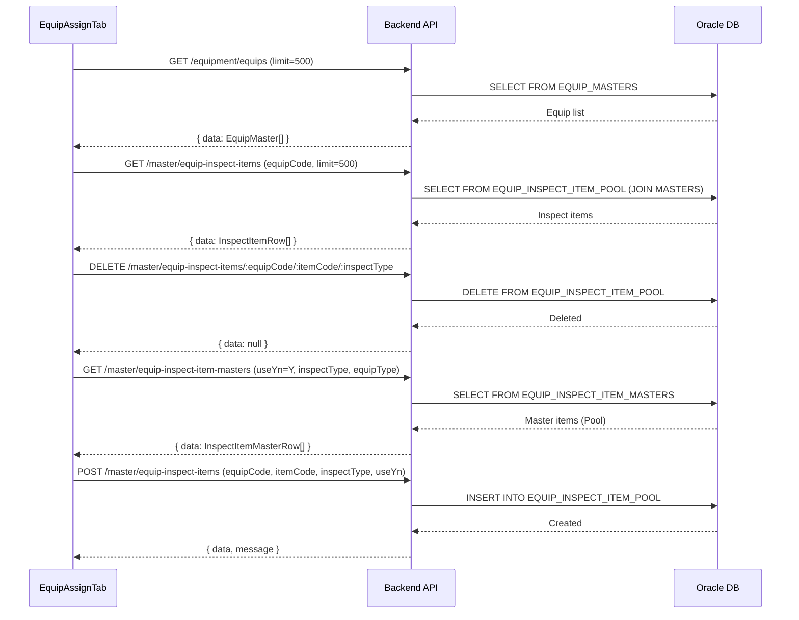

# 설비점검항목 관리 (EQUIP_INSPECT_ITEM) — 비즈니스 로직 & 데이터 흐름 분석
> **분석 기준 커밋:** `8a7e96ea`
> **분석 일자:** `2026-07-04`

## 1. 화면 개요
- **메뉴명:** 설비점검항목 관리
- **경로:** `/master/equip-inspect`
- **유형:** 설비-점검항목 매핑 관리
- **주요 기능:** 설비별 점검항목 할당/해제, Pool에서 항목 일괄 등록, QR 라벨 발행

## 2. 화면 구성
```
┌──────────────────────────────────────────────────────────────────────┐
│ Header (제목 + 설명)                                                 │
├─────────────────────────┬────────────────────────────────────────────┤
│ 좌측: 설비 목록          │ 우측: 점검항목 (탭: DAILY/PERIODIC/PM/WORKER)│
│ - 설비유형별 그룹화      │ - DataGrid (항목 목록)                      │
│ - 검색 필터              │ - 사진 썸네일 포함                          │
│ - 선택 시 우측 갱신      │ - [+점검항목추가] → 선택 패널               │
│                         │ - QR 라벨 발행 (InspectItemLabelModal)      │
└─────────────────────────┴────────────────────────────────────────────┘
```

### 컴포넌트 구조
| 컴포넌트 | 위치 | 설명 |
|---------|------|------|
| EquipInspectPage | page.tsx | 레이아웃만 |
| EquipAssignTab | components/EquipAssignTab.tsx | 설비 목록 + 탭 + 항목 패널 |
| InspectItemPanel | components/InspectItemPanel.tsx | 선택 설비의 항목 DataGrid |
| InspectItemSelectPanel | components/InspectItemSelectPanel.tsx | Pool에서 항목 선택/등록 패널 |
| InspectItemLabelModal | components/InspectItemLabelModal.tsx | QR 라벨 발행 모달 (window.print) |

## 3. 상태 관리
- **equips**: `EquipSummary[]` (설비 목록, 마운트 시 1회 로드)
- **selectedEquip**: 선택된 설비
- **items**: 선택 설비의 점검항목 (inspectType 탭별 필터)
- **activeTab**: DAILY/PERIODIC/PM/WORKER
- **addModalOpen**: 항목 추가 패널 오픈
- **expandedGroups**: 설비유형별 그룹 확장 상태

## 4. API 호출 흐름


## 5. 백엔드 처리

### EquipInspectController (`apps/backend/src/modules/master/controllers/equip-inspect.controller.ts`)
- `@Controller('master/equip-inspect-items')`
- GET findAll — equipCode 필터로 해당 설비의 점검항목 조회 (JOIN)
- POST create — 설비에 점검항목 할당 (INSERT INTO POOL)
- DELETE :equipCode/:itemCode/:inspectType — 할당 해제

### EquipInspectService (master)
- `findAll(query, company, plant)` — EQUIP_INSPECT_ITEM_POOL + EQUIP_INSPECT_ITEM_MASTERS 조인
- `create(dto, company, plant)` — POOL INSERT
- `delete(company, plant, equipCode, itemCode, inspectType)` — POOL DELETE

## 6. 처리 규칙 및 검증
1. **Already registered:** Pool에 이미 등록된 항목은 체크/선택 불가 (opacity 50%)
2. **일괄등록:** 여러 항목 선택 후 1개씩 POST 요청 (forEach)
3. **탭별 필터:** DAILY/PERIODIC/PM/WORKER 4개 탭으로 inspectType 구분
4. **QR 라벨:** react-qr-code 생성, window.print 60x55mm 라벨 출력
5. **설비 목록:** 마운트 시 1회만 로드 (useEffect 빈 의존성)

## 7. DB 테이블

### EQUIP_INSPECT_ITEM_POOL
| 컬럼 | 타입 | 설명 |
|------|------|------|
| COMPANY | VARCHAR2(50) PK | 회사 |
| PLANT_CD | VARCHAR2(50) PK | 공장 |
| EQUIP_CODE | VARCHAR2(36) PK | 설비코드 |
| ITEM_CODE | VARCHAR2(30) PK | 항목코드 |
| INSPECT_TYPE | VARCHAR2(20) PK | 점검유형 |
| USE_YN | VARCHAR2(1) | 사용여부 |
| SORT_SEQ | NUMBER | 정렬순서 |

## 8. 공통코드
| 그룹코드 | 용도 |
|---------|------|
| EQUIP_TYPE | 설비유형 그룹화/필터 |

## 9. 비고
- `EQUIP_INSPECT_ITEM_POOL`은 N:N 관계의 연결 테이블
- 항목 상세 정보는 `EQUIP_INSPECT_ITEM_MASTERS`에서 JOIN
