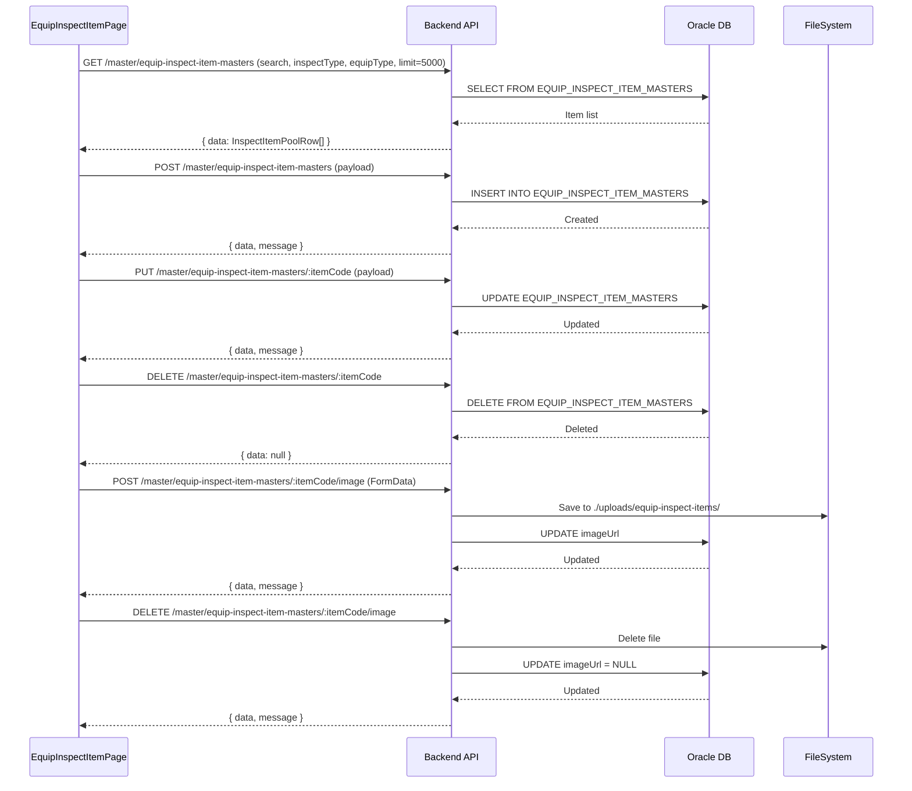

# 점검항목 마스터 (EQUIP_INSPECT_ITEM_MASTER) — 비즈니스 로직 & 데이터 흐름 분석
> **분석 기준 커밋:** `8a7e96ea`
> **분석 일자:** `2026-07-04`

## 1. 화면 개요
- **메뉴명:** 점검항목 마스터
- **경로:** `/master/equip-inspect-item`
- **유형:** 기준정보 CRUD
- **주요 기능:** 설비유형별 점검항목 Pool(마스터) 통합 관리, 이미지 업로드

## 2. 화면 구성
```
┌─────────────────────────────────────────────────────────┐
│ Header (제목 + 새로고침/등록 버튼)                       │
├───────────────────────────────────────────┬─────────────┤
│ DataGrid (점검항목 Pool 목록)              │ Panel (480px)│
│ - searchText, inspectType, equipType 필터  │ 기본정보     │
│ - 행 클릭 → 우측 패널 열림                 │ 판정기준     │
│ - 컬럼: itemCode, itemName, inspectType,  │ 사진 업로드  │
│   itemType, cycle, equipType, image, useYn│ 비고         │
└───────────────────────────────────────────┴─────────────┘
```

### 컴포넌트 구조
| 컴포넌트 | 위치 | 설명 |
|---------|------|------|
| EquipInspectItemPage | page.tsx | 메인 페이지 |
| DataGrid | components/data-grid | DataGrid 공통 컴포넌트 |

### DataGrid 컬럼
actions(수정/삭제), itemCode, itemName, inspectType(DAILY/PERIODIC/PM/WORKER), itemType(VISUAL/MEASURE), cycle, equipType, image(썸네일), useYn, criteria, unit, lslValue, uslValue, remark

## 3. 상태 관리
- **data**: `InspectItemPoolRow[]` — 점검항목 목록 (useState)
- **필터**: searchText, typeFilter(DAILY/PERIODIC/PM/WORKER), equipTypeFilter
- **패널**: panelOpen, editing, form, selectedImageFile, previewUrl
- **unsavedGuard**: 수정 중 행 전환 시 데이터 유실 방어

## 4. API 호출 흐름


## 5. 백엔드 처리

### EquipInspectItemPoolController (`apps/backend/src/modules/master/controllers/equip-inspect-item-pool.controller.ts`)
- `@Controller('master/equip-inspect-item-masters')`
- GET findAll — 목록 조회 (query: EquipInspectItemPoolQueryDto)
- POST create — 생성
- PUT :itemCode — 수정
- DELETE :itemCode — 삭제
- POST :itemCode/image — 이미지 업로드 (FileInterceptor, multer)
- DELETE :itemCode/image — 이미지 삭제

### EquipInspectItemPoolService
- `findAll(query, company, plant)` — EQUIP_INSPECT_ITEM_MASTERS 조회
- `create(dto, company, plant)` — INSERT
- `update(company, plant, itemCode, dto)` — UPDATE
- `delete(company, plant, itemCode)` — DELETE
- `updateImage(itemCode, imageUrl, company, plant)` — 이미지 경로 저장/삭제

## 6. 처리 규칙 및 검증
1. **필수 입력:** itemCode, itemName, inspectType, cycle
2. **itemCode:** 수정 모드에서 disabled (PK 변경 불가)
3. **판정형(VISUAL):** criteria(문자열) 입력
4. **측정형(MEASURE):** unit, lslValue, uslValue 입력 (criteria 불필요)
5. **이미지:** JPEG/PNG/GIF/WEBP, 5MB 제한, 업로드 시 FormData multipart
6. **unsaved guard:** 패널 열린 상태에서 입력 변경 시 확인 모달

## 7. DB 테이블

### EQUIP_INSPECT_ITEM_MASTERS
| 컬럼 | 타입 | 설명 |
|------|------|------|
| COMPANY | VARCHAR2(50) PK | 회사 |
| PLANT_CD | VARCHAR2(50) PK | 공장 |
| ITEM_CODE | VARCHAR2(30) PK | 항목코드 |
| ITEM_NAME | VARCHAR2(200) | 항목명 |
| INSPECT_TYPE | VARCHAR2(20) | 점검유형 |
| EQUIP_TYPE | VARCHAR2(50) | 설비유형 |
| ITEM_TYPE | VARCHAR2(20) | 항목구분 (VISUAL/MEASURE) |
| CRITERIA | VARCHAR2(500) | 판정기준 |
| CYCLE | VARCHAR2(20) | 주기 |
| UNIT | VARCHAR2(20) | 단위 |
| LSL_VALUE | NUMBER | 하한 |
| USL_VALUE | NUMBER | 상한 |
| WORKER_QR_CODE | VARCHAR2(50) | 작업자 QR |
| IMAGE_URL | VARCHAR2(500) | 이미지 경로 |
| USE_YN | VARCHAR2(1) | 사용여부 |

## 8. 공통코드
| 그룹코드 | 용도 |
|---------|------|
| EQUIP_TYPE | 설비유형 필터 |
| UNIT_TYPE | 측정 단위 |

## 9. 비고
- `EQUIP_INSPECT_ITEM_MASTERS`는 설비유형별 점검항목 템플릿 Pool
- 실제 설비-항목 연결은 `EQUIP_INSPECT_ITEM_POOL` 테이블 (EquipAssignTab)
- 이미지 저장 위치: `./uploads/equip-inspect-items/`
