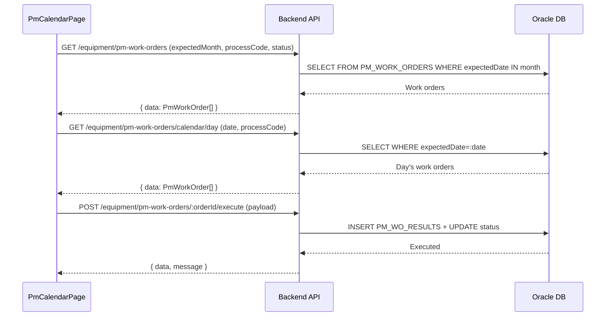

# 설비 PM 계획 캘린더 (EQUIP_PM_CALENDAR) — 비즈니스 로직 & 데이터 흐름 분석
> **분석 기준 커밋:** `8a7e96ea`
> **분석 일자:** `2026-07-04`

## 1. 화면 개요
- **메뉴명:** 설비 PM 계획 캘린더
- **경로:** `/equipment/pm-calendar`
- **유형:** PM 작업지시 캘린더 + 실행
- **주요 기능:** PM 작업지시를 캘린더에서 조회, 선택일 작업지시 목록 확인, 실행 모달 열기

## 2. 화면 구성
```
┌──────────────────────────────────────────────────────────────┐
│ Header (제목 + 공정필터 + 캘린더 생성/갱신)                  │
├──────────────────────────┬───────────────────────────────────┤
│ PmDaySchedulePanel (좌)  │ PmCalendar / PmPlanPanel (우)   │
│ - 설비별 PM 작업지시 목록 │ - 월별 캘린더                     │
│ - 상태: 예정/완료/취소    │ - 또는 작업지시 DataGrid          │
│ - 실행 버튼 → PmExecuteModal│                                │
│ - 작업지시 취소 버튼       │                                 │
└──────────────────────────┴───────────────────────────────────┘
```

### 컴포넌트 구조
| 컴포넌트 | 위치 | 설명 |
|---------|------|------|
| PmCalendarPage | page.tsx | 메인 페이지 |
| PmDaySchedulePanel | components/PmDaySchedulePanel.tsx | 일별 PM 작업 목록 (InspectCalendar와 유사) |
| PmExecuteModal | components/PmExecuteModal.tsx | PM 실행 모달 |

## 3. API 호출 흐름


## 4. 백엔드 처리
- PmWorkOrderController 재사용

## 5. DB 테이블
- PM_WORK_ORDERS
- PM_WO_RESULTS

## 6. 비고
- InspectCalendar 컴포넌트를 PM용으로 변형 (PmDaySchedulePanel)
- PM 작업지시는 PM 계획 화면에서도 실행 가능 (중복 UI)
