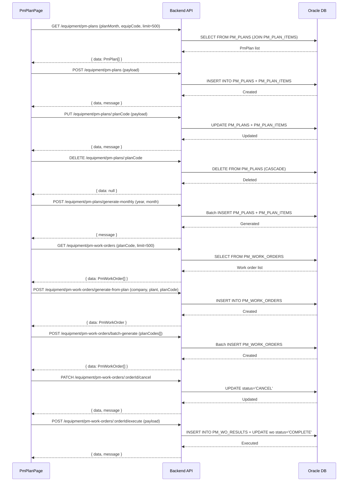

# 설비 PM 계획 (EQUIP_PM_PLAN) — 비즈니스 로직 & 데이터 흐름 분석
> **분석 기준 커밋:** `8a7e96ea`
> **분석 일자:** `2026-07-04`

## 1. 화면 개요
- **메뉴명:** 설비 PM 계획
- **경로:** `/equipment/pm-plan`
- **유형:** 계획 CRUD + 작업지시 자동 생성
- **주요 기능:** PM 계획 수립, 월별 계획 캘린더, 작업지시 생성/취소

## 2. 화면 구성
```
┌──────────────────────────────────────────────────────────────┐
│ Header (제목 + 계획생성(월)/작업지시일괄생성)                  │
├──────────────────────────────────────────────────────────────┤
│ PmPlanPanel (좌)                    | PmWorkOrderPanel (우)  │
│ - DataGrid: PM 계획 목록             | - DataGrid: 작업지시 목록│
│ - 등록/수정/삭제                     | - 작업지시 수동 생성      │
│ - 월별 계획 일괄생성 버튼             | - 작업지시 취소           │
│ - 각 계획행에서 작업지시 개별 생성     | - 작업지시 클릭 → 실행모달│
│ - 컬럼: 계획코드, 설비, 점검주기,      |                          │
│   계획월, 작업기간, 작업지시 여부       |                          │
└──────────────────────────────────────────────────────────────┘
```

### 컴포넌트 구조
| 컴포넌트 | 위치 | 설명 |
|---------|------|------|
| PmPlanPage | page.tsx | 메인 페이지 + 좌/우 분할 |
| PmPlanPanel | components/PmPlanPanel.tsx | PM 계획 목록 + CRUD |
| PmWorkOrderPanel | components/PmWorkOrderPanel.tsx | 작업지시 목록 + 생성/취소 |
| PmPlanFilter | components/PmPlanFilter.tsx | 기간/설비 필터 |
| PmExecuteModal | components/PmExecuteModal.tsx | 작업지시 실행 + 항목별 결과 입력 |
| ConfirmModal | ui | 삭제 확인 |

## 3. 상태 관리
- **selectedPmPlan**: 선택된 PM 계획 (우측 작업지시 표시)
- **selectedPlanMonth**: 계획월 (HE-6 7)
- **pmPlanData**: `PmPlan[]`
- **workOrderData**: `PmWorkOrder[]`
- **modal**: executeModal, confirmation

## 4. API 호출 흐름


## 5. 백엔드 처리

### PmPlanController (`apps/backend/src/modules/equipment/controllers/pm-plan.controller.ts`)
- `@Controller('equipment/pm-plans')`
- GET findAll — planMonth, equipCode 필터
- GET :planCode — 상세 (items 포함)
- POST create — 계획 생성 (items 배열)
- PUT :planCode — 수정
- DELETE :planCode — 삭제
- POST /generate-monthly — 월별 계획 일괄 생성

### PmWorkOrderController (`apps/backend/src/modules/equipment/controllers/pm-work-order.controller.ts`)
- `@Controller('equipment/pm-work-orders')`
- GET findAll — planCode 필터
- POST /generate-from-plan — 단건 작업지시 생성
- POST /batch-generate — 일괄 작업지시 생성
- PATCH :orderId/cancel — 작업 취소
- POST :orderId/execute — 작업 실행 (결과 저장)

### PmPlanService
- `findAll(query, company, plant)` — PM_PLANS 조회 + items 포함
- `create(dto, company, plant, userId)` — INSERT
- `update(planCode, dto, userId, company, plant)` — UPDATE
- `delete(planCode, company, plant)` — DELETE
- `generateMonthly(year, month, company, plant, userId)` — PM_PLAN_ITEMS 조합하여 월별 계획 생성

### PmWorkOrderService
- `findAll(query, company, plant)` — 작업지시 조회
- `generateFromPlan(planCode, company, plant, userId)` — 계획 → 작업지시
- `batchGenerate(planCodes, company, plant, userId)` — 일괄 생성
- `cancel(orderId, userId, company, plant)` — 취소
- `execute(orderId, dto, userId, company, plant)` — 실행 + 결과 저장

## 6. 처리 규칙
1. **계획코드:** PLAN-(년)(월)-XXX 형식 (SEQ에서 채번)
2. **월별 생성:** 설비별 PM 계획 아이템 기반으로 한 달치 계획 자동 생성
3. **작업지시 생성:** 계획에서 작업지시 생성 시 PM_WORK_ORDERS에 INSERT + 요청자/부서 기록
4. **실행 완료:** 완료 시 PM_WO_RESULTS에 결과 저장 + WORK_ORDER 상태 'COMPLETE'로 변경
5. **취소:** 'OPEN' 상태만 취소 가능, 취소 시 'CANCEL'로 변경
6. **중복 생성 방지:** 동일 계획에 이미 작업지시가 있으면 생성 버튼 비활성화

## 7. DB 테이블

### PM_PLANS
| 컬럼 | 타입 | 설명 |
|------|------|------|
| PLAN_CODE | VARCHAR2(50) PK | 계획코드 (PLAN-YYYYMM-NNN) |
| EQUIP_CODE | VARCHAR2(50) | 설비코드 FK |
| PLAN_MONTH | VARCHAR2(6) | 계획월 (YYYYMM) |
| PLAN_YEAR | NUMBER | 계획년 |
| PLAN_MONTH_NUM | NUMBER | 계획월 |
| START_DATE | TIMESTAMP | 시작일 |
| END_DATE | TIMESTAMP | 종료일 |

### PM_PLAN_ITEMS
| 컬럼 | 타입 | 설명 |
|------|------|------|
| PLAN_CODE | VARCHAR2(50) PK | 계획코드 FK |
| SEQ | NUMBER PK | 순번 |
| ITEM_CODE | VARCHAR2(30) | 점검항목코드 (FK to MASTERS) |

### PM_WORK_ORDERS
| 컬럼 | 타입 | 설명 |
|------|------|------|
| ORDER_ID | VARCHAR2(50) PK | 작업지시ID |
| PLAN_CODE | VARCHAR2(50) | 계획코드 FK |
| EQUIP_CODE | VARCHAR2(50) | 설비코드 |
| STATUS | VARCHAR2(20) | OPEN/COMPLETE/CANCEL |
| ASSIGNEE | VARCHAR2(100) | 담당자 |
| EXPECTED_DATE | TIMESTAMP | 예정일 |
| COMPLETED_DATE | TIMESTAMP | 완료일 |

### PM_WO_RESULTS
| 컬럼 | 타입 | 설명 |
|------|------|------|
| RESULT_ID | VARCHAR2(50) PK | 결과ID |
| ORDER_ID | VARCHAR2(50) FK | 작업지시코드 |
| DETAILS | CLOB | 항목별 결과 (JSON) |
| OVERALL_RESULT | VARCHAR2(20) | 종합결과 |
| NOTE | VARCHAR2(500) | 작업내용 |

## 8. 공통코드
| 그룹코드 | 용도 |
|---------|------|
| PM_STATUS | 작업지시 상태 (OPEN/COMPLETE/CANCEL) |
| INSPECT_JUDGE | 점검결과 (PASS/FAIL) |

## 9. 비고
- PM 결과도 EQUIP_INSPECT_LOGS에 별도 저장 (백업 이력)
- 작업지시 실행 시 항목별 details JSON 구조는 DAILY/PERIODIC과 동일
