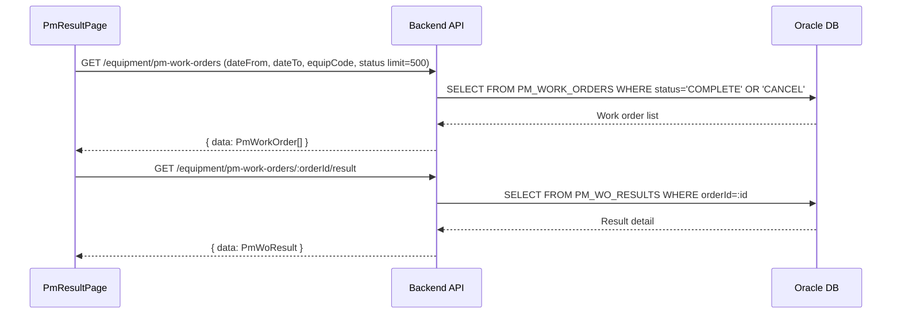

# 설비 PM 실적 (EQUIP_PM_RESULT) — 비즈니스 로직 & 데이터 흐름 분석
> **분석 기준 커밋:** `8a7e96ea`
> **분석 일자:** `2026-07-04`

## 1. 화면 개요
- **메뉴명:** 설비 PM 실적
- **경로:** `/equipment/pm-result`
- **유형:** 실적 조회
- **주요 기능:** PM 작업지시 완료 실적 조회, 상세(항목별 결과) 확인

## 2. 화면 구성
```
┌──────────────────────────────────────────────────────────┐
│ Header (제목 + 기간/설비/상태 필터)                       │
├──────────────────────────────────────────────────────────┤
│ DataGrid (PM 실적 목록)                                  │
│ - 컬럼: workOrderId, planCode, equipCode, equipName,     │
│   expectedDate, completedDate, overallResult, assignee,  │
│   status, note                                          │
│ - 행 클릭 → 상세 모달                                    │
│ - 상태: COMPLETE / CANCEL                                │
└──────────────────────────────────────────────────────────┘
```

### 컴포넌트 구조
| 컴포넌트 | 위치 | 설명 |
|---------|------|------|
| PmResultPage | page.tsx | 메인 페이지 |
| PmResultFilter | components/PmResultFilter.tsx | 필터 |

### DataGrid 컬럼
workOrderId, equipCode+equipName, expectedDate, completedDate, overallResult(ComCodeBadge), assignee, status(ComCodeBadge), note, actions(상세)

## 3. API 호출 흐름


## 4. 백엔드 처리
- PmWorkOrderController의 GET findAll + GET :orderId/result

## 5. DB 테이블
- PM_WORK_ORDERS
- PM_WO_RESULTS
- PM_PLANS (참조)

## 6. 공통코드
| 그룹코드 | 용도 |
|---------|------|
| PM_STATUS | 작업지시 상태 (OPEN/COMPLETE/CANCEL) |
| INSPECT_JUDGE | 종합결과 (PASS/FAIL) |

## 7. 비고
- Completed + Cancel 상태 작업지시만 표시 (기본 필터)
- 상세는 PmExecuteModal의 read-only 버전으로 표시
