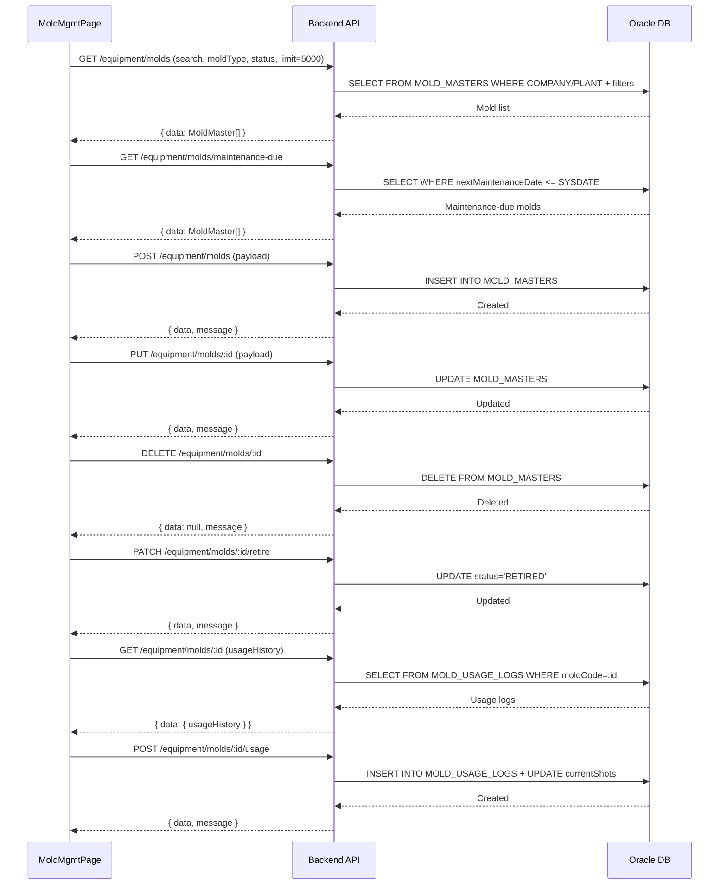
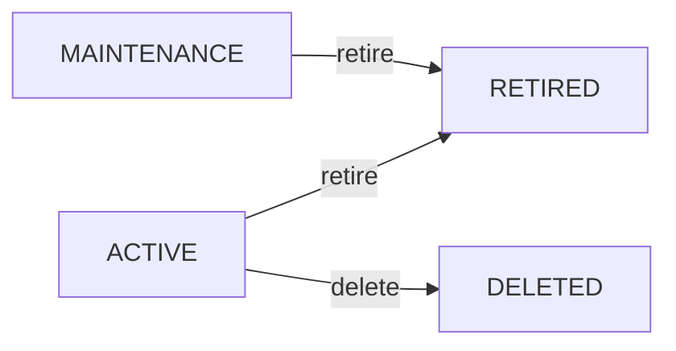

# 금형관리 (EQ_MOLD_MGMT) — 비즈니스 로직 & 데이터 흐름 분석
> **분석 기준 커밋:** `8a7e96ea`
> **분석 일자:** `2026-07-04`

## 1. 화면 개요
- **메뉴명:** 금형관리
- **경로:** `/equipment/mold-mgmt`
- **유형:** 기준정보 CRUD + 실적 입력
- **주요 기능:** 금형 마스터 관리, 타수율 모니터링, 사용이력 등록

## 2. 화면 구성
```
┌─────────────────────────────────────────────────────┐
│ Header (제목 + 보전대상/새로고침/생성 버튼)           │
├─────────────────────────────────────────────────────┤
│ StatCard: 전체/정상/주의/초과/폐기                     │
├───────────────────────────────────────┬─────────────┤
│                                       │ MoldFormPanel│
│ DataGrid (금형 목록)                   │ (우측 슬라이드)│
│ - 행 클릭 → 사용이력 표시               │             │
│ - 타수율 색상: green/yellow/red        │             │
│ - 필터: 검색어/금형유형/상태             │             │
├───────────────────────────────────────┴─────────────┤
│ MoldUsageList (선택 금형의 사용이력)                   │
└─────────────────────────────────────────────────────┘
```

### 컴포넌트 구조
| 컴포넌트 | 위치 | 설명 |
|---------|------|------|
| MoldMgmtPage | page.tsx | 메인 페이지, 상태 관리 |
| MoldFormPanel | components/MoldFormPanel.tsx | 등록/수정 슬라이드 패널 |
| MoldUsageList | components/MoldUsageList.tsx | 사용이력 목록 + 인라인 추가 |
| ConfirmModal | ui | 삭제/폐기 확인 |

### DataGrid 컬럼
actions, moldCode, moldName, moldType(ComCodeBadge), itemCode, cavity, currentShots, guaranteedShots, shotRate(%), status(ComCodeBadge), nextMaintenanceDate

## 3. 상태 관리
- **data**: `MoldMaster[]` — 금형 목록 (useState)
- **selectedRow**: 선택 금형 (사용이력 표시용)
- **필터**: searchText, typeFilter(MOLD_TYPE), statusFilter(MOLD_STATUS)
- **패널**: isPanelOpen, editTarget, deleteTarget
- **showMaintenanceDue**: 보전대상만 조회 토글

## 4. API 호출 흐름


## 5. 백엔드 처리

### MoldController (`apps/backend/src/modules/equipment/controllers/mold.controller.ts`)
- `@Controller('equipment')` — 하위 경로: `molds`, `molds/maintenance-due`, `molds/:id`, `molds/:id/usage`, `molds/:id/retire`
- Tenant: `@Company()`, `@Plant()` 데코레이터
- Auth: `@UseGuards(JwtAuthGuard)`

### MoldService → MoldService
- `findAll(query, company, plant)` — MOLD_MASTERS 조회 (search, moldType, status 필터)
- `findById(id, company, plant)` — 단건 + usageHistory 포함
- `create(dto, company, plant, userId)` — INSERT
- `update(id, dto, userId, company, plant)` — UPDATE
- `delete(id, company, plant)` — DELETE
- `getMaintenanceDue(company, plant)` — 보전대상 조회
- `addUsage(id, dto, company, plant, userId)` — 사용이력 추가 + currentShots 누적
- `retire(id, userId, company, plant)` — 폐기 처리

### 엔티티 참조
| 엔티티 | 테이블 | PK | 비고 |
|--------|--------|----|------|
| MoldMaster | MOLD_MASTERS | moldCode | 금형 마스터 |
| MoldUsageLog | MOLD_USAGE_LOGS | usageDate + seq | 사용이력 |
| ItemMaster | ITEM_MASTERS | itemCode | 품목 참조 (ManyToOne) |

## 6. 처리 규칙 및 검증
1. **필수 입력:** moldCode, moldName (저장 버튼 비활성화)
2. **폐기 처리:** PATCH /molds/:id/retire → status='RETIRED', RETIRED 상태면 재수정/폐기 불가
3. **타수율 경고:** 90% 이상 yellow, 100% 초과 red 하이라이트
4. **사용이력 등록:** shotCount 필수, 등록 시 currentShots 자동 누적
5. **삭제:** DELETE 요청 시 API 인터셉터 에러 처리
6. **보전대상:** nextMaintenanceDate가 오늘 이전인 금형만 조회

## 7. 상태 전이


## 8. 상태 코드 및 공통코드
| 그룹코드 | 용도 |
|---------|------|
| MOLD_TYPE | 금형 유형 필터/표시 |
| MOLD_STATUS | 금형 상태 (ACTIVE/MAINTENANCE/RETIRED) |

## 9. DB 테이블 영향 및 엔티티

### MOLD_MASTERS
| 컬럼 | 타입 | 설명 |
|------|------|------|
| MOLD_CODE | VARCHAR2(50) PK | 금형코드 |
| MOLD_NAME | VARCHAR2(200) | 금형명 |
| MOLD_TYPE | VARCHAR2(50) | 금형유형 (MOLD_TYPE) |
| ITEM_CODE | VARCHAR2(50) | 품목코드 |
| CAVITY | INT | 캐비티수 |
| GUARANTEED_SHOTS | INT | 보증타수 |
| CURRENT_SHOTS | INT | 현재타수 |
| LAST_MAINTENANCE_DATE | TIMESTAMP | 최종보전일 |
| NEXT_MAINTENANCE_DATE | TIMESTAMP | 차기보전일 |
| MAINTENANCE_CYCLE | INT | 보전주기 |
| STATUS | VARCHAR2(20) | 상태 |
| LOCATION | VARCHAR2(200) | 위치 |
| MAKER | VARCHAR2(200) | 제작사 |
| PURCHASE_DATE | TIMESTAMP | 구매일 |
| REMARK | VARCHAR2(500) | 비고 |
| COMPANY | VARCHAR2(50) | 회사 |
| PLANT_CD | VARCHAR2(20) | 공장 |

### MOLD_USAGE_LOGS
| 컬럼 | 타입 | 설명 |
|------|------|------|
| USAGE_DATE | TIMESTAMP PK | 사용일 |
| SEQ | INT PK | 순번 |
| MOLD_CODE | VARCHAR2(50) | 금형코드 FK |
| SHOT_COUNT | INT | 타수 |
| ORDER_NO | VARCHAR2(50) | 오더번호 |
| EQUIP_CODE | VARCHAR2(50) | 설비코드 |
| WORKER_CODE | VARCHAR2(50) | 작업자코드 |

## 10. 에러 코드
API 인터셉터에서 공통 처리 (별도 에러코드 테이블 없음)

## 11. 비고
- 일일점검 캘린더(`inspect-calendar`)와 DaySchedulePanel, InspectExecuteModal 컴포넌트를 공유
- 설비 정기점검 캘린더도 같은 구조 사용
