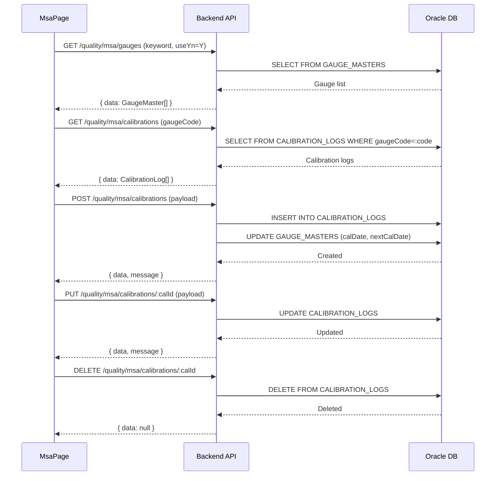

---
sources:
  - apps/backend/src/modules/quality/spc/controllers/msa.controller.ts
  - apps/backend/src/modules/quality/spc/services/msa.service.ts
verifiedCommit: 8a7e96ea
---

# 계측기 교정 (GAUGE_CALIBRATION) — 비즈니스 로직 & 데이터 흐름 분석
> **분석 기준 커밋:** `8a7e96ea`
> **분석 일자:** `2026-07-04`

## 1. 화면 개요
- **메뉴명:** 계측기 교정
- **경로:** `/quality/msa`
- **유형:** 교정 관리 (좌측 계측기 목록 + 우측 교정이력)
- **주요 기능:** 계측기별 교정 이력 관리, 교정 결과 등록/수정/삭제

## 2. 화면 구성
```
┌──────────────────────────────────────────────────────────────────────┐
│ Header (제목 + 검색 + 등록 버튼)                                     │
├─────────────────────────────┬────────────────────────────────────────┤
│ 좌측 Gauge 데이터그리드     │ 우측 CalibrationList                   │
│ - 계측기 목록               │ - 선택 계측기의 교정이력               │
│ - 검색어 필터               │ - 컬럼: calDate, calType, result       │
│ - 행 선택 시 우측 갱신       │   (PASS/FAIL), nextCalDate,           │
│                             │   inspector, remark                    │
│                             │ - 등록 → CalibrationFormPanel           │
│                             │ - 행 클릭 → CalibrationDetailModal      │
└─────────────────────────────┴────────────────────────────────────────┘
```

### 컴포넌트 구조
| 컴포넌트 | 위치 | 설명 |
|---------|------|------|
| MsaPage | page.tsx | 메인 페이지 (좌/우 분할) |
| GaugeList | components/GaugeList.tsx | 좌측 계측기 목록 |
| CalibrationList | components/CalibrationList.tsx | 우측 교정이력 DataGrid |
| CalibrationFormPanel | components/CalibrationFormPanel.tsx | 교정 등록/수정 패널 |
| CalibrationDetailModal | components/CalibrationDetailModal.tsx | 교정 상세 모달 |

### DataGrid 컬럼 (좌측)
gaugeCode, gaugeName, gaugeType, category, serialNo, calCycle, calDate, nextCalDate, managementStatus

### DataGrid 컬럼 (우측)
calDate, calType, result(PASS/FAIL/ComCodeBadge), nextCalDate, inspector, remark, actions

## 3. 상태 관리
- **gauges**: 계측기 목록 (1회 로드)
- **selectedGauge**: 선택 계측기
- **calibrations**: 선택 계측기의 교정이력
- **panel**: calibrationPanelOpen, editTarget, form

## 4. API 호출 흐름


## 5. 백엔드 처리

### MsaController
- `@Controller('quality/msa')`
- GET /gauges — 계측기 목록 (공통)
- GET /calibrations — 교정이력 (gaugeCode 쿼리)
- POST /calibrations — 교정 등록 (GAUGE_MASTERS의 calDate/nextCalDate도 UPDATE)
- PUT /calibrations/:calId — 교정 수정
- DELETE /calibrations/:calId — 교정 삭제

### MsaService
- `findAllCalibrations(gaugeCode, company, plant)` — CALIBRATION_LOGS 조회
- `createCalibration(dto, company, plant, userId)` — INSERT + GAUGE_MASTERS 갱신
- `updateCalibration(calId, dto, company, plant)` — UPDATE
- `deleteCalibration(calId, company, plant)` — DELETE

## 6. 처리 규칙
1. **최신 교정:** 교정 등록 시 GAUGE_MASTERS.calDate/nextCalDate도 함께 UPDATE
2. **nextCalDate 자동 계산:** calDate + calCycle(일)
3. **좌우 연동:** 좌측 계측기 선택 시 우측 교정이력 갱신
4. **등록 버튼:** 좌측 계측기 선택해야 활성화

## 7. DB 테이블

### GAUGE_MASTERS (갱신 대상: calDate, nextCalDate)
### CALIBRATION_LOGS
| 컬럼 | 타입 | 설명 |
|------|------|------|
| CAL_ID | VARCHAR2(50) PK | 교정ID (SEQ) |
| GAUGE_CODE | VARCHAR2(50) FK | 계측기코드 |
| CAL_DATE | DATE | 교정일 |
| CAL_TYPE | VARCHAR2(50) | 교정구분 |
| RESULT | VARCHAR2(20) | 결과 (PASS/FAIL) |
| NEXT_CAL_DATE | DATE | 차기교정일 |
| INSPECTOR | VARCHAR2(100) | 교정자 |
| REMARK | VARCHAR2(500) | 비고 |
| COMPANY | VARCHAR2(50) | 회사 |
| PLANT_CD | VARCHAR2(20) | 공장 |
| CREATED_AT | TIMESTAMP | 생성일시 |
| CREATED_BY | VARCHAR2(50) | 생성자 |

## 8. 공통코드
| 그룹코드 | 용도 |
|---------|------|
| GAUGE_TYPE | 계측기 유형 |
| CAL_TYPE | 교정구분 |
| CAL_RESULT | 교정결과 (PASS/FAIL) |

## 9. 비고
- GAUGE_MASTER, GAUGE_CALIBRATION, GAUGE_CALIBRATION_HISTORY가 동일한 `MsaController` 사용
- CalibrationHistoryPage는 `/equipment/calibration-history`에 있지만 backend는 동일한 `/quality/msa/calibrations` API 호출
