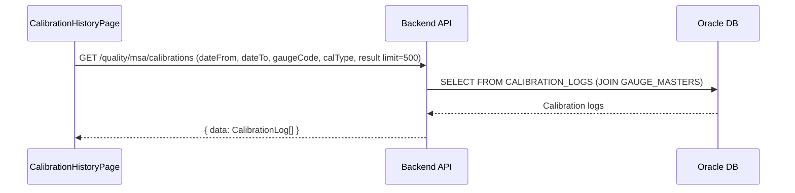

# 계측기 교정이력 (GAUGE_CALIBRATION_HISTORY) — 비즈니스 로직 & 데이터 흐름 분석
> **분석 기준 커밋:** `8a7e96ea`
> **분석 일자:** `2026-07-04`

## 1. 화면 개요
- **메뉴명:** 계측기 교정이력
- **경로:** `/equipment/calibration-history`
- **유형:** 통합 교정이력 조회
- **주요 기능:** 모든 계측기 교정이력을 통합 조회 + 상세 확인

## 2. 화면 구성
```
┌──────────────────────────────────────────────────────────┐
│ Header (제목 + 필터: 기간/계측기/교정구분/결과)          │
├──────────────────────────────────────────────────────────┤
│ DataGrid (통합 교정이력 목록)                            │
│ - 컬럼: gaugeCode, gaugeName, calDate, calType, result, │
│   nextCalDate, inspector, remark                        │
│ - 행 클릭 → CalibrationDetailModal                     │
└──────────────────────────────────────────────────────────┘
```

### 컴포넌트 구조
| 컴포넌트 | 위치 | 설명 |
|---------|------|------|
| CalibrationHistoryPage | page.tsx | 메인 페이지 |
| CalibrationHistoryFilter | components/CalibrationHistoryFilter.tsx | 필터 |

### DataGrid 컬럼
calDate, gaugeCode, gaugeName, calType, result(PASS/FAIL), nextCalDate, inspector, remark

## 3. API 호출 흐름


## 4. 백엔드 처리
- MsaController.GET /calibrations — GAUGE_CALIBRATION과 동일한 API, 다른 쿼리 파라미터
- gaugeCode가 없으면 전체 조회, 있으면 특정 계측기 조회

## 5. DB 테이블
- CALIBRATION_LOGS
- GAUGE_MASTERS (JOIN for gaugeName)

## 6. 처리 규칙
1. 기본 기간: 최근 3개월 (useEffect)
2. 전체 계측기 교정이력 통합 조회
3. 상세 보기: CalibrationDetailModal (MsaPage와 공유)

## 7. 공통코드
| 그룹코드 | 용도 |
|---------|------|
| CAL_TYPE | 교정구분 필터/표시 |
| CAL_RESULT | 교정결과 필터/표시 |

## 8. 비고
- GAUGE_CALIBRATION(MsaPage)가 좌측 계측기를 선택해야 조회되는 반면, 이 화면은 전체 조회 (read-only)
- 두 화면 모두 동일 백엔드 엔드포인트 사용
