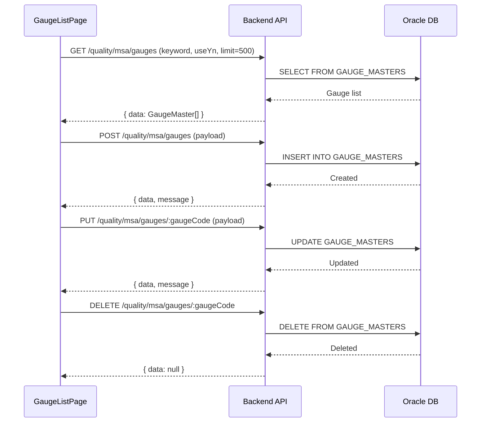

# 계측기 마스터 (GAUGE_MASTER) — 비즈니스 로직 & 데이터 흐름 분석
> **분석 기준 커밋:** `8a7e96ea`
> **분석 일자:** `2026-07-04`

## 1. 화면 개요
- **메뉴명:** 계측기 마스터
- **경로:** `/master/gauge`
- **유형:** 기준정보 CRUD
- **주요 기능:** 계측기/측정기 등록, 수정, 검색 (GaugeMaster)

## 2. 화면 구성
```
┌──────────────────────────────────────────────────────────────┐
│ Header (제목 + 검색 필터 + 등록 버튼)                        │
├──────────────────────────────────────────────────────────────┤
│ GaugeList (DataGrid)                                         │
│ - 컬럼: gaugeCode, gaugeName, gaugeType, category, maker,    │
│         serialNo, calCycle, calDate, nextCalDate, (management│
│         status), useYn                                       │
│ - 검색: keyword, useYn                                      │
│ - 행 클릭 → 우측 패널                                       │
├──────────────────────────────────────────────────────────────┤
│ GaugeFormPanel (우측 슬라이드 패널 480px)                     │
│ - 기본정보: gaugeCode, gaugeName, gaugeType, category,       │
│   maker, serialNo, purchaseDate, location                    │
│ - 교정정보: calCycle, calDate, nextCalDate, calStandard,     │
│   managementStatus, responsiblePerson                        │
│ - 비고 + 첨부파일 업로드                                     │
└──────────────────────────────────────────────────────────────┘
```

### 컴포넌트 구조
| 컴포넌트 | 위치 | 설명 |
|---------|------|------|
| GaugeListPage | page.tsx | 메인 페이지 |
| GaugeList | components/GaugeList.tsx | DataGrid 래퍼 |
| GaugeFormPanel | components/GaugeFormPanel.tsx | 등록/수정 패널 |

### DataGrid 컬럼
gaugeCode, gaugeName, gaugeType, category, maker, serialNo, calCycle, calDate, nextCalDate, managementStatus, useYn

## 3. 상태 관리
- **data**: `GaugeMaster[]`
- **편집**: panelOpen, editing, form, deleteTarget
- **필터**: keyword, useYn

## 4. API 호출 흐름


## 5. 백엔드 처리

### MsaController (`apps/backend/src/modules/quality/spc/controllers/msa.controller.ts`)
- `@Controller('quality/msa')`
- GET /gauges — 전체 계측기 목록 조회 (keyword, useYn)
- POST /gauges — 계측기 등록 (gaugeCode는 SEQ.NEXTVAL)
- PUT /gauges/:gaugeCode — 수정
- DELETE /gauges/:gaugeCode — 삭제

### MsaService
- `findAllGauges(query, company, plant)` — GAUGE_MASTERS 조회
- `createGauge(dto, company, plant, userId)` — INSERT
- `updateGauge(gaugeCode, dto, company, plant)` — UPDATE
- `deleteGauge(gaugeCode, company, plant)` — DELETE

## 6. 처리 규칙
1. **계측기코드:** SEQ.NEXTVAL 자동 채번 (수정 시 disabled)
2. **필수 입력:** gaugeName, gaugeType, calCycle
3. **교정정보:** calDate + calCycle로 nextCalDate 자동 계산
4. **사용여부:** 'N' 설정 시 조회 필터에서 제외 가능
5. **삭제:** DELETE 요청 시 하위 교정이력(CALIBRATION_LOGS)이 있으면 삭제 불가 또는 CASCADE 처리 필요

## 7. DB 테이블

### GAUGE_MASTERS
| 컬럼 | 타입 | 설명 |
|------|------|------|
| GAUGE_CODE | VARCHAR2(50) PK | 계측기코드 (SEQ) |
| GAUGE_NAME | VARCHAR2(200) | 계측기명 |
| GAUGE_TYPE | VARCHAR2(50) | 계측기유형 |
| CATEGORY | VARCHAR2(50) | 분류 |
| MAKER | VARCHAR2(200) | 제조사 |
| SERIAL_NO | VARCHAR2(100) | 시리얼번호 |
| CAL_CYCLE | NUMBER | 교정주기(일) |
| CAL_DATE | DATE | 최종교정일 |
| NEXT_CAL_DATE | DATE | 차기교정일 |
| MANAGEMENT_STATUS | VARCHAR2(20) | 관리상태 |
| RESPONSIBLE_PERSON | VARCHAR2(100) | 책임자 |
| PURCHASE_DATE | DATE | 구매일 |
| LOCATION | VARCHAR2(200) | 위치 |
| CAL_STANDARD | VARCHAR2(500) | 교정기준 |
| REMARK | VARCHAR2(500) | 비고 |
| ATTACHMENT | VARCHAR2(500) | 첨부파일경로 |
| USE_YN | VARCHAR2(1) | 사용여부 |
| COMPANY | VARCHAR2(50) | 회사 |
| PLANT_CD | VARCHAR2(20) | 공장 |

## 8. 공통코드
| 그룹코드 | 용도 |
|---------|------|
| GAUGE_TYPE | 계측기 유형 |
| GAUGE_CATEGORY | 계측기 분류 |
| MANAGEMENT_STATUS | 관리상태 |

## 9. 비고
- GAUGE_MASTER는 MSA(Quality) 도메인에 속함
- 교정이력은 별도 CALIBRATION_LOGS 테이블
