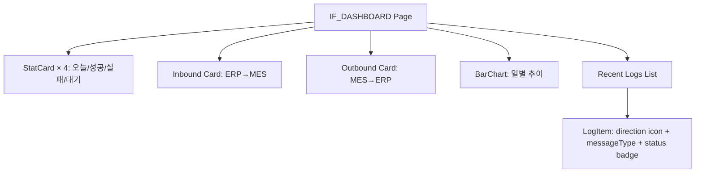
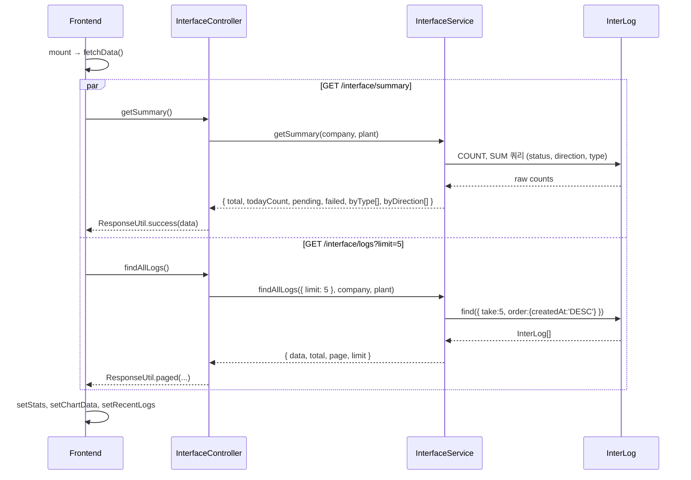

# 인터페이스 대시보드 — 비즈니스 로직 & 데이터 흐름 분석
> **분석 기준 커밋:** `8a7e96ea`
> **분석 일자:** `2026-07-04`

## 1. 화면 개요

ERP 인터페이스 현황을 한눈에 보여주는 대시보드. 오늘 전송 건수, 성공/실패/대기 현황, Inbound/Outbound 건수, 일별 추이 차트, 최근 로그 목록을 표시한다.

| 항목 | 내용 |
|------|------|
| **메뉴 코드** | IF_DASHBOARD |
| **경로** | `/interface/dashboard` |
| **프론트 파일** | `apps/frontend/src/app/(authenticated)/interface/dashboard/page.tsx` |
| **백엔드** | `InterfaceController` (`apps/backend/src/modules/interface/controllers/interface.controller.ts`) |
| **서비스** | `InterfaceService` (`apps/backend/src/modules/interface/services/interface.service.ts`) |
| **DB 엔티티** | `InterLog` |

## 2. 화면 구성



| 영역 | 설명 | 데이터 소스 |
|------|------|-----------|
| StatCard 4개 | today, success, failed, pending | `GET /interface/summary` |
| Inbound/Outbound | direction별 count | `GET /interface/summary` (byDirection) |
| BarChart | messageType별 count | `GET /interface/summary` (byType) |
| 최근 로그 | 최근 5건 로그 목록 | `GET /interface/logs?limit=5` |

## 3. 상태 관리

`useState` 로컬 상태 사용. 전역 상태 없음.

```typescript
const [stats, setStats] = useState<DashboardStats>(...);
const [chartData, setChartData] = useState<...>([]);
const [recentLogs, setRecentLogs] = useState<RecentLog[]>([]);
const [loading, setLoading] = useState(false);
```

- `fetchData`: Promise.all로 summary + logs 병렬 호출
- `useEffect`: 최초 1회 fetchData 실행

## 4. API 호출 흐름



## 5. 백엔드 처리

```mermaid
flowchart TB
    subgraph "InterfaceService.getSummary"
        Q1[statusQb: COUNT + SUM CASE WHEN status]
        Q2[byTypeQb: GROUP BY messageType]
        Q3[byDirectionQb: GROUP BY direction]
        Q1 & Q2 & Q3 --> RAW[Promise.all → raw counts]
        RAW --> MAP[{ total, todayCount, pending, failed, byType, byDirection }]
    end
```

- `getSummary`: 3개 쿼리 병렬 실행
  1. 전체 COUNT, 오늘 COUNT, PENDING/FAIL SUM
  2. messageType별 GROUP BY
  3. direction별 GROUP BY
- `getRecentLogs`: `find({ order: { createdAt: 'DESC' }, take: limit })`

## 6. 처리 규칙 및 검증

- 대시보드 전용 읽기 전용 페이지
- `success` = `total - failed - pending` (별도 COUNT 없음)
- `byDirection`에서 IN/OUT 추출하여 inbound/outbound 카드 표시
- 최근 로그는 최대 5건

## 7. 상태 전이

대시보드에서 직접 상태 전이 없음. 인터페이스 로그 상태는 `SUCCESS / FAIL / PENDING / RETRY`.

## 8. 상태 코드 및 공통코드

| 코드 | 설명 |
|------|------|
| `IF_LOG_STATUS` | 인터페이스 로그 상태 (StatusHeaderHelp 참조) |

## 9. DB 테이블 영향 및 엔티티

**InterLog** (`inter-log.entity.ts`)
| 컬럼 | 타입 | 설명 |
|------|------|------|
| transDate | DATE | 전송일 (PK) |
| seq | NUMBER | 시퀀스 번호 (PK, `SEQ_INTER_LOGS.NEXTVAL`) |
| direction | VARCHAR2 | IN/OUT |
| messageType | VARCHAR2 | JOB_ORDER / PROD_RESULT / BOM_SYNC / PART_SYNC |
| interfaceId | VARCHAR2 | 인터페이스 ID |
| status | VARCHAR2 | PENDING / SUCCESS / FAIL / RETRY |
| payload | CLOB | JSON payload |
| errorMsg | VARCHAR2 | 에러 메시지 |
| retryCount | NUMBER | 재시도 횟수 |
| company | VARCHAR2 | 테넌트 |
| plant | VARCHAR2 | 테넌트 |

## 10. 에러 코드

- 에러 발생 시 `catch`에서 현재 상태 유지, 에러 토스트/알림 없음

## 11. 비고

- `ResponseUtil.success()` 응답 구조: `{ success: true, data: ... }`
- 프론트에서 `summaryRes.data?.data` 패턴으로 data unwrap
- interfaceId는 `transDate/seq` 조합 (서비스에서 `logWithClientId`로 생성)
