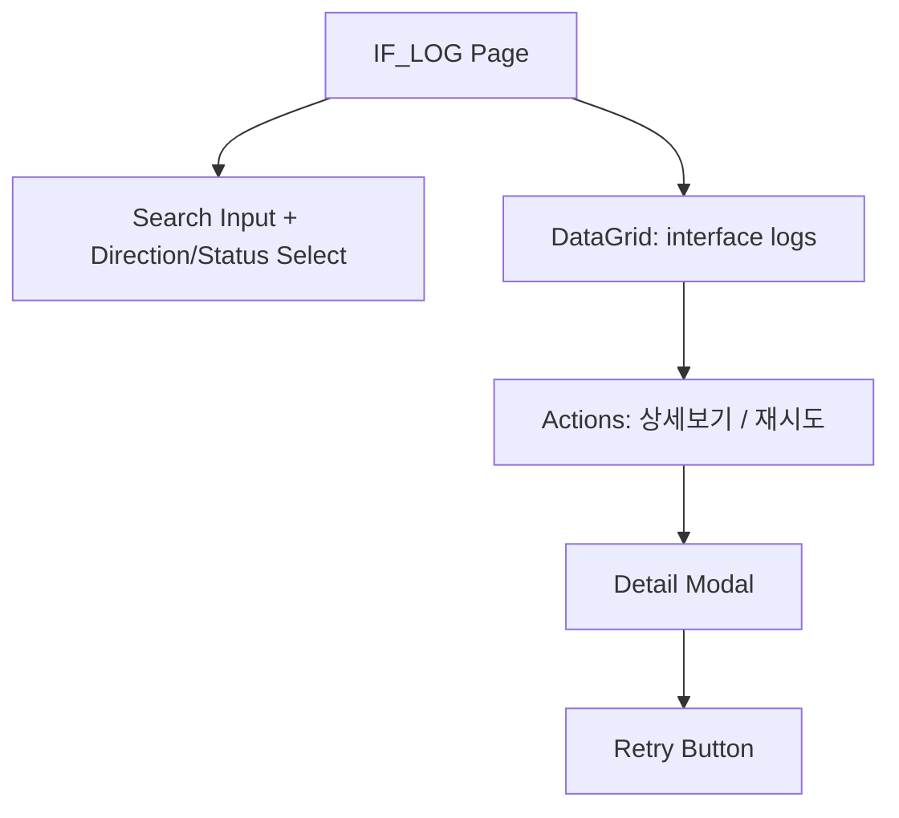
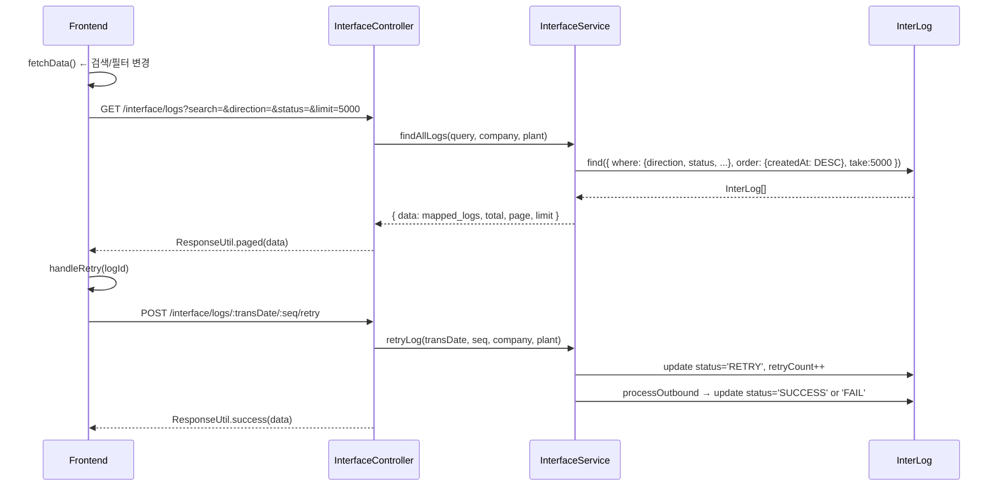
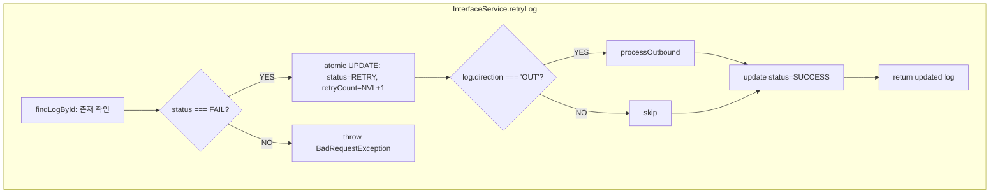

---
sources:
  - apps/frontend/src/app/(authenticated)/interface/log/page.tsx
verifiedCommit: 8a7e96ea
---

# 인터페이스 로그 — 비즈니스 로직 & 데이터 흐름 분석
> **분석 기준 커밋:** `8a7e96ea`
> **분석 일자:** `2026-07-04`

## 1. 화면 개요

ERP ↔ MES 데이터 송수신 이력을 조회하고 실패 건을 재시도하는 페이지. DataGrid 기반, 방향/상태 필터, 상세 모달, 재시도 기능 포함.

| 항목 | 내용 |
|------|------|
| **메뉴 코드** | IF_LOG |
| **프론트 파일** | `apps/frontend/src/app/(authenticated)/interface/log/page.tsx` |
| **컴포넌트** | `interfaceLogColumns.tsx`, `types.ts` |
| **백엔드** | `InterfaceController` (`/interface/logs`) |
| **서비스** | `InterfaceService` |
| **DB 엔티티** | `InterLog` |

## 2. 화면 구성



| 영역 | 설명 |
|------|------|
| 검색 | searchTerm (interfaceId 검색), directionFilter (IN/OUT), statusFilter (SUCCESS/FAIL/PENDING/RETRY) |
| DataGrid | columns: actions, direction, messageType, interfaceId, status, retryCount, createdAt, errorMsg |
| 상세 모달 | direction, messageType, interfaceId, status, createdAt, recvAt, retryCount, errorMsg |
| 재시도 | FAIL 상태 로그만 재시도 가능 |

## 3. 상태 관리

```typescript
const [data, setData] = useState<InterLog[]>([]);
const [loading, setLoading] = useState(false);
const [searchTerm, setSearchTerm] = useState("");
const [directionFilter, setDirectionFilter] = useState("");
const [statusFilter, setStatusFilter] = useState("");
const [isDetailModalOpen, setIsDetailModalOpen] = useState(false);
const [selectedLog, setSelectedLog] = useState<InterLog | null>(null);
```

- `fetchData`는 searchTerm/directionFilter/statusFilter가 바뀔 때마다 재호출

## 4. API 호출 흐름



## 5. 백엔드 처리



## 6. 처리 규칙 및 검증

- FAIL 상태 로그만 재시도 가능
- 재시도 시 `retryCount = NVL(RETRY_COUNT, 0) + 1` (원자적 증가)
- `logWithClientId`: `id = transDate/seq` 문자열 조합
- 프론트 최대 5000건 조회 (`limit=5000`)
- 공통코드 `IF_LOG_STATUS`로 상태 표시 (StatusBadge)

## 7. 상태 전이

```
PENDING → SUCCESS (정상 처리)
PENDING → FAIL (처리 오류)
FAIL → RETRY → SUCCESS (재시도 성공)
FAIL → RETRY → FAIL (재시도 실패)
```

## 8. 상태 코드 및 공통코드

| 코드 | 프론트 값 | 설명 |
|------|-----------|------|
| `IF_LOG_STATUS` | - | 인터페이스 로그 상태 (StatusBadge에서 사용) |
| SUCCESS | - | 성공 |
| FAIL | - | 실패 |
| PENDING | - | 대기 |
| RETRY | - | 재시도 |

## 9. DB 테이블 영향 및 엔티티

- `InterLog` (조회/업데이트)
- Sequence: `SEQ_INTER_LOGS` (신규 로그 생성 시)

## 10. 에러 코드

| HTTP | 상황 |
|------|------|
| 400 | FAIL 상태가 아닌 로그 재시도 |
| 404 | 로그 미존재 |
| 500 | retryCount 갱신 실패 (affected=0) |

## 11. 비고

- 상세 조회는 별도 API 없이 그리드 row 데이터로 표시
- `ResponseUtil.paged()` 로 페이지네이션 응답: `{ success, data[], total, page, limit }`
