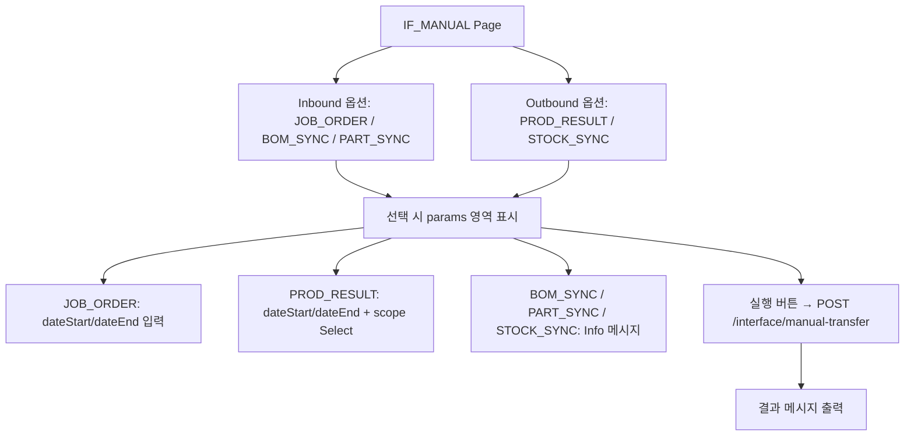
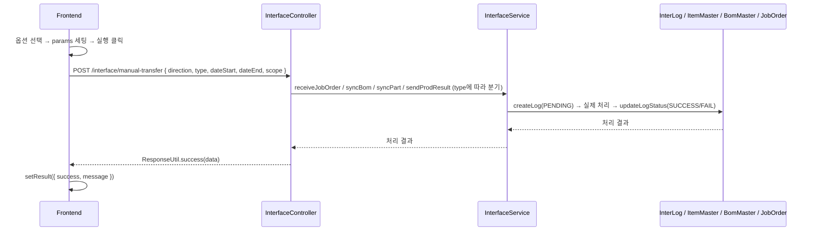
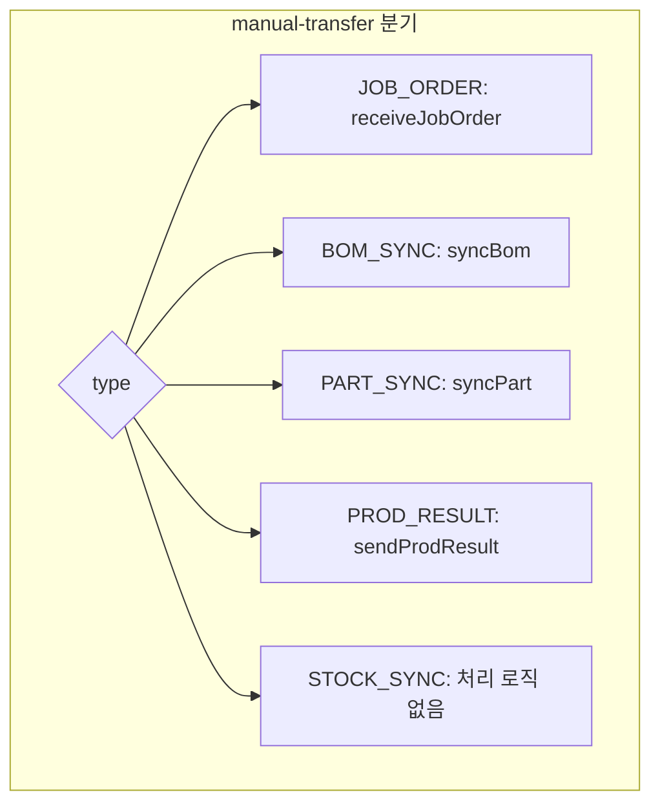

---
sources:
  - apps/frontend/src/app/(authenticated)/interface/manual/page.tsx
verifiedCommit: 8a7e96ea
---

# 인터페이스 수동 전송 — 비즈니스 로직 & 데이터 흐름 분석
> **분석 기준 커밋:** `8a7e96ea`
> **분석 일자:** `2026-07-04`

## 1. 화면 개요

ERP ↔ MES 간 데이터를 수동으로 전송하는 페이지. Inbound (ERP→MES: 작업지시, BOM, 품목) / Outbound (MES→ERP: 생산실적, 재고) 옵션 선택 후 실행.

| 항목 | 내용 |
|------|------|
| **메뉴 코드** | IF_MANUAL |
| **프론트 파일** | `apps/frontend/src/app/(authenticated)/interface/manual/page.tsx` |
| **백엔드** | `InterfaceController` |
| **서비스** | `InterfaceService` |

## 2. 화면 구성



## 3. 상태 관리

```typescript
const [selectedOption, setSelectedOption] = useState<TransferOption | null>(null);
const [isProcessing, setIsProcessing] = useState(false);
const [result, setResult] = useState<{ success: boolean; message: string } | null>(null);
const [params, setParams] = useState({ dateStart: "", dateEnd: "", scope: "all" });
```

## 4. API 호출 흐름



- 실제 프론트에서 호출하는 엔드포인트: `POST /interface/manual-transfer`
- 백엔드에서 type에 따라 `InterfaceService.receiveJobOrder / syncBom / syncPart / sendProdResult` 호출

## 5. 백엔드 처리



## 6. 처리 규칙 및 검증

- JOB_ORDER: 작업일자 범위 필수
- PROD_RESULT: 기간/범위 선택 가능 (all/today/selected)
- BOM_SYNC / PART_SYNC / STOCK_SYNC: 별도 파라미터 없음 (사용자 안내 메시지만)
- 모든 전송은 로그 생성(PENDING) → 처리 → SUCCESS/FAIL 전이

## 7. 상태 전이

```
PENDING → SUCCESS (정상 처리)
PENDING → FAIL (처리 오류)
```

## 8. 상태 코드 및 공통코드

- 없음 (프론트 하드코딩)

## 9. DB 테이블 영향 및 엔티티

- `InterLog` (전송 로그 기록)
- `ItemMaster` (PART_SYNC 시 품목 생성/수정)
- `BomMaster` (BOM_SYNC 시 BOM 생성/수정)
- `JobOrder` (JOB_ORDER 시 작업지시 생성, PROD_RESULT 시 erpSyncYn 업데이트)

## 10. 에러 코드

- 처리 실패 시 FAIL 로그 + errorMsg 기록
- 프론트에서 에러 메시지를 result로 표시

## 11. 비고

- 현재 STOCK_SYNC는 별도 비즈니스 로직 없음 (프론트 정보 메시지만)
- 실제 ERP 전송은 `processOutbound()`에서 Logger만 기록, 실제 HTTP/MQ 전송은 추후 구현
