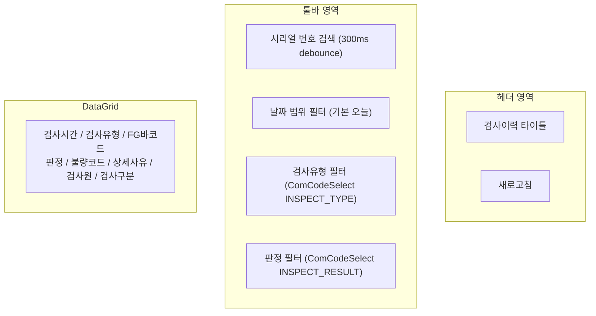
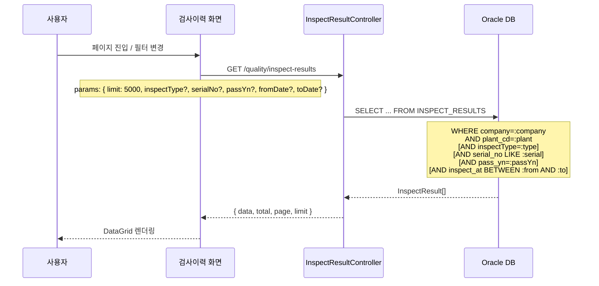
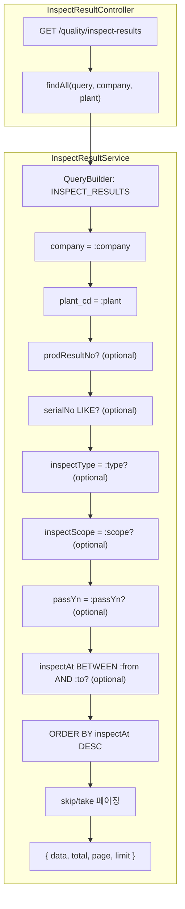

# 검사이력 — 비즈니스 로직 & 데이터 흐름 분석
> **분석 기준 커밋:** `8a7e96ea`
> **분석 일자:** `2026-07-04`

## 1. 화면 개요

| 항목 | 내용 |
|---|---|
| Menu Code | `INSP_HISTORY` |
| URL | `/inspection/history` |
| Frontend Path | `apps/frontend/src/app/(authenticated)/inspection/history/page.tsx` |
| 목적 | 전체 검사유형(VISUAL/CONTINUITY/TERMINAL)의 검사이력 통합 조회 |
| 주요 사용자 | 품질관리자, 생산관리자 |
| Workflow Node | `process-inspection` (lane: quality) — `검사이력` |

## 2. 화면 구성



### 컴포넌트 구성

| 컴포넌트 | 파일 | 역할 |
|---|---|---|
| `page.tsx` | `inspection/history/page.tsx` | 필터/그리드 전체 레이아웃 |
| `inspectionHistoryColumns.tsx` | `inspection/history/inspectionHistoryColumns.tsx` | 그리드 컬럼 정의 |
| `ComCodeSelect` | shared | 공통코드 선택 (INSPECT_TYPE, INSPECT_RESULT) |
| `DateRangeFilter` | shared | 날짜 범위 필터 |
| `DataGrid` | shared | 데이터 그리드 |

### 입력 필드

| 필드 | 타입 | 설명 |
|---|---|---|
| 검색어 | Input (+ debounce 300ms) | 시리얼 번호 검색 (SERIAL_NO LIKE) |
| 시작일 | DateRangeFilter | 검사일자 시작 |
| 종료일 | DateRangeFilter | 검사일자 종료 |
| 검사유형 | ComCodeSelect (INSPECT_TYPE) | VISUAL/CONTINUITY/TERMINAL |
| 판정 | ComCodeSelect (INSPECT_RESULT) | Y/N |

## 3. 상태 관리

```typescript
data: InspectHistoryRow[]        // 검사이력 데이터
loading: boolean                  // 로딩
searchText: string                // 검색어 (raw)
debouncedSearch: string           // 디바운스된 검색어 (300ms)
typeFilter: string                // 검사유형 필터
resultFilter: string              // 판정 필터
fromDate: string                  // 시작일 (기본 오늘)
toDate: string                    // 종료일 (기본 오늘)
```

## 4. API 호출 흐름

| 호출 시점 | Method | URL | Params | 목적 |
|---|---|---|---|---|
| 최초 진입 + 필터 변경 | GET | `/quality/inspect-results` | `limit=5000, inspectType, serialNo, passYn, fromDate, toDate` | 검사이력 조회 |



## 5. 백엔드 처리



### DTO (InspectResultQueryDto)

```typescript
class InspectResultQueryDto extends PaginationQueryDto {
  prodResultNo?: string;
  serialNo?: string;
  inspectType?: string;
  inspectScope?: string;
  passYn?: string;
  fromDate?: string;
  toDate?: string;
}
```

### Default

| 파라미터 | 기본값 |
|---|---|
| page | 1 |
| limit | 20 (frontend는 5000 요청) |

## 6. 처리 규칙 및 검증

1. **조회 전용**: 검사이력은 읽기 전용 화면 (CRUD 없음)
2. **시리얼 번호 LIKE 검색**: `SERIAL_NO LIKE %searchText%`
3. **날짜 범위**: `TO_DATE` 함수로 Oracle 날짜 변환, 종료일은 +1일
4. **검사유형/판정 필터**: 정확히 일치 (exact match)
5. **기본 오늘**: `getTodayLocal()`로 당일 날짜 기본 설정
6. **5000건 제한**: 대량 조회 방지

## 7. 상태 코드 및 공통코드

| 코드 그룹 | 코드값 | 설명 |
|---|---|---|
| `INSPECT_TYPE` | VISUAL | 외관검사 |
| | CONTINUITY | 통전검사 |
| | TERMINAL | 단자검사 |
| `INSPECT_RESULT` | Y | 합격 |
| | N | 불합격 |
| `JUDGE_YN` | Y/N | 판정 (StatusBadge 공통 사용) |

### 검사유형 뱃지 색상

| 유형 | 색상 |
|---|---|
| VISUAL | sky (하늘) |
| TERMINAL | amber (주황) |
| CONTINUITY | indigo (남색) |

## 8. DB 테이블 영향

### INSPECT_RESULTS — 읽기 전용

| 컬럼 | 설명 |
|---|---|
| RESULT_NO | 검사실적 번호 (PK) |
| PROD_RESULT_ID | 생산실적 연결 |
| SERIAL_NO | 시리얼 번호 (검색 대상) |
| INSPECT_TYPE | 검사유형 (필터 대상) |
| INSPECT_SCOPE | 검사범위 (FULL/SAMPLE) |
| PASS_YN | 판정 (필터 대상) |
| ERROR_CODE | 불량코드 |
| ERROR_DETAIL | 상세사유 |
| FG_BARCODE | FG 바코드 |
| INSPECT_TIME | 검사시간 (날짜 필터 대상) |
| INSPECTOR_ID | 검사원 |
| COMPANY | 회사 (tenant) |
| PLANT_CD | 사업장 (tenant) |

### 연관 엔티티

| 엔티티 | 테이블 | 설명 |
|---|---|---|
| `InspectResult` | INSPECT_RESULTS | 주 테이블 |
| `ProdResult` | PROD_RESULTS | 생산실적 (PROD_RESULT_ID로 연결) |

## 9. 에러 코드

| 조건 | 응답 |
|---|---|
| 정상 조회 | HTTP 200 + `ResponseUtil.paged(data, total, page, limit)` |
| 오류 | 빈 배열 반환 (`[]`) — 프론트 catch에서 처리 |

## 10. 비고

- INSP_RESULT/INSP_TERMINAL_RESULT 화면의 InspectPanel에도 검사이력 DataGrid가 포함되어 있으나, 이 화면은 **전체 통합 조회** 전용
- 검사이력 화면은 CRUD 없이 SELECT 전용
- 통계 API (`/quality/inspect-results/stats/pass-rate`, `/stats/by-type`, `/stats/daily-trend`) 존재하나 현재 화면에서는 미사용
- `sqlQuery` prop으로 DataGrid에 표시된 SQL은 단순 가이드용 (실제 쿼리는 QueryBuilder로 동적 생성)
- 검색은 `SERIAL_NO` 기준 (fgBarcode 아님) — FG_BARCODE 검색을 원하면 `searchText`가 아닌 별도 검색 필요
