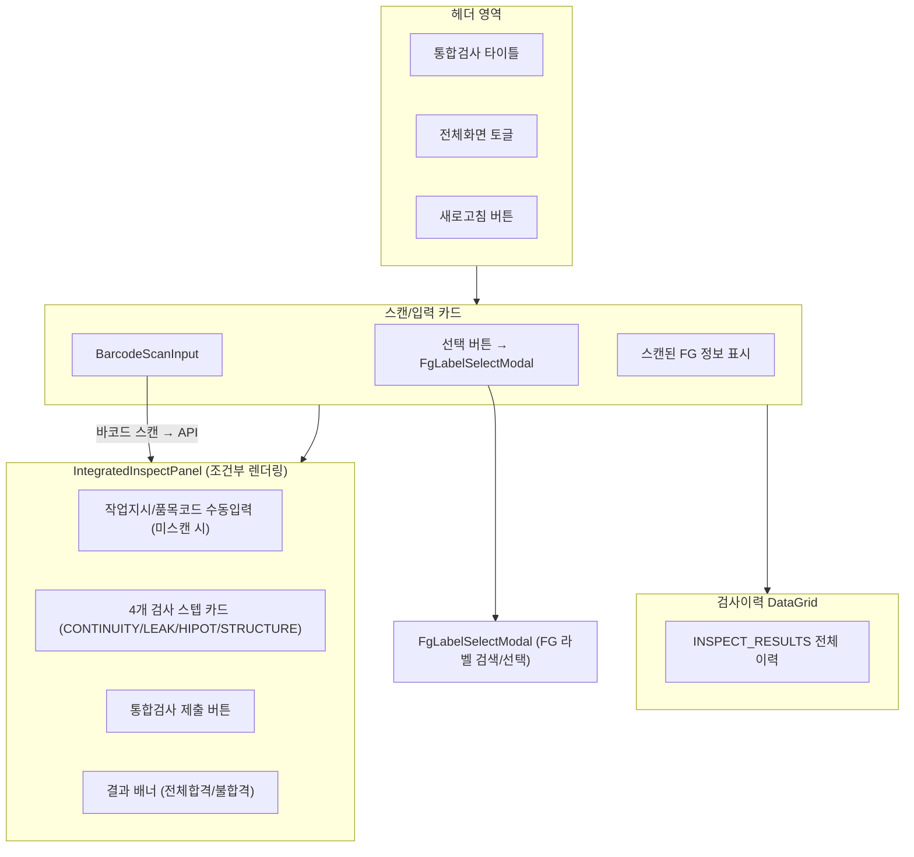
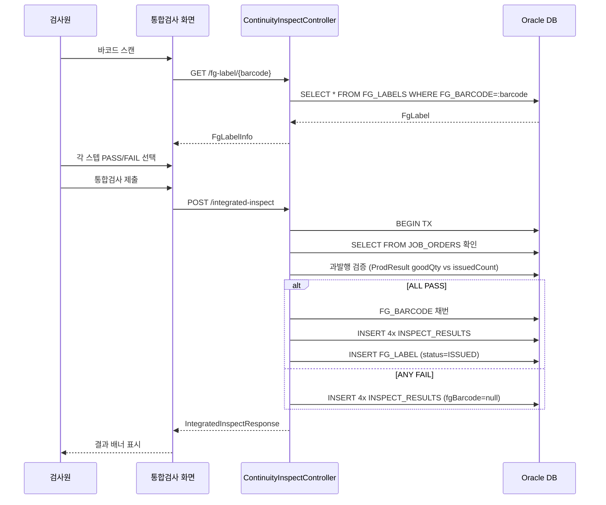
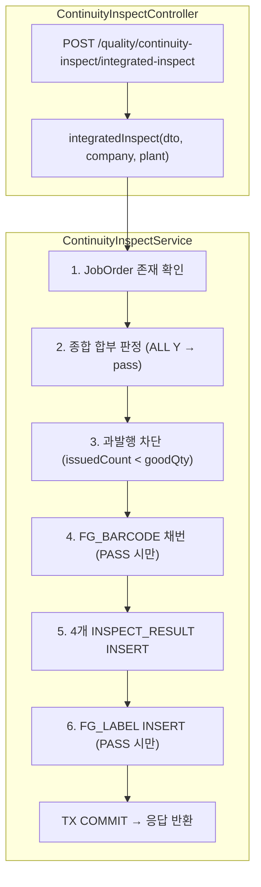
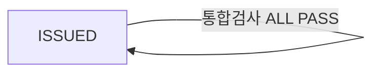

---
sources:
  - apps/frontend/src/app/(authenticated)/inspection/integrated/page.tsx
verifiedCommit: 8a7e96ea
---

# 통합검사 — 비즈니스 로직 & 데이터 흐름 분석
> **분석 기준 커밋:** `8a7e96ea`
> **분석 일자:** `2026-07-04`

## 1. 화면 개요

| 항목 | 내용 |
|---|---|
| Menu Code | `INSP_INTEGRATED` |
| URL | `/inspection/integrated` |
| Frontend Path | `apps/frontend/src/app/(authenticated)/inspection/integrated/page.tsx` |
| 목적 | 회로(CONTINUITY), 리크(LEAK), 내전압(HIPOT), 구조(STRUCTURE) 4개 검사를 한 번에 제출/등록 |
| 주요 사용자 | 품질 검사원, 생산 라인 작업자 |
| Workflow Node | `process-inspection` (lane: quality) — `통합검사` |

## 2. 화면 구성



### 컴포넌트 구성

| 컴포넌트 | 파일 | 역할 |
|---|---|---|
| `page.tsx` | `inspection/integrated/page.tsx` | 메인 레이아웃, 바코드 스캔, 패널/모달 상태 관리 |
| `IntegratedInspectPanel` | `inspection/integrated/components/IntegratedInspectPanel.tsx` | 4개 검사 스텝 PASS/FAIL 선택 + 제출 |
| `FgLabelSelectModal` | `inspection/integrated/components/FgLabelSelectModal.tsx` | FG 라벨 검색/선택 모달 |
| `integratedColumns.tsx` | `inspection/integrated/integratedColumns.tsx` | 검사이력 DataGrid 컬럼 정의 |

### 입력 필드

| 필드 | 타입 | 출처 | 설명 |
|---|---|---|---|
| FG Barcode | BarcodeScanInput | 스캐너 | ISO 15459 바코드 |
| 작업지시 | Input | 수동입력 | 미스캔 시 수동 입력 |
| 품목코드 | Input | 수동입력 | 미스캔 시 수동 입력 |
| 검사스텝 판정 | Y/N 버튼 | 사용자 선택 | 각 스텝별 PASS/FAIL |
| 불량코드 | Input | 사용자 입력 | FAIL 시 표시 |
| 상세사유 | Input | 사용자 입력 | FAIL 시 표시 |

### 버튼

| 버튼 | 동작 |
|---|---|
| Refresh (`RefreshCw`) | `GET /quality/inspect-results` 호출 |
| 전체화면 (`Maximize2`) | Fullscreen API toggle |
| 선택 (`List`) | `FgLabelSelectModal` 열기 |
| 통합검사 제출 | `POST /quality/continuity-inspect/integrated-inspect` |

## 3. 상태 관리

```typescript
// page.tsx (로컬 state)
inspectHistory: InspectRecord[]          // 검사이력 DataGrid
scanInput: string                        // 바코드 스캔 입력값
scannedLabel: FgLabelInfo | null         // API로 조회된 FG 라벨 정보
isPanelOpen: boolean                     // IntegratedInspectPanel 표시
isSelectModalOpen: boolean               // FG 라벨 선택 모달
isFullscreen: boolean                    // 전체화면 상태

// IntegratedInspectPanel (로컬 state)
steps: IntegratedStepState[]             // 4개 검사스텝 (passYn/errorCode/errorDetail)
manualOrderNo: string                    // 수동 작업지시
manualItemCode: string                   // 수동 품목코드
submitting: boolean                      // 제출 중
result: IntegratedInspectApiResponse | null  // 제출 결과
```

## 4. API 호출 흐름

| 호출 시점 | Method | URL | Params | 목적 |
|---|---|---|---|---|
| 최초 진입 + 새로고침 | GET | `/quality/inspect-results` | `limit: 500` | 검사이력 조회 |
| 바코드 스캔 | GET | `/quality/continuity-inspect/fg-label/:fgBarcode` | - | FG 라벨 조회 |
| 검사 제출 | POST | `/quality/continuity-inspect/integrated-inspect` | (body) | 4개 검사 동시 등록 |
| 모달 라벨 검색 | GET | `/quality/continuity-inspect/fg-labels` | `search, limit` | FG 라벨 목록 검색 |



## 5. 백엔드 처리



### DTO 검증

- `IntegratedInspectDto`: orderNo, itemCode 필수 / steps 최소 1개 이상
- 각 step: inspectType(`CONTINUITY|LEAK|HIPOT|STRUCTURE`), passYn(`Y|N`)
- FAIL step: errorCode, errorDetail 선택

### 처리 규칙

- **ALL PASS** → FG 바코드 채번 → FG_LABEL INSERT (status=ISSUED) + 4개 INSPECT_RESULT
- **ANY FAIL** → FG 바코드 미발행 + 각 스텝별 INSPECT_RESULT만 등록 (fgBarcode=null)
- 과발행 차단: 생산 양품수(goodQty sum) >= 기발행 ISSUED 라벨 수여야 발행 가능
- FG 바코드는 `SeqGeneratorService.nextFgBarcode()`로 채번
- INSPECT_RESULT.resultNo는 `SEQ_RULES 'INSPECT_RESULT'`로 채번

## 6. 처리 규칙 및 검증

1. **모든 스텝 판정 필수**: 4개 스텝 모두 PASS/FAIL 선택해야 제출 가능
2. **과발행 차단**: 합격 발행수가 생산 양품수를 초과할 수 없음
3. **구조검사 결과 복사**: `FG_LABELS.STRUCTURE_YN`에 STRUCTURE 스텝 결과 저장
4. **연속성**: 첫 번째 스텝(CONTINUITY)의 resultNo가 FG_LABEL.INSPECT_RESULT_ID로 연결
5. **작업지시 필수**: 스캔 미스 시 수동 입력 필요

## 7. 상태 전이



- 통합검사는 FG 라벨을 ISSUED 상태로 **신규 발행**만 함 (상태 전이 X)
- 기존 ISSUED 라벨의 status는 변경하지 않음

## 8. 상태 코드 및 공통코드

| 코드 그룹 | 코드값 | 설명 |
|---|---|---|
| `INSPECT_TYPE` | CONTINUITY | 회로검사 |
| | LEAK | 리크검사 |
| | HIPOT | 내전압검사 |
| | STRUCTURE | 구조검사 |
| `JUDGE_YN` | Y | 합격 |
| | N | 불합격 |
| `JOB_ORDER_STATUS` | RUNNING/IN_PROGRESS/WAITING | 작업지시 상태 |

## 9. DB 테이블 영향 및 엔티티

### INSPECT_RESULTS (InspectResult)

| 컬럼 | 타입 | 설명 |
|---|---|---|
| RESULT_NO (PK) | VARCHAR2(30) | 채번 (SEQ_RULES INSPECT_RESULT) |
| PROD_RESULT_ID | VARCHAR2(36) | → ProdResult 연결 (nullable) |
| INSPECT_TYPE | VARCHAR2(50) | CONTINUITY/LEAK/HIPOT/STRUCTURE |
| INSPECT_SCOPE | VARCHAR2(20) | 'FULL' |
| PASS_YN | CHAR(1) | Y/N |
| ERROR_CODE | VARCHAR2(50) | 불량코드 (FAIL 시) |
| ERROR_DETAIL | VARCHAR2(500) | 상세사유 (FAIL 시) |
| FG_BARCODE | VARCHAR2(30) | 채번된 FG 바코드 (ALL PASS 시) |
| INSPECT_TIME | TIMESTAMP | 검사시간 |
| EQUIP_CODE | VARCHAR2(50) | 검사 설비 |
| COMPANY / PLANT_CD | VARCHAR2(50) | Tenant |

### FG_LABELS (FgLabel) — ALL PASS 시 INSERT

| 컬럼 | 타입 | 설명 |
|---|---|---|
| FG_BARCODE (PK) | VARCHAR2(30) | 채번 바코드 |
| ITEM_CODE | VARCHAR2(50) | 품목코드 |
| ORDER_NO | VARCHAR2(50) | 작업지시 |
| STATUS | VARCHAR2(20) | 'ISSUED' |
| INSPECT_RESULT_ID | VARCHAR2(30) | 첫 번째 스텝 resultNo |
| INSPECT_PASS_YN | CHAR(1) | 'Y' |
| STRUCTURE_YN | CHAR(1) | 구조검사 결과 |
| EQUIP_CODE/WORKER_CODE/LINE_CODE | - | 설비/작업자/라인 |

### JOB_ORDERS (JobOrder) — 읽기 전용 (존재 확인)

## 10. 에러 코드

| 조건 | Exception | 메시지 |
|---|---|---|
| 작업지시 없음 | `NotFoundException` | 작업지시를 찾을 수 없습니다: {orderNo} |
| 스텝 0개 | `BadRequestException` | 최소 1개 이상의 검사 스텝이 필요합니다 |
| 과발행 | `BadRequestException` | 통합검사 합격 발행수가 생산 양품수를 초과할 수 없습니다 |
| Tenant 불일치 | `BadRequestException` | 회사/사업장 불일치 |

## 11. 비고

- 통합검사는 FG 바코드를 신규 발행하므로, FG 라벨이 이미 발행된 제품에는 적용 불가
- InspectionResultWorkflow(통전검사)와 달리 작업지시 선택 없이 바코드 스캔 기반
- FRONTEND 클라이언트 측 필터링 없음 (API에서 전체 조회 후 표시)
- 소모품/검사기 연동 없음 (순수 검사 판정만 등록)
