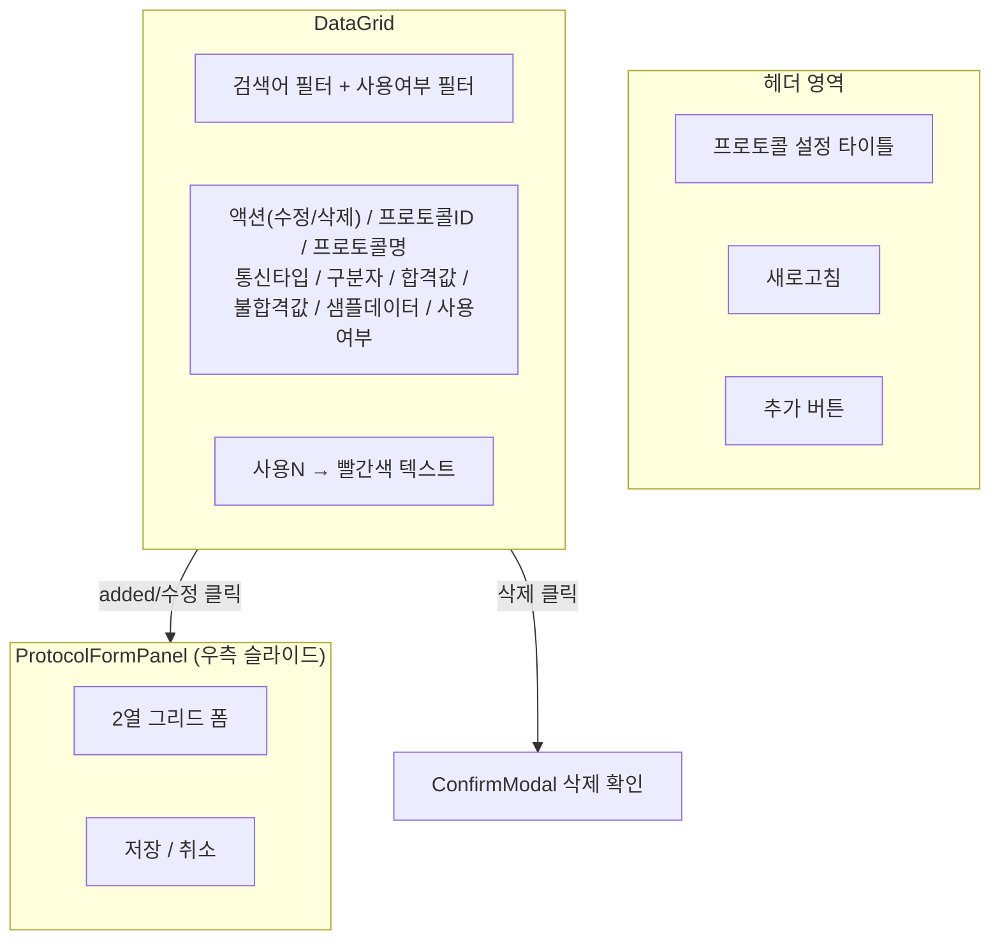
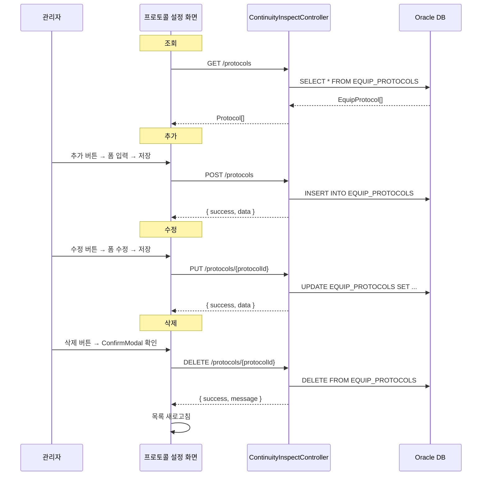
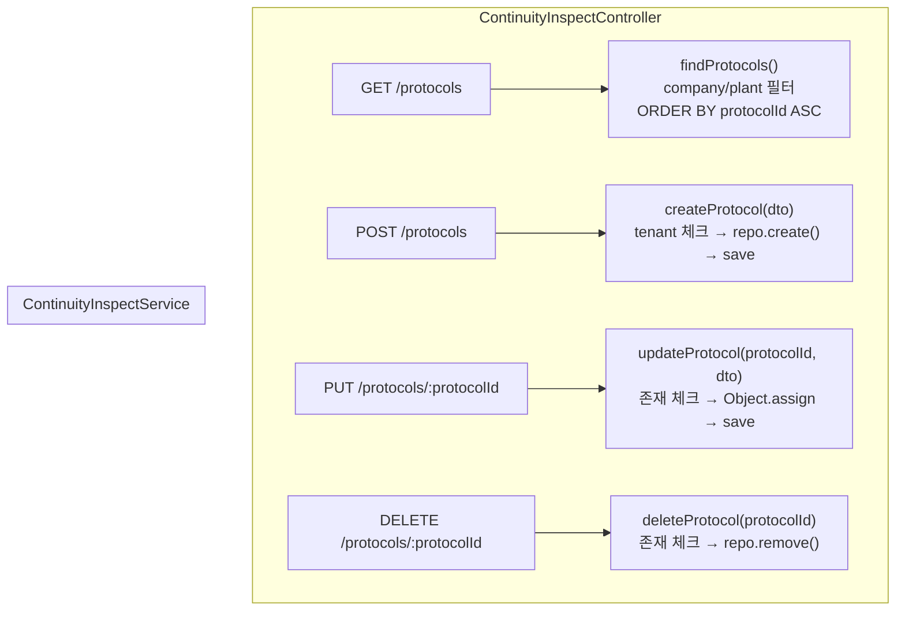

---
sources:
  - apps/frontend/src/app/(authenticated)/inspection/protocol/page.tsx
verifiedCommit: 8a7e96ea
---

# 검사기 프로토콜 설정 — 비즈니스 로직 & 데이터 흐름 분석
> **분석 기준 커밋:** `8a7e96ea`
> **분석 일자:** `2026-07-04`

## 1. 화면 개요

| 항목 | 내용 |
|---|---|
| Menu Code | `INSP_PROTOCOL` |
| URL | `/inspection/protocol` |
| Frontend Path | `apps/frontend/src/app/(authenticated)/inspection/protocol/page.tsx` |
| 목적 | 검사장비(EQUIP_PROTOCOLS) 통신 프로토콜 CRUD 관리 |
| 주요 사용자 | 시스템 관리자, 설비 관리자 |
| Workflow Node | `process-inspection` (lane: quality) — `검사기 프로토콜 설정` (workflowMap에 미등록) |

## 2. 화면 구성



### 컴포넌트 구성

| 컴포넌트 | 파일 | 역할 |
|---|---|---|
| `page.tsx` | `inspection/protocol/page.tsx` | 메인 레이아웃, 목록/패널/삭제 상태 관리 |
| `ProtocolFormPanel` | `inspection/protocol/components/ProtocolFormPanel.tsx` | 프로토콜 추가/수정 폼 (슬라이드 패널) |
| `protocolColumns.tsx` | `inspection/protocol/protocolColumns.tsx` | 그리드 컬럼 (수정/삭제 액션 포함) |
| `ConfirmModal` | shared | 삭제 확인 모달 |

### 입력 필드 (ProtocolFormPanel)

| 필드 | 타입 | 설명 |
|---|---|---|
| Protocol ID | Input | 식별자 (수정 시 disabled) |
| Protocol Name | Input | 프로토콜명 |
| Comm Type | Select (SERIAL/TCP/HTTP) | 통신 유형 |
| 설비코드 (Equip Code) | Input | 연결 설비 (선택) |
| 구분자 (Delimiter) | Input | 데이터 파싱 구분자 (기본 `,`) |
| Result Index | Input (number) | 결과 위치 index (기본 1) |
| Pass Value | Input | 합격 문자열 (기본 PASS) |
| Fail Value | Input | 불합격 문자열 (기본 FAIL) |
| Error Index | Input (number) | 에러코드 위치 (선택) |
| Start Char | Input | 데이터 시작 문자 (선택) |
| End Char | Input | 데이터 종료 문자 (선택) |
| Sample Data | Input (전체폭) | 샘플 데이터 |
| Description | Input (전체폭) | 설명 |
| Use Y/N | Radio (Y/N) | 사용 여부 (기본 Y) |

## 3. 상태 관리

```typescript
// page.tsx
protocols: Protocol[]                    // 프로토콜 목록
loading: boolean                         // 로딩
searchText / debouncedSearch: string     // 검색어 (300ms debounce)
useYnFilter: string                      // 사용여부 필터
isPanelOpen: boolean                     // 패널 표시
editingProtocol: Protocol | null         // 수정 대상 (null=추가)
deleteTarget: Protocol | null            // 삭제 대상

// ProtocolFormPanel
form: { protocolId, protocolName, commType, ... }  // 폼 데이터
saving: boolean                          // 저장 중
```

## 4. API 호출 흐름

| 호출 시점 | Method | URL | 목적 |
|---|---|---|---|
| 최초 진입 | GET | `/quality/continuity-inspect/protocols` | 전체 프로토콜 목록 |
| 추가 | POST | `/quality/continuity-inspect/protocols` | 새 프로토콜 등록 |
| 수정 | PUT | `/quality/continuity-inspect/protocols/:protocolId` | 프로토콜 수정 |
| 삭제 | DELETE | `/quality/continuity-inspect/protocols/:protocolId` | 프로토콜 삭제 |



## 5. 백엔드 처리



### DTO 검증

| DTO | 필수 | 선택 |
|---|---|---|
| `CreateEquipProtocolDto` | protocolId, protocolName | equipCode, commType(SERIAL), delimiter(,), resultIndex(1), passValue(PASS), failValue(FAIL), errorIndex, dataStartChar, dataEndChar, sampleData, description, useYn(Y) |
| `UpdateEquipProtocolDto` | (PartialType — 전부 선택) | 동일 필드 |

### Client-side 필터링

현재 `/protocols` API는 서버에서 모든 데이터를 반환하고, 프론트엔드에서 필터링:
1. `useYnFilter`로 사용여부 필터
2. `debouncedSearch`로 protocolId/protocolName LIKE 필터

## 6. 처리 규칙 및 검증

1. **Protocol ID 중복 생성 방지**: PK 중복 시 INSERT 실패 (DB 제약)
2. **수정 시 ID 변경 불가**: `editingProtocol.protocolId`로 식별, PUT으로 전체 Update
3. **사용여부 N인 행**: 그리드에서 빨간색 텍스트 표시
4. **최소 입력 검증**: protocolId, protocolName 공백 시 저장 차단
5. **Client-side 필터**: 검색어 + 사용여부 필터는 프론트에서 처리

## 7. DB 테이블 영향

### EQUIP_PROTOCOLS (EquipProtocol) — CRUD

| 컬럼 | 타입 | 설명 |
|---|---|---|
| PROTOCOL_ID (PK) | VARCHAR2(30) | 프로토콜 ID |
| EQUIP_CODE | VARCHAR2(50) | 설비 코드 (nullable) |
| PROTOCOL_NAME | VARCHAR2(100) | 프로토콜명 |
| COMM_TYPE | VARCHAR2(20) | 통신 유형 (SERIAL/TCP/HTTP) |
| DELIMITER | VARCHAR2(10) | 구분자 |
| RESULT_INDEX | NUMBER | 결과 위치 index |
| PASS_VALUE | VARCHAR2(20) | 합격 문자열 |
| FAIL_VALUE | VARCHAR2(20) | 불합격 문자열 |
| ERROR_INDEX | NUMBER | 에러 위치 index (nullable) |
| DATA_START_CHAR | VARCHAR2(5) | 데이터 시작 문자 (nullable) |
| DATA_END_CHAR | VARCHAR2(5) | 데이터 종료 문자 (nullable) |
| SAMPLE_DATA | VARCHAR2(500) | 샘플 데이터 (nullable) |
| DESCRIPTION | VARCHAR2(200) | 설명 (nullable) |
| USE_YN | CHAR(1) | 사용 여부 |
| COMPANY | VARCHAR2(50) | 회사 (tenant) |
| PLANT_CD | VARCHAR2(50) | 사업장 (tenant) |

### 엔티티 관계

| 엔티티 | 테이블 | 관계 |
|---|---|---|
| `EquipProtocol` | EQUIP_PROTOCOLS | 독립 테이블 (FK 없음) |

## 8. 에러 코드

| 조건 | Exception | HTTP | 메시지 |
|---|---|---|---|
| 수정/삭제 대상 없음 | `NotFoundException` | 404 | 프로토콜을 찾을 수 없습니다: {protocolId} |
| Tenant 불일치 | `BadRequestException` | 400 | 회사/사업장 불일치 |
| PK 중복 | DB Driver Error | 500 | ORA-00001 (unique constraint) |

## 9. 비고

- 이 화면의 프로토콜 데이터는 `autoInspect()` API에서 `parseRawData()` 메서드로 사용됨
  - raw 데이터 → dataStartChar/dataEndChar 제거 → delimiter 분할 → resultIndex 위치값 → passValue/failValue 비교 → passYn 판정
- 프로토콜은 작업지시/검사 실적과 직접 연결되지 않는 독립 기준정보
- 프론트에서 전체 데이터를 받아 클라이언트 필터링 (서버 페이징/필터 미적용)
- `createEquipProtocolDto`와 `UpdateEquipProtocolDto`는 PartialType 관계
- SQL 그리드 힌트는 가이드용이며 실제 조회는 TypeORM Repository 사용
