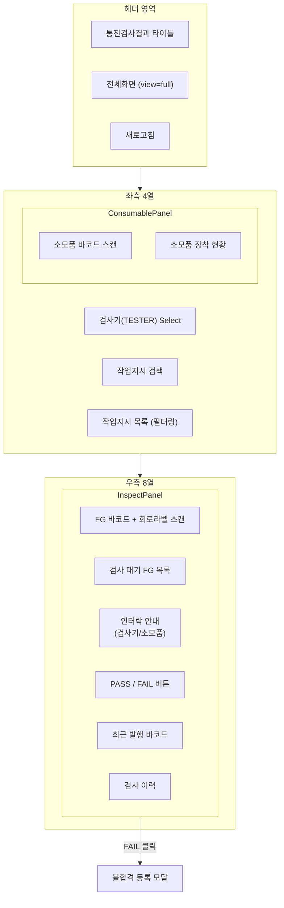
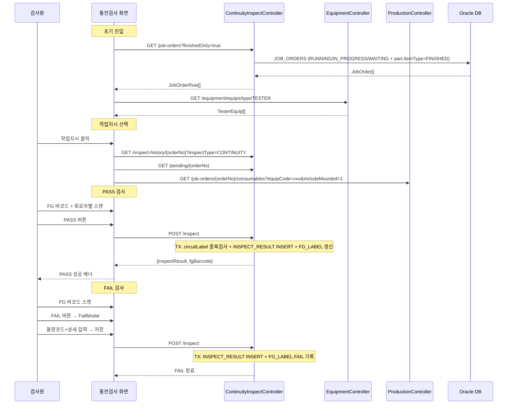
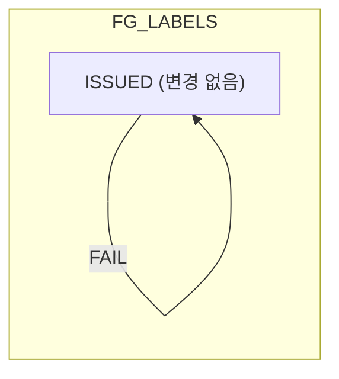

# 통전검사결과 — 비즈니스 로직 & 데이터 흐름 분석
> **분석 기준 커밋:** `8a7e96ea`
> **분석 일자:** `2026-07-04`

## 1. 화면 개요

| 항목 | 내용 |
|---|---|
| Menu Code | `INSP_RESULT` |
| URL | `/inspection/result` |
| Frontend Path | `apps/frontend/src/app/(authenticated)/inspection/result/page.tsx` |
| 목적 | 통전검사(CONTINUITY) — 작업지시 선택 → FG 라벨 스캔 → PASS/FAIL 판정 |
| 주요 사용자 | 생산 라인 검사원 |
| Workflow Node | `process-inspection` (lane: quality) — `검사결과` |

## 2. 화면 구성



### 컴포넌트 구성

| 컴포넌트 | 파일 | 역할 |
|---|---|---|
| `page.tsx` | `inspection/result/page.tsx` | `InspectionResultWorkflow` 렌더링 (inspectType=CONTINUITY, finishedOnly=true) |
| `InspectionResultWorkflow` | `inspection/result/components/InspectionResultWorkflow.tsx` | 전체 워크플로우 (검사기 선택, 작업지시 목록, ConsumablePanel+InspectPanel 조립) |
| `InspectPanel` | `inspection/result/components/InspectPanel.tsx` | FG 바코드 스캔 + PASS/FAIL + 검사이력 |
| `FailModal` | `inspection/result/components/FailModal.tsx` | 불량코드+상세 입력 모달 |
| `ConsumablePanel` | `inspection/result/components/ConsumablePanel.tsx` | 소모성 설비부품 스캔 장착/해제 |

### 입력 필드

| 필드 | 타입 | 설명 |
|---|---|---|
| 검사기 선택 | Select | TESTER 설비 목록, localStorage 유지 |
| 작업지시 검색 | Input | orderNo/itemName/itemCode 검색 |
| FG 바코드 | BarcodeScanInput | 제품 라벨 스캔 (PASS/FAIL 전 필수) |
| 회로라벨 | BarcodeScanInput | 설비 출력 바코드 (PASS 시 필수) |
| 소모품 바코드 | BarcodeScanInput | 소모품 롯트 바코드 스캔 장착 |
| 불량코드 | ComCodeSelect (CONTINUITY_DEFECT) | FAIL 모달에서 선택 |
| 불량상세 | textarea | FAIL 모달에서 입력 |

### 버튼

| 버튼 | 동작 |
|---|---|
| Refresh | GET `/quality/continuity-inspect/job-orders` |
| 전체화면 | `view=full` 쿼리 + Fullscreen API |
| PASS 버튼 | POST `/quality/continuity-inspect/inspect` (passYn=Y) |
| FAIL 버튼 | FailModal 열기 → POST `/quality/continuity-inspect/inspect` (passYn=N) |
| 소모품 해제 | DELETE `/production/job-orders/:orderNo/consumables/:conUid` |

## 3. 상태 관리

```typescript
// InspectionResultWorkflow
orders: JobOrderRow[]                     // 작업지시 목록
searchText / debouncedSearch: string       // 검색 (300ms debounce)
selected: JobOrderRow | null               // 선택된 작업지시
testers: TesterEquip[]                    // 검사기 목록
selectedEquipCode: string                 // 선택 검사기 (localStorage 유지)
consumablesReady: boolean                  // 소모품 장착 완료
unmountedConsumCount: number               // 미장착 소모품 수

// InspectPanel
history: InspectHistoryRow[]               // 검사이력
scannedBarcode: string                     // 스캔 FG 바코드
circuitLabel: string                       // 회로라벨
pendingBarcodes: FgLabelRow[]              // 검사 대기 FG 목록
inspecting: boolean                        // 검사 중
lastBarcode: string | null                 // 최근 PASS 바코드
failModalOpen: boolean                     // FAIL 모달

// ConsumablePanel
items: ConsumableMapRow[]                  // 소모품 매핑 목록
scanInput: string                          // 소모품 스캔
```

## 4. API 호출 흐름

| 호출 시점 | Method | URL | Params | 목적 |
|---|---|---|---|---|
| 최초 진입 | GET | `/quality/continuity-inspect/job-orders` | `finishedOnly=true` | 완제품 작업지시 목록 |
| 최초 진입 | GET | `/equipment/equips/type/TESTER` | - | 검사기(TESTER) 목록 |
| 작업지시 선택 | GET | `/quality/continuity-inspect/inspect-history/:orderNo` | `inspectType=CONTINUITY` | 검사이력 |
| 작업지시 선택 | GET | `/quality/continuity-inspect/pending/:orderNo` | - | 검사 대기 FG 목록 |
| 작업지시+검사기 선택 | GET | `/production/job-orders/:orderNo/consumables` | `equipCode, includeMounted=1` | 소모품 매핑 |
| PASS | POST | `/quality/continuity-inspect/inspect` | (body) | 합격 등록 |
| FAIL | POST | `/quality/continuity-inspect/inspect` | (body) | 불합격 등록 |
| 소모품 장착 | POST | `/production/job-orders/:orderNo/consumables/scan` | `conUid, equipCode` | 소모품 장착 |
| 소모품 해제 | DELETE | `/production/job-orders/:orderNo/consumables/:conUid` | - | 소모품 장착 해제 |



## 5. 백엔드 처리

```mermaid
flowchart TB
    subgraph Controller["ContinuityInspectController"]
        JO["GET /job-orders"] --> findJobOrders
        IH["GET /inspect-history/:orderNo"] --> getInspectHistory
        PL["GET /pending/:orderNo"] --> getPendingLabels
        INS["POST /inspect"] --> inspect
    end
    subgraph Service["ContinuityInspectService.inspect()"]
        inspect --> checkJO["JobOrder 존재 확인 + Tenant 체크"]
        checkJO --> checkCircuit["PASS 시: circuitLabel 중복검사"]
        checkCircuit --> resolvePR["ProdResult 해결 (fgBarcode/prodResultNo 순)]]
        resolvePR --> genResultNo["INSPECT_RESULT 채번"]
        genResultNo --> insertIR["INSPECT_RESULT INSERT"]
        insertIR -->|PASS| updateLabel["FgLabel 조회 (status=ISSUED)<br/>inspectResultId/passYn 갱신"]
        insertIR -->|FAIL| updateLabelFail["FgLabel 조회 (status=ISSUED)<br/>inspectPassYn=N 기록"]
        updateLabel --> returnPASS["fgBarcode 반환"]
        updateLabelFail --> returnFAIL["fgBarcode=null 반환"]
    end
```

### inspect() 서비스 상세

1. JobOrder 존재 확인 + tenant 일치 검증
2. PASS 시: `circuitLabel` 중복검사 (기등록 circuitLabel 차단)
3. `resolveProdResult()` — 우선순위: `prodResultNo` → `fgBarcode` 매칭 → 단일 `ProdResult` 자동 연결
4. `SeqGenerator.getNo('INSPECT_RESULT')` 채번
5. `INSPECT_RESULT` INSERT (`inspectType=CONTINUITY`, `inspectScope='FULL'`)
6. PASS: `FG_LABELS` UPDATE — `inspectResultId`, `inspectPassYn='Y'`, `workerId`, `equipCode`, `lineCode`
   - FAIL: `FG_LABELS` UPDATE — `inspectResultId`, `inspectPassYn='N'`
7. PASS 시 `INSPECT_RESULTS.FG_BARCODE` = dto.fgBarcode 로 UPDATE

### findJobOrders() 쿼리

```sql
SELECT jo.* FROM JOB_ORDERS jo
LEFT JOIN PARTS part ON ...
WHERE jo.status IN ('RUNNING', 'IN_PROGRESS', 'WAITING')
  AND part.itemType = 'FINISHED'       -- finishedOnly=true 시
  AND jo.company = :company
  AND jo.plant = :plant
ORDER BY jo.priority ASC, jo.planDate ASC
```

## 6. 처리 규칙 및 검증

1. **검사기 인터락**: 검사기 미선택 시 PASS/FAIL 버튼 비활성화
2. **소모품 인터락**: 소모품 미장착 시 검사 차단 (매핑 0건이면 통과)
3. **회로라벨 중복 차단**: 동일 회로라벨로 2회 이상 PASS 불가
4. **PASS 시 FG 바코드 필수**: 합격 시 제품 라벨 스캔 필수
5. **ISSUED 상태 FG 라벨만 스캔 가능**: `status='ISSUED'` 라벨만 처리
6. **스캔 모드**: FG 바코드 + 회로라벨 순차 스캔 필수
7. **완제품(FINISHED) 작업지시만**: `finishedOnly=true` 로 조회
8. **자동 선택**: 작업지시가 1개면 자동 선택

## 7. 상태 전이



- FG_LABELS.STATUS는 변경 없음 (ISSUED 유지)
- FG_LABELS.INSPECT_PASS_YN만 갱신 (Y/N)
- INSPECT_RESULTS는 항상 INSERT

## 8. 상태 코드 및 공통코드

| 코드 그룹 | 코드값 | 설명 |
|---|---|---|
| `INSPECT_TYPE` | CONTINUITY | 통전검사 |
| `JUDGE_YN` | Y | 합격 |
| | N | 불합격 |
| `JOB_ORDER_STATUS` | RUNNING / IN_PROGRESS / WAITING | 작업지시 상태 |
| `CONTINUITY_DEFECT` | (동적) | 통전검사 불량코드 |
| 설비유형 | TESTER | 검사기 설비 타입 |

## 9. DB 테이블 영향 및 엔티티

### INSPECT_RESULTS — INSERT

| 컬럼 | PASS | FAIL |
|---|---|---|
| RESULT_NO | SEQ_RULES 채번 | 동일 |
| PROD_RESULT_ID | resolveProdResult() 결과 | 동일 |
| INSPECT_TYPE | 'CONTINUITY' | 'CONTINUITY' |
| INSPECT_SCOPE | 'FULL' | 'FULL' |
| PASS_YN | 'Y' | 'N' |
| ERROR_CODE | null | dto.errorCode |
| ERROR_DETAIL | null | dto.errorDetail |
| CIRCUIT_LABEL | dto.circuitLabel | null |
| FG_BARCODE | dto.fgBarcode | null (또는 dto.fgBarcode) |
| EQUIP_CODE | dto.equipCode | 동일 |

### FG_LABELS — UPDATE

| 컬럼 | PASS | FAIL |
|---|---|---|
| INSPECT_RESULT_ID | 신규 resultNo | 신규 resultNo |
| INSPECT_PASS_YN | 'Y' | 'N' |
| WORKER_CODE | dto.workerId | - |
| EQUIP_CODE | dto.equipCode | - |
| LINE_CODE | dto.lineCode | - |

### JOB_ORDERS — 읽기 전용

## 10. 에러 코드

| 조건 | Exception | 메시지 |
|---|---|---|
| JobOrder 없음 | `NotFoundException` | 작업지시를 찾을 수 없습니다: {orderNo} |
| 회로라벨 미입력 | `BadRequestException` | 합격 시 회로라벨 스캔이 필요합니다 |
| 회로라벨 중복 | `BadRequestException` | 이미 사용된 회로라벨입니다: {label} |
| FG 바코드 미입력 | `BadRequestException` | 합격 시 제품 라벨(FG) 스캔이 필요합니다 |
| ISSUED 라벨 없음 | `NotFoundException` | ISSUED 상태의 FG 라벨을 찾을 수 없습니다 |
| Tenant 불일치 | `BadRequestException` | 회사/사업장 불일치 |

## 11. 비고

- 단자검사결과(INSP_TERMINAL_RESULT)와 동일한 `InspectionResultWorkflow` 컴포넌트 사용 (inspectType=TERMINAL)
- `finishedOnly=true` 차이: 통전검사는 완제품만, 단자검사는 제한 없음
- 소모품 모듈(`ConsumablePanel`)은 키오스크 공통 API 재사용
- `view=full` 쿼리파라미터로 키오스크 모드 지원
- 검사기 선택은 `localStorage`에 `hanes:inspection:equip:{inspectType}` 키로 영속
