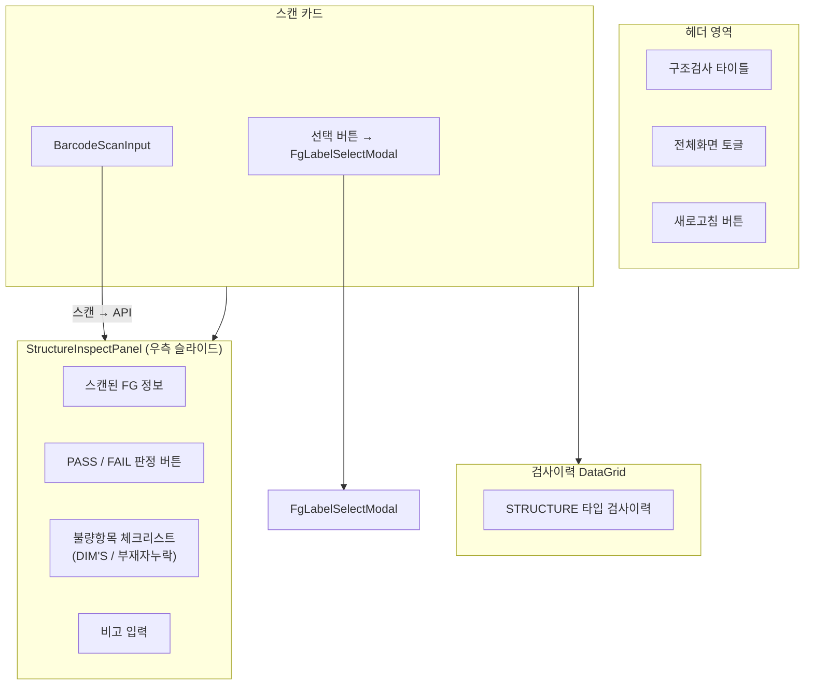
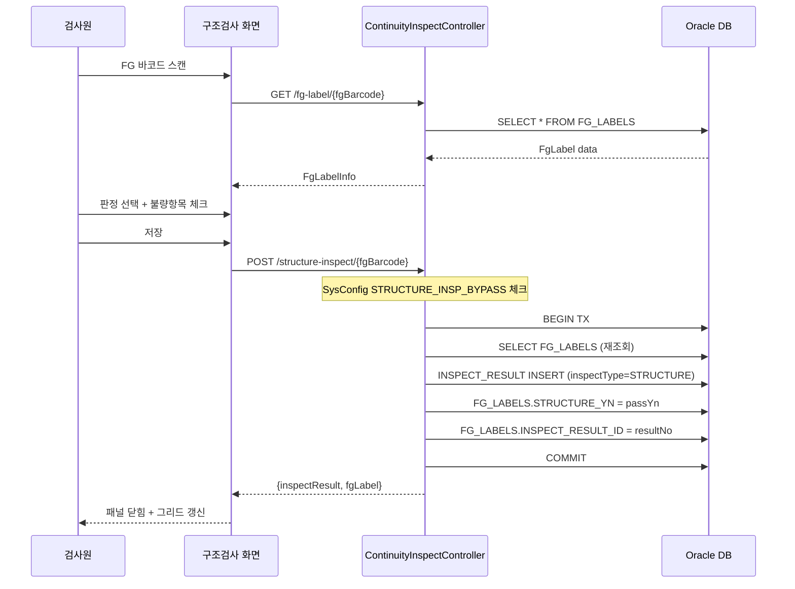
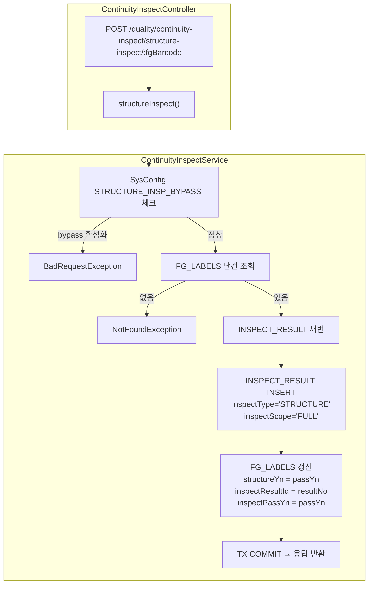

# 구조검사 — 비즈니스 로직 & 데이터 흐름 분석
> **분석 기준 커밋:** `8a7e96ea`
> **분석 일자:** `2026-07-04`

## 1. 화면 개요

| 항목 | 내용 |
|---|---|
| Menu Code | `INSP_STRUCTURE` |
| URL | `/inspection/structure` |
| Frontend Path | `apps/frontend/src/app/(authenticated)/inspection/structure/page.tsx` |
| 목적 | 저전압 공정 DIM'S / 부재자누락 검사 결과 등록 |
| 주요 사용자 | 품질 검사원 |
| Workflow Node | `process-inspection` (lane: quality) — `구조검사` (workflowMap에 path 미등록) |

## 2. 화면 구성



### 컴포넌트 구성

| 컴포넌트 | 파일 | 역할 |
|---|---|---|
| `page.tsx` | `inspection/structure/page.tsx` | 메인 레이아웃, 스캔/그리드/패널 상태 |
| `StructureInspectPanel` | `inspection/structure/components/StructureInspectPanel.tsx` | FG 정보 + PASS/FAIL + 불량항목 체크리스트 |
| `FgLabelSelectModal` | `inspection/structure/components/FgLabelSelectModal.tsx` | FG 라벨 검색/선택 모달 (integrated와 동일) |
| `structureInspectColumns.tsx` | `inspection/structure/structureInspectColumns.tsx` | 구조검사 이력 그리드 컬럼 |

### 입력 필드

| 필드 | 타입 | 설명 |
|---|---|---|
| FG Barcode | BarcodeScanInput | 라벨 스캔 |
| PASS/FAIL | Y/N toggle 버튼 | 판정 선택 |
| DIM'S 체크 | checkbox + QtyInput + Input | DIM'S 불량 선택 시 수량/사유 |
| 부재자누락 체크 | checkbox + QtyInput + Input | 부재자누락 불량 선택 시 수량/사유 |
| 비고 | Input | FAIL 시 추가 설명 |

## 3. 상태 관리

```typescript
// page.tsx
inspectHistory: StructureInspectRecord[]
scannedLabel: FgLabelInfo | null
isPanelOpen: boolean
isSelectModalOpen: boolean

// StructureInspectPanel
passYn: "Y" | "N"                     // 판정 (기본 Y)
errorDetail: string                    // 비고
checklist: DefectCheckItem[]          // 불량항목 (DIM'S, MISSING_PART)
saving: boolean                        // 저장 중
```

## 4. API 호출 흐름

| 호출 시점 | Method | URL | Params | 목적 |
|---|---|---|---|---|
| 최초 진입 | GET | `/quality/inspect-results` | `inspectType=STRUCTURE, limit=500` | 구조검사이력 |
| 바코드 스캔 | GET | `/quality/continuity-inspect/fg-label/:fgBarcode` | - | FG 라벨 조회 |
| 검사 저장 | POST | `/quality/continuity-inspect/structure-inspect/:fgBarcode` | (body) | 구조검사 결과 등록 |
| 모달 검색 | GET | `/quality/continuity-inspect/fg-labels` | `search, limit` | FG 라벨 검색 |



## 5. 백엔드 처리



### DTO

```typescript
body: {
  passYn: 'Y' | 'N'     // 필수
  errorCode?: string     // FAIL 시 불량코드
  errorDetail?: string   // FAIL 시 상세
  inspectData?: string   // FAIL 시 JSON.stringify(checkedItems)
  inspectorId?: string
}
```

### 처리 규칙

- `STRUCTURE_INSP_BYPASS` 시스템 설정이 활성화되면 검사 차단
- FG 라벨의 **STATUS는 변경하지 않음** (생산흐름과 독립적)
- `FG_LABELS.STRUCTURE_YN`에만 결과 저장 (Y/N)
- FG 라벨은 PACKED/SHIPPED/VOIDED 상태여도 구조검사 가능 (별도 차단 없음)
- 불량항목 체크리스트는 `inspectData`에 JSON 배열로 저장

## 6. 처리 규칙 및 검증

1. FG 라벨이 실제 DB에 존재해야 함
2. 불량코드는 체크리스트에서 선택된 항목의 code를 콤마(,)로 join
3. PASS 시 errorCode/errorDetail/inspectData는 null로 저장
4. 저장 후 패널 자동 닫힘 + 그리드 새로고침

## 7. 상태 전이

구조검사는 FG_LABELS의 **STATUS를 변경하지 않음**. `STRUCTURE_YN` 필드만 갱신:
- PASS → `STRUCTURE_YN = 'Y'`
- FAIL → `STRUCTURE_YN = 'N'`

## 8. 상태 코드 및 공통코드

| 코드 그룹 | 코드값 | 설명 |
|---|---|---|
| `JUDGE_YN` | Y | 합격 |
| | N | 불합격 |
| 결함항목 | DIM | DIM'S 불량 |
| | MISSING_PART | 부재자누락 |

## 9. DB 테이블 영향 및 엔티티

### FG_LABELS (FgLabel) — UPDATE

| 컬럼 | 변경 |
|---|---|
| STRUCTURE_YN | passYn (Y/N) |
| INSPECT_RESULT_ID | 생성된 InspectResult.resultNo |
| INSPECT_PASS_YN | passYn (Y/N) |

### INSPECT_RESULTS (InspectResult) — INSERT

| 컬럼 | 값 |
|---|---|
| RESULT_NO | SEQ_RULES 'INSPECT_RESULT' 채번 |
| INSPECT_TYPE | 'STRUCTURE' |
| INSPECT_SCOPE | 'FULL' |
| PASS_YN | 요청값 (Y/N) |
| ERROR_CODE | FAIL 시 errorCode (nullable) |
| ERROR_DETAIL | FAIL 시 errorDetail (nullable) |
| INSPECT_DATA | FAIL 시 JSON.stringify(checkedItems) (nullable) |
| FG_BARCODE | 요청 fgBarcode |
| PROD_RESULT_ID | null (구조검사는 ProdResult 미연결) |
| INSPECT_TIME | CURRENT_TIMESTAMP |

## 10. 에러 코드

| 조건 | Exception | 메시지 |
|---|---|---|
| FG 라벨 없음 | `NotFoundException` | FG 라벨을 찾을 수 없습니다: {fgBarcode} |
| Bypass 활성화 | `BadRequestException` | 구조검사가 시스템 설정에서 bypass 처리되었습니다 |
| Tenant 불일치 | service.assertTenantMatches() | 회사/사업장 불일치 |

## 11. 비고

- 통합검사(INSP_INTEGRATED)와 달리 FG 바코드를 신규 발행하지 않고 기존 라벨에 구조검사 결과만 기록
- InspectionResultWorkflow(통전검사/단자검사)와 달리 작업지시/검사기/소모품 연동 없음
- FgLabelSelectModal은 integrated와 동일한 컴포넌트 구조 (별도 파일이나 동일한 로직)
- 불량항목 체크리스트는 FRONTEND 하드코딩 (DIM'S / MISSING_PART)
