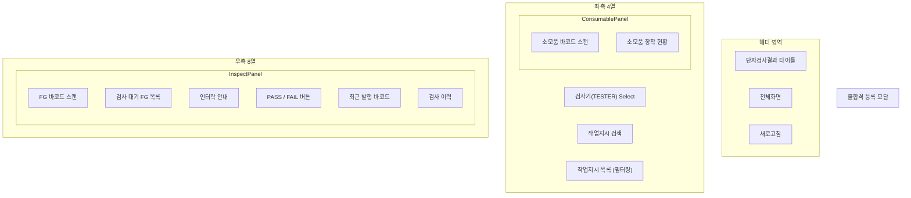
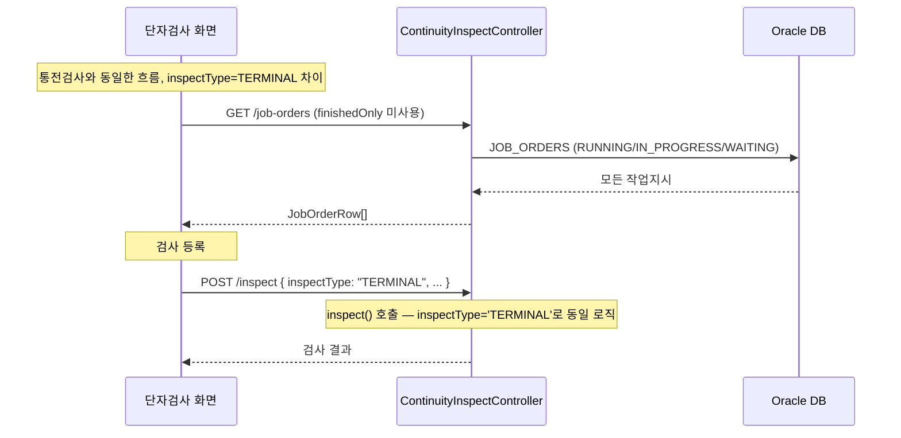

---
sources:
  - apps/frontend/src/app/(authenticated)/inspection/terminal-result/page.tsx
verifiedCommit: 8a7e96ea
---

# 단자검사결과 — 비즈니스 로직 & 데이터 흐름 분석
> **분석 기준 커밋:** `8a7e96ea`
> **분석 일자:** `2026-07-04`

## 1. 화면 개요

| 항목 | 내용 |
|---|---|
| Menu Code | `INSP_TERMINAL_RESULT` |
| URL | `/inspection/terminal-result` |
| Frontend Path | `apps/frontend/src/app/(authenticated)/inspection/terminal-result/page.tsx` |
| 목적 | 단자검사(TERMINAL) — 작업지시 선택 → FG 라벨 스캔 → PASS/FAIL 판정 |
| 주요 사용자 | 생산 라인 검사원 |
| Workflow Node | `process-inspection` (lane: quality) — `단자검사결과` |

## 2. 화면 구성

### 통전검사와의 차이점

| 항목 | INSP_RESULT (통전검사) | INSP_TERMINAL_RESULT (단자검사) |
|---|---|---|
| `inspectType` | `CONTINUITY` | `TERMINAL` |
| `finishedOnly` | `true` (완제품만) | `false` (전체 작업지시) |
| 회로라벨 필수 | PASS 시 필수 | PASS 시 필수 |
| 검사기 선택 | localStorage 키: `hanes:inspection:equip:CONTINUITY` | `hanes:inspection:equip:TERMINAL` |

### 컴포넌트 구성

통전검사(`INSP_RESULT`)와 동일한 `InspectionResultWorkflow`, `InspectPanel`, `ConsumablePanel`, `FailModal` 재사용.

| 컴포넌트 | 파일 | 역할 |
|---|---|---|
| `page.tsx` | `inspection/terminal-result/page.tsx` | `InspectionResultWorkflow` 렌더링 (inspectType=TERMINAL, finishedOnly=false) |
| `InspectionResultWorkflow` | `inspection/result/components/InspectionResultWorkflow.tsx` | 전체 워크플로우 |
| `InspectPanel` | `inspection/result/components/InspectPanel.tsx` | 스캔 + PASS/FAIL |
| `FailModal` | `inspection/result/components/FailModal.tsx` | 불량코드 모달 |
| `ConsumablePanel` | `inspection/result/components/ConsumablePanel.tsx` | 소모품 장착 |

## 3. 상태 관리

`InspectionResultWorkflow` + `InspectPanel` + `ConsumablePanel` 상세는 INSP_RESULT 분석 참조.

## 4. API 호출 흐름

| 호출 시점 | Method | URL | Params | 목적 |
|---|---|---|---|---|
| 최초 진입 | GET | `/quality/continuity-inspect/job-orders` | (finishedOnly 미전송) | 전체 작업지시 목록 |
| 최초 진입 | GET | `/equipment/equips/type/TESTER` | - | 검사기 목록 |
| 작업지시 선택 | GET | `/quality/continuity-inspect/inspect-history/:orderNo` | `inspectType=TERMINAL` | 단자검사 이력 |
| 작업지시 선택 | GET | `/quality/continuity-inspect/pending/:orderNo` | - | 검사 대기 FG |
| 소모품 조회 | GET | `/production/job-orders/:orderNo/consumables` | `equipCode, includeMounted=1` | 소모품 매핑 |
| PASS/FAIL | POST | `/quality/continuity-inspect/inspect` | (body) inspectType=TERMINAL | 검사 등록 |
| 소모품 장착 | POST | `/production/job-orders/:orderNo/consumables/scan` | `conUid, equipCode` | 장착 |
| 소모품 해제 | DELETE | `/production/job-orders/:orderNo/consumables/:conUid` | - | 해제 |

## 5. 백엔드 처리

INSP_RESULT(통전검사)와 동일한 `ContinuityInspectService.inspect()` 메서드 사용.
유일한 차이는 `inspectType` 파라미터가 `'TERMINAL'`로 전달되어 INSPECT_RESULTS.INSPECT_TYPE에 저장됨.

### 처리 흐름 (요약)

1. JobOrder 존재 확인
2. PASS 시 circuitLabel 중복검사
3. `resolveProdResult()`로 ProdResult 연결
4. INSPECT_RESULT INSERT (inspectType='TERMINAL')
5. FG_LABELS UPDATE (inspectPassYn / inspectResultId)
6. TX COMMIT

## 6. 처리 규칙 및 검증

1. 통전검사와 동일한 규칙 적용 (검사기 인터락, 소모품 인터락, 회로라벨 필수 등)
2. **finishedOnly 미적용**: 완제품뿐 아니라 모든 작업지시 대상
3. **inspectType=TERMINAL**로 INSPECT_RESULTS에 기록
4. FG_LABELS.STATUS는 변경 없음 (ISSUED 유지)

## 7. 상태 전이

INSP_RESULT와 동일:
- FG_LABELS.STATUS 변경 없음
- FG_LABELS.INSPECT_PASS_YN만 갱신

## 8. 상태 코드 및 공통코드

| 코드 그룹 | 코드값 | 설명 |
|---|---|---|
| `INSPECT_TYPE` | TERMINAL | 단자검사 |
| `JUDGE_YN` | Y/N | 합격/불합격 |
| `CONTINUITY_DEFECT` | (동적) | 단자검사 불량코드 (공통코드 재사용) |

## 9. DB 테이블 영향

INSP_RESULT와 동일한 테이블 영향. 유일한 차이:

### INSPECT_RESULTS.INSPECT_TYPE

| 비교 | INSP_RESULT | INSP_TERMINAL_RESULT |
|---|---|---|
| INSPECT_TYPE | 'CONTINUITY' | 'TERMINAL' |

## 10. 에러 코드

INSP_RESULT와 동일 (ContinuityInspectService.inspect() 재사용)

## 11. 비고

- 통전검사와 거의 동일한 화면/로직, inspectType과 finishedOnly만 다름
- `page.tsx`는 단 15줄 — 모든 로직은 `InspectionResultWorkflow`에 위임
- 코드 중복 방지를 위해 `InspectionResultWorkflow`를 공유 컴포넌트로 설계
- `localStorage` 저장키: `hanes:inspection:equip:TERMINAL`
