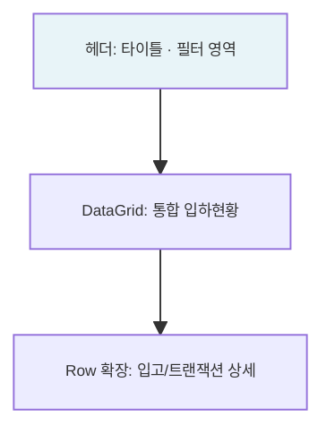

# 입고현황 — 비즈니스 로직 & 데이터 흐름 분석

> **분석 기준 커밋:** `8a7e96ea`
> **분석 일자:** `2026-07-04`

---

## 1. 화면 개요

| 항목 | 내용 |
|------|------|
| **메뉴 코드** | `INV_ARRIVAL_STOCK` |
| **URL** | `/inventory/arrival-stock` |
| **메뉴 경로** | 재고관리 > 입고현황 |
| **화면 목적** | 입하→입고→재고 전 과정 통합 조회 |
| **주요 사용자** | 자재/재고 담당자 |

## 2. 화면 구성

## 3. API

| 시점 | API | 용도 |
| --- | --- | --- |
| 초기 로드 | `GET /material/arrivals?limit=5000&status=&fromDate=&toDate=&search=` | 입하 목록 조회 |

## 4. 백엔드 — ArrivalService

- MAT_ARRIVALS + MAT_RECEIVINGS + MAT_STOCKS 통합 조회

## 5. DB 테이블

| 테이블 | 역할 |
|--------|------|
| `MAT_ARRIVALS` | 입하 마스터 |
| `MAT_RECEIVINGS` | 입고 내역 |
| `MAT_STOCKS` | 재고 현황 |
| `MAT_LOTS` | LOT 정보 |

## 6. 비고

- **읽기 전용**
- **tenant scope**: company/plant 포함
