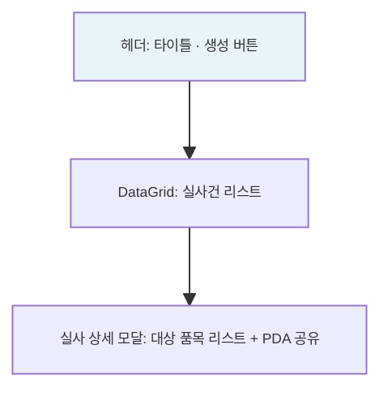

---
sources:
  - apps/backend/src/common/guards/inventory-freeze.guard.ts
  - apps/backend/src/modules/material/services/physical-inv.service.ts
verifiedCommit: 8a7e96ea
---

# 실사관리 — 비즈니스 로직 & 데이터 흐름 분석

> **분석 기준 커밋:** `8a7e96ea`
> **분석 일자:** `2026-07-04`

---

## 1. 화면 개요

| 항목 | 내용 |
|------|------|
| **메뉴 코드** | `INV_MAT_PHYSICAL_INV` |
| **URL** | `/inventory/physical-inv` |
| **메뉴 경로** | 재고관리 > 실사관리 |
| **화면 목적** | 실사 대상 생성 + PDA 연동 + 실사 결과 등록 |
| **주요 사용자** | 재고관리 담당자 |

## 2. 화면 구성

## 3. API 호출 흐름

| 시점 | API | 용도 |
| --- | --- | --- |
| 초기 로드 | `GET /physical-inv/schedules?limit=5000` | 실사 스케줄 조회 |
| 실사 생성 | `POST /physical-inv/schedules` | 실사 스케줄 생성 |
| 실사 적용 | `PATCH /physical-inv/schedules/{id}/apply` | 차이→보정 반영 |
| 상세 조회 | `GET /physical-inv/schedules/{id}/details` | 대상 품목 리스트 |

## 4. 백엔드 — PhysicalInvService

### create()
1. `PHYSICAL_INV_SCHEDULES` INSERT
2. 대상 품목을 MatStock→ItemMaster 기준으로 선정
3. `PHYSICAL_INV_DETAILS` INSERT (대상별 systemQty 기록)

### PDA 흐름
- PDA가 실사 수량 전송 → DETAILS.countQty UPDATE
- PC: countQty vs systemQty 차이 비교

### apply()
- systemQty != countQty 차이를 INV_ADJ_LOGS(=ADJUSTMENT)로 반영
- PHYSICAL_INV_SCHEDULES.status='APPLIED'

## 5. DB 테이블 영향

| 테이블 | 변경 |
| --- | --- |
| `PHYSICAL_INV_SCHEDULES` | INSERT / UPDATE status |
| `PHYSICAL_INV_DETAILS` | INSERT / UPDATE countQty |
| `INV_ADJ_LOGS` | apply 시 INSERT (차이 보정) |

## 6. 실사 상태

| 상태 | 설명 |
|------|------|
| DRAFT | 생성 완료 (PDA 작성 대기) |
| IN_PROGRESS | PDA 작성 중 |
| COMPLETED | PDA 작성 완료 |
| APPLIED | 차이 반영 완료 |

## 7. 비고

- **@UseGuards(InventoryFreezeGuard)**: 재고프리즈 차단 (apply 시)
- **PDA 연동**: PDA Sidebar에서 countQty 입력
- **tenant scope**: company/plant 포함
