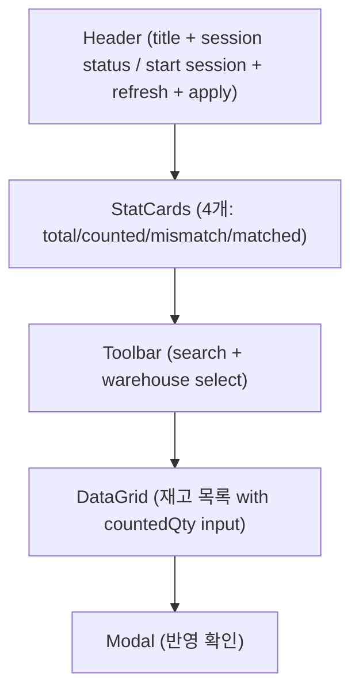
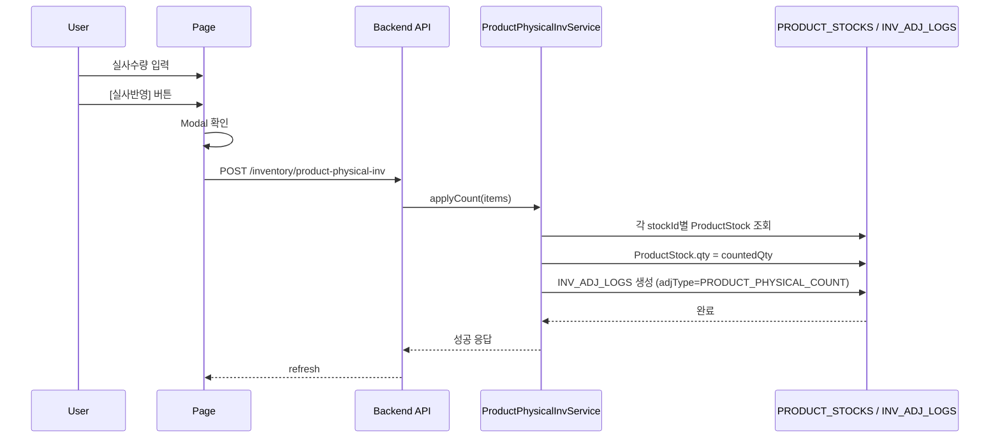
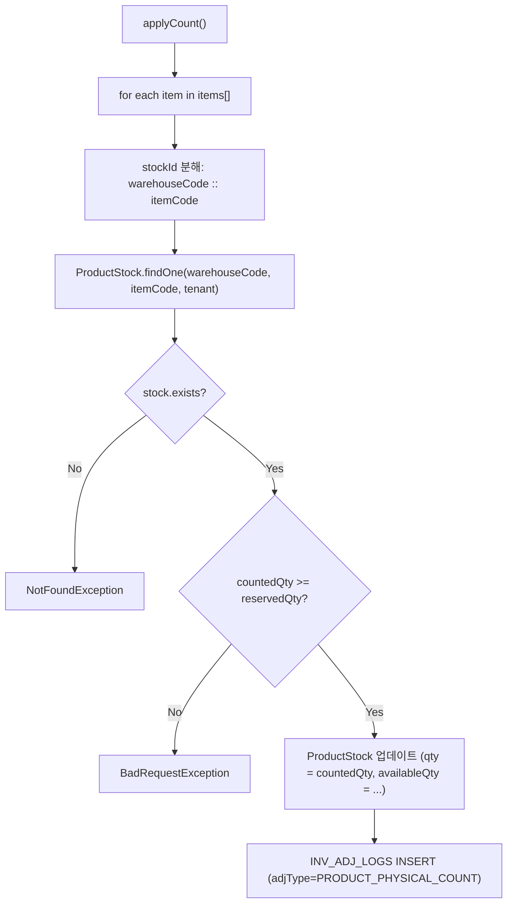

---
sources:
  - apps/frontend/src/app/(authenticated)/inventory/product-physical-inv/page.tsx
verifiedCommit: 8a7e96ea
---

# 제품재고실사 — 비즈니스 로직 & 데이터 흐름 분석
> **분석 기준 커밋:** `8a7e96ea`
> **분석 일자:** `2026-07-04`

## 1. 화면 개요

| 항목 | 내용 |
|------|------|
| **메뉴 코드** | `INV_PRODUCT_PHYSICAL_INV` |
| **메뉴명** | 제품재고실사 |
| **URL** | `/inventory/product-physical-inv` |
| **소스 경로** | `apps/frontend/src/app/(authenticated)/inventory/product-physical-inv/page.tsx` |
| **목적** | PRODUCT_STOCKS 실사수량 입력 및 반영 |
| **사용자** | 재고관리자, 실사자 |
| **워크플로우 노드** | 실사 세션 개시 → 재고 목록 조회 → 실사수량 입력 → 반영 |

## 2. 화면 구성

### 2.1 레이아웃



### 2.2 컴포넌트

| 구분 | 컴포넌트 | 소스 위치 |
|------|---------|----------|
| 레이아웃 | `Card`, `CardContent`, `Modal` | `@/components/ui` |
| 통계 | `StatCard` | `@/components/ui` |
| Input | `Input` | `@/components/ui` |
| Button | `Button` | `@/components/ui` |
| 창고 Select | `WarehouseSelect` | `@/components/shared` |
| 그리드 | `DataGrid` | `@/components/data-grid/DataGrid` |
| 컬럼 정의 | `createProductPhysicalInvGridColumns` | `./productPhysicalInvColumns.tsx` |

### 2.3 필드/컬럼

| 컬럼명 | 표시 | 유형 | 비고 |
|--------|------|------|------|
| 창고 | warehouseName | 텍스트 | |
| 품목코드 | itemCode | 모노텍스트 | |
| 품목명 | itemName | 텍스트 | |
| 장부수량 | qty | 숫자 | (system qty) |
| 실사수량 | countedQty | `input[type=text]` | 직접 입력 |
| 차이 | diff = countedQty - qty | 숫자 (파랑/빨강/초록) | null이면 '-' |
| 최종실사일 | lastCountAt | 날짜 | |

### 2.4 Filter

| 필터명 | 유형 | 비고 |
|--------|------|------|
| 검색 | `Input` | 검색어 |
| 창고 | `WarehouseSelect` (includeAll) | |

## 3. 상태 관리

```typescript
data: StockForCount[]          // 실사 대상 재고 목록
loading, saving: boolean
searchText: string
warehouseFilter: string
showConfirm: boolean           // 반영 확인 Modal 제어
activeSession: ActiveSession | null  // 진행 중 실사 세션
startingSession: boolean
```

## 4. API 호출 흐름

### 4.1 API 목록

| Method | Endpoint | 용도 | 호출 시점 |
|--------|----------|------|----------|
| `GET` | `/inventory/product-physical-inv/active` | 진행 중 세션 조회 | 최초 로드 |
| `POST` | `/inventory/product-physical-inv/session/start` | 실사 세션 개시 | [실사 개시] 버튼 |
| `GET` | `/inventory/product-physical-inv` | 실사 대상 재고 조회 | 최초 로드 / Refresh / 반영 후 |
| `POST` | `/inventory/product-physical-inv` | 실사 결과 반영 | [실사반영] 버튼 확인 |

### 4.2 API 추적

| API | Controller | Service |
|-----|-----------|---------|
| `GET /inventory/product-physical-inv` | `ProductPhysicalInvController.findStocks()` | `ProductPhysicalInvService.findStocks()` |
| `GET /inventory/product-physical-inv/active` | `ProductPhysicalInvController.getActiveSession()` | `ProductPhysicalInvService.getActiveSession()` |
| `POST /inventory/product-physical-inv/session/start` | `ProductPhysicalInvController.startSession()` | `ProductPhysicalInvService.startSession()` |
| `POST /inventory/product-physical-inv` | `ProductPhysicalInvController.apply()` | `ProductPhysicalInvService.applyCount()` |

### 4.3 주요 시퀀스



## 5. 백엔드 처리

### 5.1 서비스 계층 (`product-physical-inv.service.ts`)



### 5.2 실사 세션 (PHYSICAL_INV_SESSIONS)

- `startSession()` → PHYSICAL_INV_SESSIONS INSERT
- `getActiveSession()` → PHYSICAL_INV_SESSIONS WHERE status='IN_PROGRESS'

## 6. 처리 규칙 및 검증

1. **실사수량 < 예약수량 불가**: `countedQty < stock.reservedQty` → BadRequest
2. **반영은 트랜잭션 단위**: `TransactionService.run()`으로 일괄 처리
3. **INV_ADJ_LOGS 적재**: 모든 실사 이력은 `adjType='PRODUCT_PHYSICAL_COUNT'`로 기록

## 7. DB 테이블 영향 및 엔티티

| 테이블 | 엔티티 | 용도 | 읽기/쓰기 |
|--------|--------|------|----------|
| `PRODUCT_STOCKS` | `ProductStock` | 제품 현재고 | RW (UPDATE qty) |
| `INV_ADJ_LOGS` | `InvAdjLog` | 재고조정 이력 | W (INSERT) |
| `PHYSICAL_INV_SESSIONS` | `PhysicalInvSession` | 실사 세션 | RW |
| `PHYSICAL_INV_COUNT_DETAILS` | `PhysicalInvCountDetail` | 실사 상세 | W |
| `WAREHOUSES` | `Warehouse` | 창고 정보 | R |
| `ITEM_MASTER` | `ItemMaster` | 품목 정보 | R |

## 8. 에러 코드

| 조건 | 예외 | HTTP |
|------|------|------|
| 재고 없음 | `NotFoundException` | 404 |
| 실사수량 < 예약수량 | `BadRequestException` | 400 |
| 세션 없음 | `NotFoundException` | 404 |

## 9. 공통코드

- `adjType` = `PRODUCT_PHYSICAL_COUNT` (하드코딩)

## 10. 비고

- `useBoxReceive.ts`의 `receiveBoxes`는 제품입고 기능이므로 이 페이지와 무관
- 실사 세션 진행 중에도 실사 반영 가능 (세션과 반영은 독립적)
