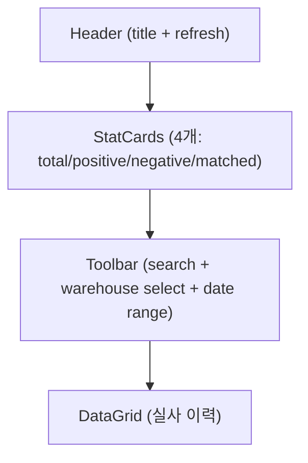

# 제품재고실사이력 — 비즈니스 로직 & 데이터 흐름 분석
> **분석 기준 커밋:** `8a7e96ea`
> **분석 일자:** `2026-07-04`

## 1. 화면 개요

| 항목 | 내용 |
|------|------|
| **메뉴 코드** | `INV_PRODUCT_PHYSICAL_INV_HISTORY` |
| **메뉴명** | 제품재고실사이력 |
| **URL** | `/inventory/product-physical-inv-history` |
| **소스 경로** | `apps/frontend/src/app/(authenticated)/inventory/product-physical-inv-history/page.tsx` |
| **목적** | INV_ADJ_LOGS(adjType=PRODUCT_PHYSICAL_COUNT) 조회 및 차이 분석 |
| **사용자** | 재고관리자 |
| **워크플로우 노드** | 조회 (Read-Only) |

## 2. 화면 구성

### 2.1 레이아웃



### 2.2 컴포넌트

| 구분 | 컴포넌트 | 소스 위치 |
|------|---------|----------|
| 레이아웃 | `Card`, `CardContent` | `@/components/ui` |
| 통계 | `StatCard` | `@/components/ui` |
| Input | `Input` | `@/components/ui` |
| 창고 Select | `WarehouseSelect` | `@/components/shared` |
| 기간 필터 | `DateRangeFilter` | `@/components/shared/DateRangeFilter` |
| 그리드 | `DataGrid` | `@/components/data-grid/DataGrid` |
| 컬럼 정의 | `createProductPhysicalInvHistoryGridColumns` | `./productPhysicalInvHistoryColumns.tsx` |

### 2.3 필드/컬럼

| 컬럼명 | 표시 | 유형 |
|--------|------|------|
| 실사일시 | createdAt | 날짜/시간 |
| 창고 | warehouseName | 텍스트 |
| 품목코드 | itemCode | 모노텍스트 |
| 품목명 | itemName | 텍스트 |
| LOT No | prdUid | 모노텍스트 |
| 장부수량 | beforeQty | 숫자 |
| 실사수량 | afterQty | 숫자 |
| 차이 | diffQty | 숫자 (양수=파랑, 음수=빨강, 0=초록) |
| 사유 | reason | 텍스트 |
| 실사자 | createdBy | 텍스트 |

### 2.4 행 색상

```typescript
diffQty > 0  → "bg-blue-50/50 dark:bg-blue-950/20"
diffQty < 0  → "bg-red-50/50 dark:bg-red-950/20"
diffQty === 0 → 기본
```

## 3. 상태 관리

```typescript
data: InvHistoryItem[]
loading: boolean
searchText: string
warehouseFilter: string
fromDate, toDate: string  (기본값=당일)
```

## 4. API 호출 흐름

### 4.1 API 목록

| Method | Endpoint | 용도 | 호출 시점 |
|--------|----------|------|----------|
| `GET` | `/inventory/product-physical-inv/history` | 실사 이력 조회 | 최초 로드 / Refresh / 필터 변경 |

### 4.2 API 추적

| 계층 | 파일 | 라인 |
|------|------|------|
| **프론트** | `page.tsx:56` | `api.get('/inventory/product-physical-inv/history', { params })` |
| **Controller** | `product-physical-inv.controller.ts:27-32` | `@Get('history')` → `findHistory()` |
| **Service** | `product-physical-inv.service.ts:109-158` | `findHistory()`: INV_ADJ_LOGS 조회 (adjType='PRODUCT_PHYSICAL_COUNT') |

## 5. 백엔드 처리

### 5.1 서비스 메서드

```typescript
findHistory(query, company, plant)
```

```sql
SELECT log.*, part.itemName, wh.warehouseName
FROM INV_ADJ_LOGS log
LEFT JOIN ITEM_MASTER part ON part.itemCode = log.itemCode
LEFT JOIN WAREHOUSES wh ON wh.warehouseCode = log.warehouseCode
WHERE log.adjType = 'PRODUCT_PHYSICAL_COUNT'
  AND log.company = :company
  AND log.plant = :plant
  AND (:warehouseCode)  -- optional
  AND (:fromDate)       -- optional
  AND (:toDate)         -- optional
ORDER BY log.createdAt DESC
```

## 6. 처리 규칙

- 읽기 전용 페이지, 데이터 변경 없음
- `adjType='PRODUCT_PHYSICAL_COUNT'` 고정 필터

## 7. DB 테이블 영향

| 테이블 | 엔티티 | 용도 |
|--------|--------|------|
| `INV_ADJ_LOGS` | `InvAdjLog` | 실사 이력 (Read-Only) |
| `ITEM_MASTER` | `ItemMaster` | 품목 정보 |
| `WAREHOUSES` | `Warehouse` | 창고 정보 |
| `MAT_LOTS` | `MatLot` | LOT 정보 |

## 8. 공통코드

- `adjType` = `PRODUCT_PHYSICAL_COUNT` (INV_ADJ_LOGS 고정값)

## 9. 에러 코드

- 별도 에러 코드 없음. 실패 시 `[]` 반환.

## 10. 비고

- MATERIAL physical-inv-history와 동일한 INV_ADJ_LOGS 테이블 사용
- 제품 실사 이력은 adjType으로 구분
