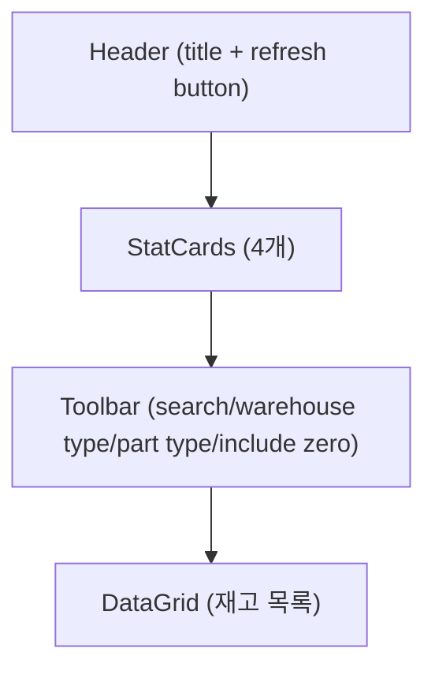
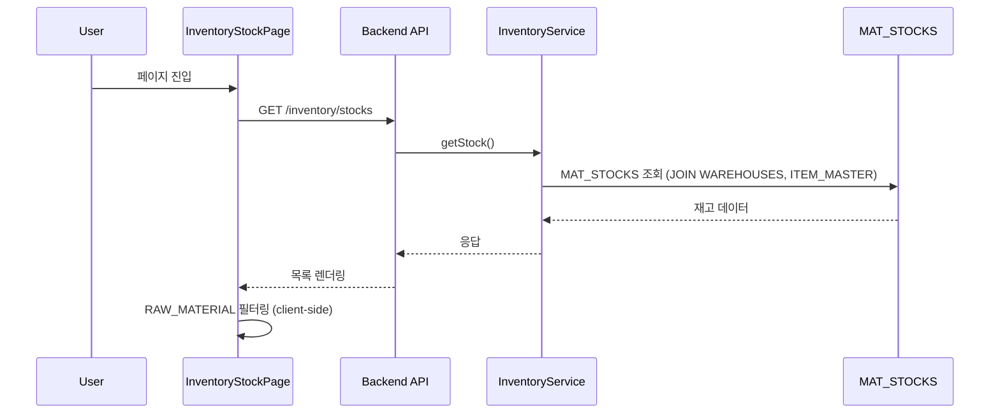
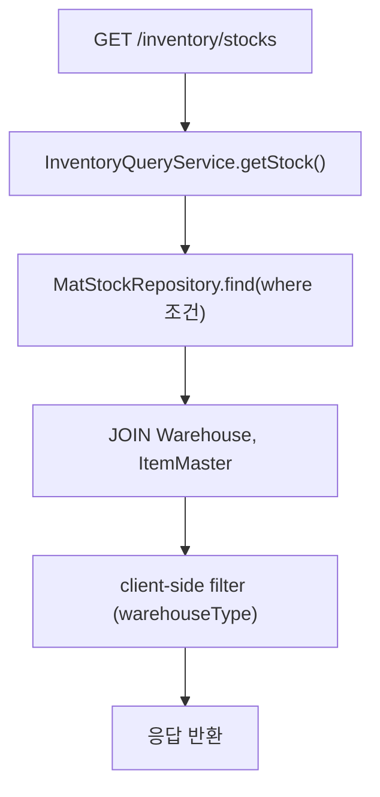

# 제품재고현황 — 비즈니스 로직 & 데이터 흐름 분석
> **분석 기준 커밋:** `8a7e96ea`
> **분석 일자:** `2026-07-04`

## 1. 화면 개요

| 항목 | 내용 |
|------|------|
| **메뉴 코드** | `INV_PRODUCT_STOCK` |
| **메뉴명** | 제품재고현황 |
| **URL** | `/inventory/stock` |
| **소스 경로** | `apps/frontend/src/app/(authenticated)/inventory/stock/page.tsx` |
| **목적** | 제품(WIP/FG)의 창고별 재고 현황 조회 (원자재 RAW 제외) |
| **사용자** | 생산관리자, 자재관리자 |
| **워크플로우 노드** | 재고 조회 → 통계 확인 → 필터링 → 엑셀 내보내기 |

## 2. 화면 구성

### 2.1 레이아웃



### 2.2 컴포넌트

| 구분 | 컴포넌트 | 소스 위치 |
|------|---------|----------|
| 레이아웃 | `Card`, `CardContent` | `@/components/ui` |
| 통계 | `StatCard` | `@/components/ui` |
| 필터 Input | `Input` | `@/components/ui` |
| Select | `Select` | `@/components/ui` |
| 그리드 | `DataGrid` | `@/components/data-grid/DataGrid` |
| 컬럼 정의 | `createStockGridColumns` | `./stockColumns.tsx` |

### 2.3 필드/컬럼

| 컬럼명 | 표시 | 유형 | 소스 |
|--------|------|------|------|
| 창고유형 | WIP/FG/FLOOR/DEFECT/SCRAP | 배지 | `stockColumns.tsx:54-66` |
| 창고코드/명 | 공통 유틸리티 | `createWarehouseColumns` | `@/lib/table-utils` |
| 품목코드/명 | 공통 유틸리티 | `createPartColumns` | `@/lib/table-utils` |
| 현재고 | qty | 숫자 | `createQtyColumn` |
| 예약수량 | reservedQty | 숫자 | `stockColumns.tsx:75-78` |
| 가용수량 | availableQty | 숫자 (음수=빨강) | `stockColumns.tsx:81-93` |
| 단위 | unit | 텍스트 | `stockColumns.tsx:96-100` |
| 마지막 거래일 | lastTransAt | 날짜 | `createDateColumn` |

### 2.4 필터

| 필터명 | 유형 | 옵션 |
|--------|------|------|
| 품목코드 검색 | `Input` (text) | 부분일치 (client-side filter) |
| 창고유형 | `Select` | All / WIP / FG / FLOOR / DEFECT / SCRAP |
| 품목유형 | `Select` | All / SEMI_PRODUCT / FINISHED |
| 재고 0 포함 | checkbox | includeZero |

## 3. 상태 관리

```typescript
stocks: StockData[]       // 전체 재고 데이터 (GET 응답)
loading: boolean           // 로딩 상태
filters: {
  warehouseType: string,   // 창고유형 필터
  itemType: string,        // 품목유형 필터
  itemCode: string,        // 검색어
  includeZero: boolean,    // 0포함 여부
}
```

로컬 `useState`로만 관리, 전역 store 불필요.

## 4. API 호출 흐름

### 4.1 API 목록

| Method | Endpoint | 용도 | 호출 시점 |
|--------|----------|------|----------|
| `GET` | `/inventory/stocks` | 재고 목록 조회 | 최초 로드 / Refresh 클릭 |

### 4.2 API 추적

| 계층 | 파일 | 라인 |
|------|------|------|
| **프론트 호출** | `page.tsx:56` | `api.get('/inventory/stocks')` |
| **Controller** | `inventory.controller.ts:240-243` | `@Get('stocks')` → `inventoryService.getStock(query, company, plant)` |
| **Query Service** | `inventory.service.ts:78-80` | 위임: `inventoryQueryService.getStock(query, company, plant)` |

### 4.3 주요 시퀀스



## 5. 백엔드 처리

### 5.1 서비스 계층

| 항목 | 내용 |
|------|------|
| **Service** | `InventoryService` → 위임: `InventoryQueryService` |
| **Repository** | `MatStock` |
| **Query 방식** | `MatStockRepository.find({ where, relations })` (TypeORM) |



### 5.2 테넌트 조건

```sql
WHERE COMPANY = :company
  AND PLANT_CD = :plant
```

## 6. 처리 규칙 및 검증

- **원자재(RAW_MATERIAL) 배제**: 프론트에서 `stock.part?.itemType === 'RAW_MATERIAL'` 필터
- **RAW 창고 배제**: `stock.warehouse?.warehouseType === 'RAW'` 제외
- **클라이언트 측 필터링**: 품목코드 검색은 `useMemo`로 client-side 처리

## 7. 상태 전이

N/A — 조회 전용 페이지, 상태 전이 없음.

## 8. 상태 코드 및 공통코드

| 코드 | 설명 | 출처 |
|------|------|------|
| WIP | 반제품 재고 | `WAREHOUSE_TYPES` 하드코딩 |
| FG | 완제품 재고 | 하드코딩 |
| FLOOR | 바닥재고 | 하드코딩 |
| DEFECT | 불량 재고 | 하드코딩 |
| SCRAP | 폐기 재고 | 하드코딩 |
| SEMI_PRODUCT | 반제품 품목유형 | `PART_TYPES` 하드코딩 |
| FINISHED | 완제품 품목유형 | 하드코딩 |

## 9. DB 테이블 영향 및 엔티티

| 테이블 | 엔티티 | 용도 |
|--------|--------|------|
| `MAT_STOCKS` | `MatStock` | 원자재/자재 현재고 |
| `WAREHOUSES` | `Warehouse` | 창고 정보 |
| `ITEM_MASTER` | `ItemMaster` | 품목 정보 |

**읽기 전용 (Read-Only)**.

## 10. 에러 코드

- 별도 에러 코드 없음. 네트워크 오류 시 `console.error` 후 빈 배열 표시.

## 11. 비고

- `InventoryStockPage`는 `MAT_STOCKS`를 조회하지만 프론트에서 RAW 행을 제외하는 방식을 취한다.
- 미래 제품 전용(PRODUCT_STOCKS)으로 전환 시 백엔드에서 필터링하는 것이 바람직하다.
- 공통 유틸 `createWarehouseColumns`, `createPartColumns`, `createQtyColumn`, `createDateColumn`을 적극 활용.
