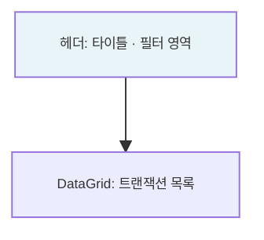

# 재고 트랜잭션 — 비즈니스 로직 & 데이터 흐름 분석

> **분석 기준 커밋:** `8a7e96ea`
> **분석 일자:** `2026-07-04`

---

## 1. 화면 개요

| 항목 | 내용 |
|------|------|
| **메뉴 코드** | `INV_TRANSACTION` |
| **URL** | `/inventory/transaction` |
| **메뉴 경로** | 재고관리 > 재고 트랜잭션 |
| **화면 목적** | STOCK_TRANSACTIONS 전수 조회 (모든 TransType) — 읽기 전용 |
| **주요 사용자** | 자재/재고 담당자 |

## 2. 화면 구성

## 3. API

| 시점 | API | 용도 |
| --- | --- | --- |
| 초기 로드 | `GET /inventory/transactions?limit=5000&transType=&fromDate=&toDate=&search=` | 트랜잭션 조회 |

## 4. 백엔드 — InventoryService.findAll()

- `StockTransaction` → `STOCK_TRANSACTIONS` 조회
- TransType enum 필터: RECEIVE / MAT_OUT / SCRAP / ADJUST_IN / ADJUST_OUT / MISC_IN / TRANSFER / LOT_SPLIT_IN/OUT / LOT_MERGE_IN/OUT / RECEIVE_CANCEL 등

## 5. DB 테이블

| 테이블 | 역할 |
|--------|------|
| `STOCK_TRANSACTIONS` | 모든 재고 이동 이력 |

## 6. 비고

- **읽기 전용**
- **tenant scope**: company/plant 포함
