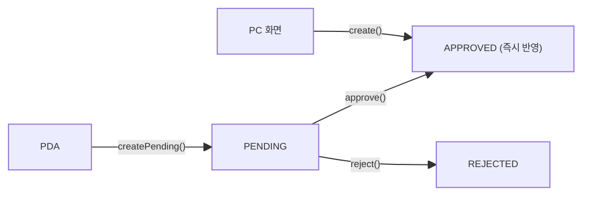

---
sources:
  - apps/backend/src/common/guards/inventory-freeze.guard.ts
  - apps/backend/src/modules/material/services/adjustment.service.ts
verifiedCommit: 8a7e96ea
---

# 재고보정 — 비즈니스 로직 & 데이터 흐름 분석

> **분석 기준 커밋:** `8a7e96ea`
> **분석 일자:** `2026-07-04`

---

## 1. 화면 개요

| 항목 | 내용 |
|------|------|
| **메뉴 코드** | `MAT_ADJUSTMENT` |
| **URL** | `/material/adjustment` |
| **메뉴 경로** | 자재관리 > 재고보정 |
| **화면 목적** | 시스템 재고 수량 수동 보정 — InvAdjLog 생성 + StockTransaction 기록 |
| **주요 사용자** | 자재관리 담당자 |

## 2. API 호출 흐름

| 시점 | API | 용도 |
| --- | --- | --- |
| 초기 로드 | `GET /material/adjustment?limit=5000&search=&fromDate=&toDate=` | 보정 이력 조회 |
| 보정 등록 | `POST /material/adjustment` | 즉시 승인 보정 (ADJUST_IN/OUT) |
| 품목 검색 | `GET /master/parts?search=&limit=20` | 품목 검색 |

## 3. 백엔드 — AdjustmentService

### create() — tx.run
1. `InvAdjLog` INSERT (adjType='ADJUSTMENT', status='APPROVED', beforeQty, afterQty 차이)
2. `MatStock` UPSERT (qty = afterQty)
3. `StockTransaction` INSERT (transType='ADJUST_IN' 또는 'ADJUST_OUT')
4. `MatLot` 재고량 업데이트

### approve/reject
- PENDING → APPROVED (재고 반영) / REJECTED (재고 변동 없음)

## 4. DB 테이블 영향

| 테이블 | 변경 |
| --- | --- |
| `INV_ADJ_LOGS` | INSERT (beforeQty, afterQty, diffQty) |
| `MAT_STOCKS` | UPSERT (qty = afterQty) |
| `STOCK_TRANSACTIONS` | INSERT (ADJUST_IN / ADJUST_OUT) |
| `MAT_LOTS` | UPDATE currentQty |

## 5. 상태 전이

## 6. 비고

- **@UseGuards(InventoryFreezeGuard)**: 재고프리즈 차단
- **tenant scope**: company/plant 포함
- **PDA 승인 대기 흐름**: createPending → approve/reject
