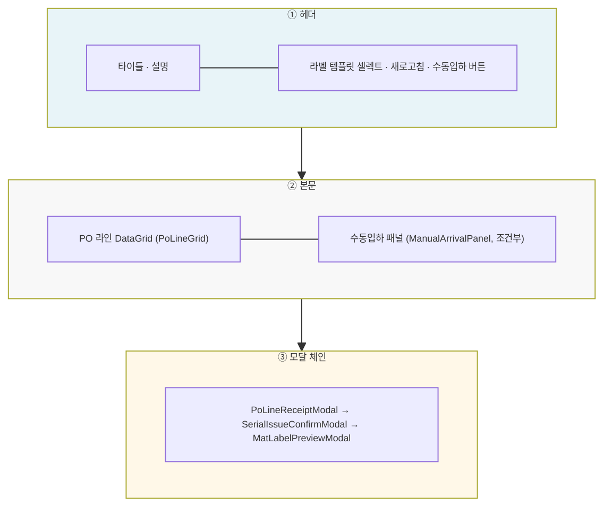
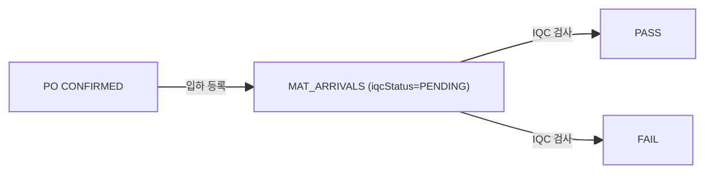

# 자재입하관리 — 비즈니스 로직 & 데이터 흐름 분석

> **분석 기준 커밋:** `8a7e96ea`
> **분석 일자:** `2026-07-04`

---

## 1. 화면 개요

| 항목 | 내용 |
|------|------|
| **메뉴 코드** | `MAT_ARRIVAL` |
| **URL** | `/material/arrival` |
| **메뉴 경로** | 자재관리 > 자재입하관리 |
| **화면 목적** | PO 라인 기준 자재 입하 등록 (IQC005) — PO 라인 그리드 → 입하 모달 → 시리얼 발급 → 라벨 미리보기 |
| **주요 사용자** | 자재입고 담당자 |

## 2. 화면 구성

| 영역 | 컴포넌트 | 역할 |
| --- | --- | --- |
| ① 헤더 | `page.tsx` | 제목, 라벨 템플릿 선택, 새로고침, 수동입하 |
| ② 좌측 | `PoLineGrid` | PO 라인 목록 그리드 (품목코드/PO번호 검색) |
| ② 우측 | `ManualArrivalPanel` | PO 없는 수동 입하 패널 |
| ③ 모달 | `PoLineReceiptModal` | 입하수량/일자/제조사 입력 |
| ③ 모달 | `SerialIssueConfirmModal` | 시리얼 발급 수 확인 |
| ③ 모달 | `MatLabelPreviewModal` | 발급 시리얼 라벨 미리보기 |

## 3. API 호출 흐름

| 시점 | API | 용도 |
| --- | --- | --- |
| 초기 로드 | `GET /material/arrivals/po-lines?itemCode=&poNo=` | PO 라인 목록 조회 |
| 초기 로드 | `GET /master/label-templates?category=mat_lot` | 라벨 템플릿 로드 |
| 라인 입하 | `POST /material/arrivals/po-line` | PO 라인 입하 등록 |
| 수동입하 | `POST /material/arrivals/manual` | 수동 입하 등록 |

## 4. 백엔드 처리 — ArrivalService.receivePoLine()

트랜잭션: `this.tx.run`

1. PO Item 검증 (CONFIRMED/PARTIAL 상태, 잔량 > 0)
2. matUid 발번 — `F_GET_MAT_UID()` Oracle Function
3. `MAT_ARRIVALS` INSERT (arrivalNo=SEQ_ARRIVAL_NO.NEXTVAL, iqcStatus='PENDING')
4. `MAT_LOTS` N건 INSERT (status='NORMAL', iqcStatus='PENDING')
5. `PURCHASE_ORDER_ITEMS.receivedQty` UPDATE
6. `MAT_ARRIVAL_TRANSACTIONS` INSERT (transType='ARRIVAL_IN')

## 5. DB 테이블 영향

| 테이블 | 변경 | 주요 칼럼 |
| --- | --- | --- |
| `MAT_ARRIVALS` | INSERT | `arrivalNo(SEQ)`, `seq`, `itemCode`, `qty`, `iqcStatus:'PENDING'` |
| `MAT_LOTS` | INSERT | `matUid(F_GET_MAT_UID)`, `status:'NORMAL'`, `iqcStatus:'PENDING'`, `initQty` |
| `PURCHASE_ORDER_ITEMS` | UPDATE | `receivedQty += qty` |
| `MAT_ARRIVAL_TRANSACTIONS` | INSERT | `transType:'ARRIVAL_IN'`, `qty` |

## 6. 상태 전이

## 7. 비고

- **tenant scope**: `@Company()`, `@Plant()` 데커레이터 사용
- **채번 방식**: `F_GET_MAT_UID()` Oracle Function — AGENTS §5 준수
- **분할 입하**: 동일 PO 라인 분할 입하 가능 (receivedQty 누적)
