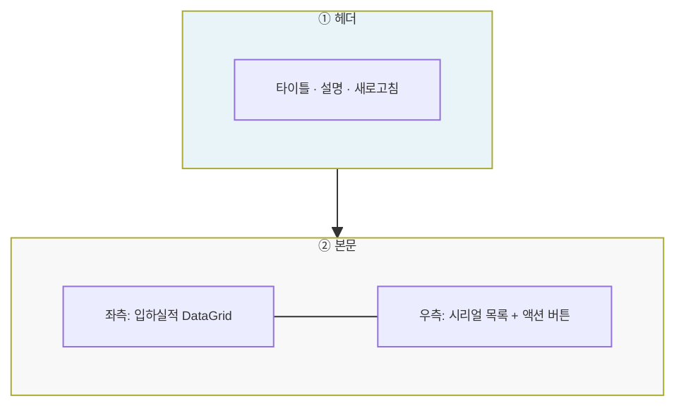

# 입하실적조회 — 비즈니스 로직 & 데이터 흐름 분석

> **분석 기준 커밋:** `8a7e96ea`
> **분석 일자:** `2026-07-04`

---

## 1. 화면 개요

| 항목 | 내용 |
|------|------|
| **메뉴 코드** | `MAT_ARRIVAL_RESULT` |
| **URL** | `/material/arrival-result` |
| **메뉴 경로** | 자재관리 > 입하실적조회 |
| **화면 목적** | IQC006 — 입하 이력 조회, 시리얼 라벨 재발행, 입하 취소, 제조사 변경 |
| **주요 사용자** | 자재입고 담당자, 품질 담당자 |

## 2. 화면 구성

## 3. API 호출 흐름

| 시점 | API | 용도 |
| --- | --- | --- |
| 초기 로드 | `GET /material/arrivals/results?limit=200&fromDate=&toDate=&itemCode=&arrivalNo=&status=` | 입하실적 목록 |
| 초기 로드 | `GET /master/label-templates?category=mat_lot` | 라벨 템플릿 로드 |
| 행 선택 | `GET /material/arrivals/results/{arrivalNo}/serials?itemCode=` | 시리얼 목록 |
| 입하취소 | `POST /material/arrivals/results/{arrivalNo}/cancel` | 입하 일괄 취소 |
| 제조사변경 | `PATCH /material/arrivals/results/{arrivalNo}/manufacturer` | 제조사 변경 |

## 4. 백엔드 — ArrivalService

1. **cancelByArrival()**: MAT_ARRIVALS.status='CANCELED', MAT_ARRIVAL_TRANSACTIONS ARRIVAL_CANCEL INSERT, 재고 복원
2. **changeManufacturer()**: MAT_LOTS.mfgPartnerCode UPDATE (지정 itemCode 조건)

## 5. DB 테이블 영향

| 테이블 | 트리거 | 변경 |
| --- | --- | --- |
| `MAT_ARRIVALS` | 입하취소 | UPDATE status='CANCELED' |
| `MAT_ARRIVAL_TRANSACTIONS` | 입하취소 | INSERT (transType='ARRIVAL_CANCEL') |
| `MAT_LOTS` | 제조사변경 | UPDATE mfgPartnerCode |

## 6. 비고

- **입하취소 조건**: 시리얼의 stockInYn='N'(미입고)인 건만 체크 가능
- **공통코드 사용**: `ComCodeSelect`로 `ARRIVAL_RESULT_STATUS` 필터
- **tenant scope**: company/plant 포함
