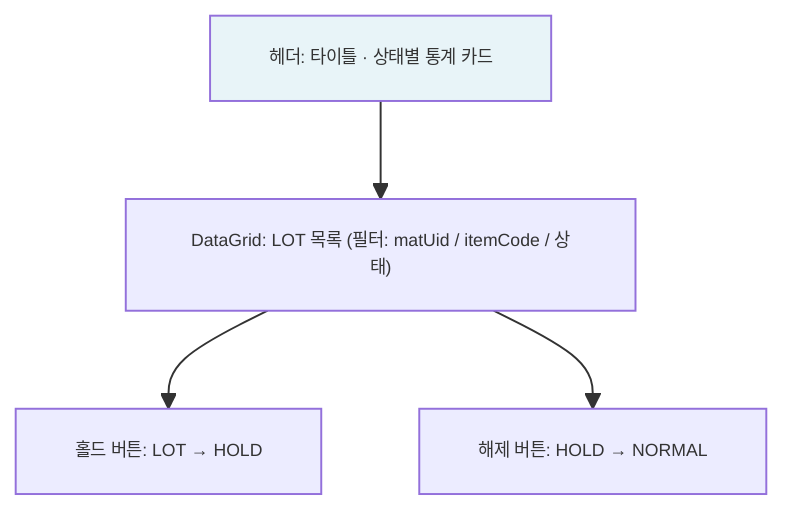
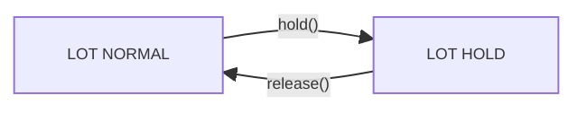

# 자재홀드/해제 — 비즈니스 로직 & 데이터 흐름 분석

> **분석 기준 커밋:** `8a7e96ea`
> **분석 일자:** `2026-07-04`

---

## 1. 화면 개요

| 항목 | 내용 |
|------|------|
| **메뉴 코드** | `MAT_HOLD` |
| **URL** | `/material/hold` |
| **메뉴 경로** | 자재관리 > 자재홀드/해제 |
| **화면 목적** | LOT 상태를 NORMAL→HOLD 또는 HOLD→NORMAL 전환 |
| **주요 사용자** | 품질/자재 담당자 |

## 2. 화면 구성

## 3. API 호출 흐름

| 시점 | API | 용도 |
| --- | --- | --- |
| 초기 로드 | `GET /material/hold?limit=5000&search=&status=&iqcStatus=` | LOT 목록 조회 |
| 홀드 설정 | `PATCH /material/hold/{matUid}/hold` | LOT 홀드 |
| 홀드 해제 | `PATCH /material/hold/{matUid}/release` | LOT 홀드 해제 |

## 4. 백엔드 — HoldService

### hold() — tx.run
1. LOT 검증 (status='NORMAL', 입고완료)
2. MAT_LOTS.status = 'HOLD', holdAt/heldBy 설정
3. `HOLD_LOGS` INSERT (matUid, action='HOLD', reason)

### release() — tx.run
1. LOT 검증 (status='HOLD')
2. MAT_LOTS.status = 'NORMAL', releasedAt/releasedBy 설정
3. `HOLD_LOGS` INSERT (action='RELEASE', reason)

## 5. DB 테이블 영향

| 테이블 | 변경 |
| --- | --- |
| `MAT_LOTS` | UPDATE status='HOLD' / 'NORMAL' |
| `HOLD_LOGS` | INSERT (이력) |

## 6. 상태 전이

## 7. 비고

- **입고완료 게이팅**: 입고완료된 LOT만 홀드 가능
- **@UseGuards(InventoryFreezeGuard)**: 재고프리즈 차단
- **tenant scope**: company/plant 포함
