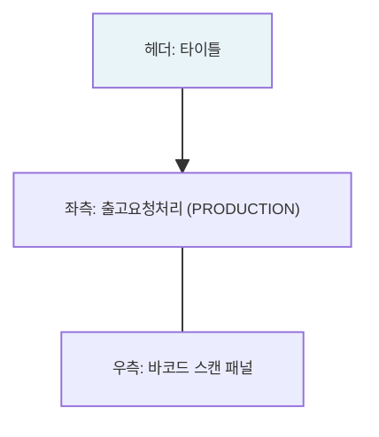

# 출고관리 — 비즈니스 로직 & 데이터 흐름 분석

> **분석 기준 커밋:** `8a7e96ea`
> **분석 일자:** `2026-07-04`

---

## 1. 화면 개요

| 항목 | 내용 |
|------|------|
| **메뉴 코드** | `MAT_ISSUE` |
| **URL** | `/material/issue` |
| **메뉴 경로** | 자재관리 > 출고관리 |
| **화면 목적** | 작업지시 기반 출고요청 처리 + 바코드 스캔 출고 (PRODUCTION 계정) |
| **주요 사용자** | 자재출고 담당자 |

## 2. 화면 구성



## 3. API 호출 흐름

| 시점 | API | 용도 |
| --- | --- | --- |
| 출고 저장 | `POST /material/issues` | 자재 출고 등록 |
| 바코드 출고 | `POST /material/issues/scan` | LOT 전량 스캔 출고 |
| 출고 취소 | `POST /material/issues/{issueNo}/{seq}/cancel` | 출고 취소 |

## 4. 백엔드 — MatIssueService

### create() — tx.run
1. 출고번호 채번
2. `MAT_ISSUES` INSERT (status='DONE')
3. `STOCK_TRANSACTIONS` INSERT (transType='MAT_OUT')
4. `MAT_STOCKS` UPDATE (qty 차감)
5. `MAT_LOTS` 전량 시 status='DEPLETED'
6. `ProcMatStockService.procStockInTx()` — 공정재고 증가

### cancel() — tx.run
1. `STOCK_TRANSACTIONS` INSERT (transType='MAT_OUT_CANCEL')
2. `MAT_STOCKS` 복원
3. `MAT_ISSUES` status='CANCELED'

## 5. DB 테이블 영향

| 테이블 | 트리거 | 변경 |
| --- | --- | --- |
| `MAT_ISSUES` | 출고 | INSERT (status='DONE') |
| `MAT_ISSUES` | 취소 | UPDATE status='CANCELED' |
| `STOCK_TRANSACTIONS` | 출고 | INSERT (transType='MAT_OUT') |
| `STOCK_TRANSACTIONS` | 취소 | INSERT (transType='MAT_OUT_CANCEL') |
| `MAT_STOCKS` | 출고 | UPDATE qty -= qty |
| `MAT_STOCKS` | 취소 | UPDATE qty += qty |
| `MAT_LOTS` | 전량출고 | UPDATE status='DEPLETED' |

## 6. 출고 게이팅

```
출고가능 = LOT.status == 'NORMAL' && LOT.iqcStatus == 'PASS'
         && (MatStock.qty - MatStock.reservedQty) >= 출고수량
```

## 7. 비고

- **@UseGuards(InventoryFreezeGuard)**: 재고프리즈 차단
- **공정재고 반영**: ProcMatStockService.procStockInTx()
- **tenant scope**: company/plant 포함
