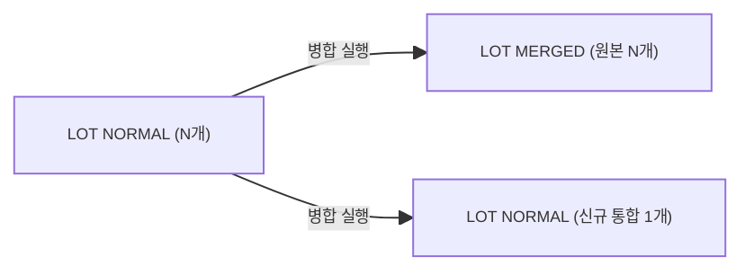

# 자재병합 — 비즈니스 로직 & 데이터 흐름 분석

> **분석 기준 커밋:** `8a7e96ea`
> **분석 일자:** `2026-07-04`

---

## 1. 화면 개요

| 항목 | 내용 |
|------|------|
| **메뉴 코드** | `MAT_LOT_MERGE` |
| **URL** | `/material/lot-merge` |
| **메뉴 경로** | 자재관리 > 자재병합 |
| **화면 목적** | 동일 품목 + 동일 입하번호 LOT N개를 1개로 병합 — 원본 전부 MERGED → 신규 통합시리얼 1개 |
| **주요 사용자** | 자재관리 담당자 |

## 2. API 호출 흐름

| 시점 | API | 용도 |
| --- | --- | --- |
| 초기 로드 | `GET /material/lot-merge?limit=5000&search=` | 병합 가능 LOT 목록 조회 |
| 바코드 스캔 | `GET /material/lot-merge/by-barcode/{matUid}` | 단건 LOT 조회 + 자격 검증 |
| 병합 실행 | `POST /material/lot-merge` | LOT 병합 실행 |
| 라벨 | MatLabelPreviewModal | 병합 결과 라벨 발행 |

## 3. 백엔드 — LotMergeService

### findMergeableLots()
- LOT_SPLIT과 동일 게이팅: RECEIVE 합 >= initQty, NORMAL 상태

### findByBarcode()
- matUid로 LOT 조회 + 병합 가능 여부 검증

### merge() — tx.run
1. 모든 source LOT 검증 (동일 품목, 동일 arrivalNo, NORMAL 상태, 입고완료)
2. 원본 전부 MAT_LOTS.status='MERGED', qty=0
3. 신규 matUid 1건 발번
4. 신규 MAT_LOT INSERT (qty=합산수량, origin=최초 LOT origin)
5. `MAT_STOCKS` 원본 차감, 신규 UPSERT
6. `STOCK_TRANSACTIONS` INSERT (LOT_MERGE_OUT x N + LOT_MERGE_IN x 1)

## 4. DB 테이블 영향

| 테이블 | 변경 |
| --- | --- |
| `MAT_LOTS` | 원본 N건 UPDATE status='MERGED', qty=0 |
| `MAT_LOTS` | 신규 1건 INSERT |
| `MAT_STOCKS` | 원본 N건 qty=0, 신규 UPSERT |
| `STOCK_TRANSACTIONS` | N+1건 INSERT |

## 5. 상태 전이

## 6. 비고

- **@UseGuards(InventoryFreezeGuard)**: 재고프리즈 차단
- **동일 조건 검증**: 동일 품목 + 동일 입하번호(source arrivalNo)만 병합 허용
- **origin 컬럼 계승**: 추적성 유지
