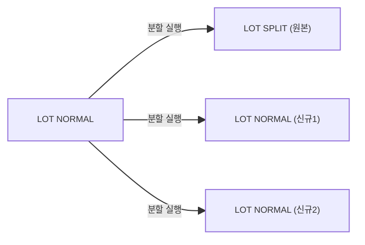

# 자재분할 — 비즈니스 로직 & 데이터 흐름 분석

> **분석 기준 커밋:** `8a7e96ea`
> **분석 일자:** `2026-07-04`

---

## 1. 화면 개요

| 항목 | 내용 |
|------|------|
| **메뉴 코드** | `MAT_LOT_SPLIT` |
| **URL** | `/material/lot-split` |
| **메뉴 경로** | 자재관리 > 자재분할 |
| **화면 목적** | 입고완료 LOT을 2개로 분할 — 원본 폐기(SPLIT) → 신규 시리얼 2개 발번 |
| **주요 사용자** | 자재관리 담당자 |

## 2. API 호출 흐름

| 시점 | API | 용도 |
| --- | --- | --- |
| 초기 로드 | `GET /material/lot-split?limit=5000&search=` | 분할 가능 LOT 목록 조회 |
| 분할 실행 | `POST /material/lot-split` | LOT 분할 실행 |
| 라벨 | MatLabelPreviewModal 재사용 | 분할 결과 라벨 발행 |

## 3. 백엔드 — LotSplitService

### findSplittableLots()
- MAT_LOTS.status='NORMAL', 재고 > 1, reservedQty=0
- **입고완료 게이팅**: `SUM(RECEIVE+LOT_SPLIT_IN+LOT_MERGE_IN) >= initQty`

### split() — tx.run
1. 원본 LOT 검증 (상태, 재고, 입고완료)
2. 분할수량 검증 (0 < splitQty < currentQty)
3. 원본 MAT_LOTS.status='SPLIT', qty=0
4. 신규 matUid 2건 발번 (`NumberingService.nextSerial()`)
5. 신규 MAT_LOTS 2건 INSERT (origin=원본 matUid 계승)
6. `MAT_STOCKS` 원본 삭제/차감, 신규 2건 UPSERT
7. `STOCK_TRANSACTIONS` INSERT (LOT_SPLIT_OUT(원본출) + LOT_SPLIT_IN(신규1) + LOT_SPLIT_IN(신규2))

## 4. DB 테이블 영향

| 테이블 | 변경 |
| --- | --- |
| `MAT_LOTS` | 원본 UPDATE status='SPLIT', qty=0 |
| `MAT_LOTS` | 신규 2건 INSERT (origin=원본 matUid) |
| `MAT_STOCKS` | 원본 qty=0, 신규 2건 UPSERT |
| `STOCK_TRANSACTIONS` | 3건 INSERT (LOT_SPLIT_OUT + LOT_SPLIT_IN x2) |

## 5. 상태 전이

## 6. 비고

- **@UseGuards(InventoryFreezeGuard)**: 재고프리즈 차단
- **입고완료 게이팅**: RECEIVE+LOT_SPLIT_IN+LOT_MERGE_IN 합 >= initQty
- **origin 컬럼 계승**: 분할/병합 추적용 최초시리얼 유지
- **채번**: NumberingService (SEQ_MAT_SERIAL_DAILY)
