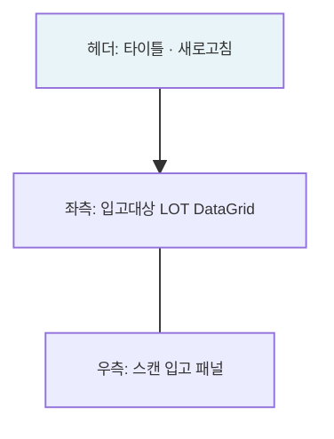

---
sources:
  - apps/backend/src/common/guards/inventory-freeze.guard.ts
  - apps/backend/src/modules/material/services/receiving.service.ts
verifiedCommit: 8a7e96ea
---

# 입고관리 — 비즈니스 로직 & 데이터 흐름 분석

> **분석 기준 커밋:** `8a7e96ea`
> **분석 일자:** `2026-07-04`

---

## 1. 화면 개요

| 항목 | 내용 |
|------|------|
| **메뉴 코드** | `MAT_RECEIVE` |
| **URL** | `/material/receive` |
| **메뉴 경로** | 자재관리 > 입고관리 |
| **화면 목적** | IQC 합격 LOT 선택/스캔 → 입고 확정 (분할 입고 가능) |
| **주요 사용자** | 자재입고 담당자 |

## 2. 화면 구성



## 3. API 호출 흐름

| 시점 | API | 용도 |
| --- | --- | --- |
| 초기 로드 | `GET /material/receiving/receivable` | 입고 가능 LOT 목록 조회 |
| 바코드 스캔 | `GET /material/receiving/receivable/by-barcode/{matUid}` | 단건 LOT 조회 |
| 입고 저장 | `POST /material/receiving` | 일괄 입고 등록 |

## 4. 백엔드 — ReceivingService

### findReceivable()
- MAT_LOTS: `iqcStatus='PASS'` OR `(iqcStatus='FAIL' AND specialAcceptYn='Y')`
- status IN ('NORMAL', 'HOLD'), initQty > 0
- 기입고수량(RECEIVE 트랜잭션 합) < initQty 조건

### createBulkReceive() — tx.run
1. 각 LOT 검증
2. `MAT_RECEIVINGS` INSERT
3. `STOCK_TRANSACTIONS` INSERT (transType='RECEIVE')
4. `MAT_STOCKS` UPSERT

## 5. DB 테이블 영향

| 테이블 | 변경 |
| --- | --- |
| `MAT_RECEIVINGS` | INSERT |
| `STOCK_TRANSACTIONS` | INSERT (transType='RECEIVE') |
| `MAT_STOCKS` | UPSERT (qty 증가) |

## 6. 입고 게이팅

```
입고가능 = (iqcStatus == 'PASS' || (iqcStatus == 'FAIL' && specialAcceptYn == 'Y'))
         && status IN ('NORMAL', 'HOLD')
         && initQty > 0
         && (initQty - 기입고수량) > 0
```

## 7. 비고

- **분할 입고**: 동일 LOT 일부 수량만 입고 가능
- **@UseGuards(InventoryFreezeGuard)**: 재고프리즈 세션 중 입고 차단
- **tenant scope**: company/plant 포함
