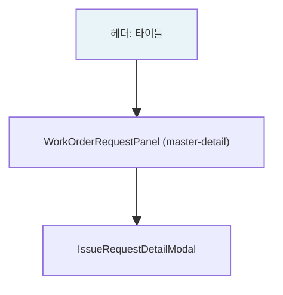
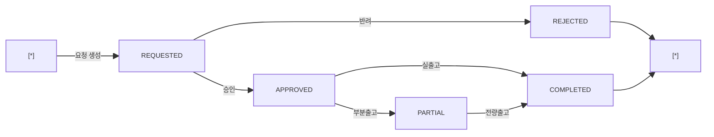

# 출고요청 — 비즈니스 로직 & 데이터 흐름 분석

> **분석 기준 커밋:** `8a7e96ea`
> **분석 일자:** `2026-07-04`

---

## 1. 화면 개요

| 항목 | 내용 |
|------|------|
| **메뉴 코드** | `MAT_REQUEST` |
| **URL** | `/material/request` |
| **메뉴 경로** | 자재관리 > 출고요청 |
| **화면 목적** | 작업지시 기준 BOM 출고요청 등록 — 좌측 작업지시 선택 → 우측 BOM 기준 출고예정 그리드 → 요청수량 입력 → 출고요청 등록 |
| **주요 사용자** | 생산 담당자 |

## 2. 화면 구성

| 영역 | 컴포넌트 | 역할 |
| --- | --- | --- |
| 헤더 | `page.tsx` | 제목 |
| 본문 | `WorkOrderRequestPanel` | 작업지시 목록 + BOM 출고요청 상세 |
| modal | `IssueRequestDetailModal` | 요청 상세 조회 |

## 3. API 호출 흐름

| 시점 | API | 용도 |
| --- | --- | --- |
| 초기 로드 | `GET /material/issue-requests` | 출고요청 목록 조회 |
| 작업지시 선택 | `GET /material/issue-requests/job-orders/{orderNo}/bom-items` | BOM 기준 출고예정 품목 산출 |
| 출고요청 | `POST /material/issue-requests` | 출고요청 생성 (status='REQUESTED') |
| 승인 | `PATCH /material/issue-requests/{requestNo}/approve` | REQUESTED → APPROVED |
| 반려 | `PATCH /material/issue-requests/{requestNo}/reject` | REQUESTED → REJECTED |
| 실출고 | `POST /material/issue-requests/{requestNo}/issue` | APPROVED → COMPLETED |

## 4. 백엔드 — IssueRequestService

### create()
1. 요청번호 채번
2. `ISSUE_REQUESTS(또는 MAT_ISSUE_REQUESTS)` INSERT (status='REQUESTED')

### approve()
- status 'REQUESTED' → 'APPROVED'

### reject()
- status 'REQUESTED' → 'REJECTED'

### issueFromRequest()
- `MatIssueService.create()` 호출하여 실출고 처리
- `ISSUE_REQUESTS.status` → 'COMPLETED'

## 5. DB 테이블 영향

| 테이블 | 트리거 | 변경 |
| --- | --- | --- |
| `ISSUE_REQUESTS` | 요청 등록 | INSERT (status='REQUESTED') |
| `ISSUE_REQUESTS` | 승인 | UPDATE status='APPROVED' |
| `ISSUE_REQUESTS` | 반려 | UPDATE status='REJECTED' |
| `ISSUE_REQUESTS` | 실출고 | UPDATE status='COMPLETED' |

## 6. 상태 전이

## 7. 비고

- **작업지시 기반**: BOM 기준 출고예정 품목 산출 (`buildBomRequestItems`)
- **tenant scope**: company/plant 포함
- **공통코드 우회**: 없음
