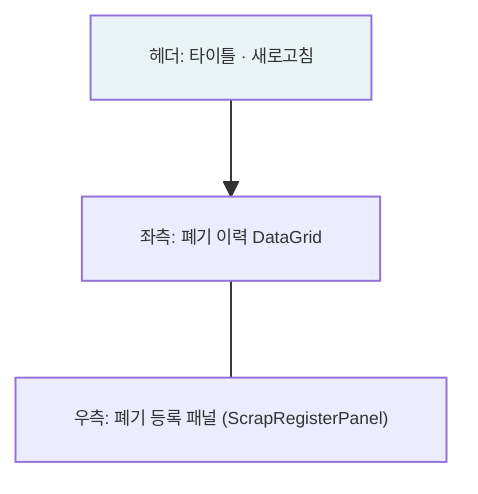

---
sources:
  - apps/backend/src/common/guards/inventory-freeze.guard.ts
  - apps/backend/src/modules/inventory/services/inventory.service.ts
  - apps/backend/src/modules/material/services/scrap.service.ts
  - apps/frontend/src/app/(authenticated)/material/scrap/components/ScrapRegisterPanel.tsx
verifiedCommit: 8a7e96ea
---

# 자재폐기 — 비즈니스 로직 & 데이터 흐름 분석

> **분석 기준 커밋:** `8a7e96ea`
> **분석 일자:** `2026-07-04`

---

## 1. 화면 개요

| 항목 | 내용 |
|------|------|
| **메뉴 코드** | `MAT_SCRAP` |
| **URL** | `/material/scrap` |
| **메뉴 경로** | 자재관리 > 자재폐기 |
| **화면 목적** | 자재 폐기 등록 및 이력 조회 — StockTransaction(SCRAP) 생성 + LOT 수량 차감 |
| **주요 사용자** | 자재관리 담당자 |

## 2. 화면 구성

## 3. API 호출 흐름

| 시점 | API | 용도 |
| --- | --- | --- |
| 초기 로드 | `GET /inventory/transactions?transType=SCRAP&limit=5000&search=&fromDate=&toDate=` | 폐기 이력 조회 |
| 폐기 등록 | `POST /material/scrap` | 자재 폐기 등록 |

## 4. 백엔드 — ScrapService

### create() — tx.run
1. LOT 검증 (NORMAL 상태, 재고 충분)
2. `STOCK_TRANSACTIONS` INSERT (transType='SCRAP')
3. `MAT_STOCKS` UPDATE (qty 차감)
4. `MAT_LOTS` 전량 폐기 시 status='SCRAPPED'

## 5. DB 테이블 영향

| 테이블 | 변경 |
| --- | --- |
| `STOCK_TRANSACTIONS` | INSERT (transType='SCRAP') |
| `MAT_STOCKS` | UPDATE qty -= qty |
| `MAT_LOTS` | UPDATE status='SCRAPPED' (전량 시) |

## 6. 비고

- **@UseGuards(InventoryFreezeGuard)**: 재고프리즈 차단
- **폐기 이력**: `/inventory/transactions` API 조회 (InventoryService)
- **tenant scope**: company/plant 포함
